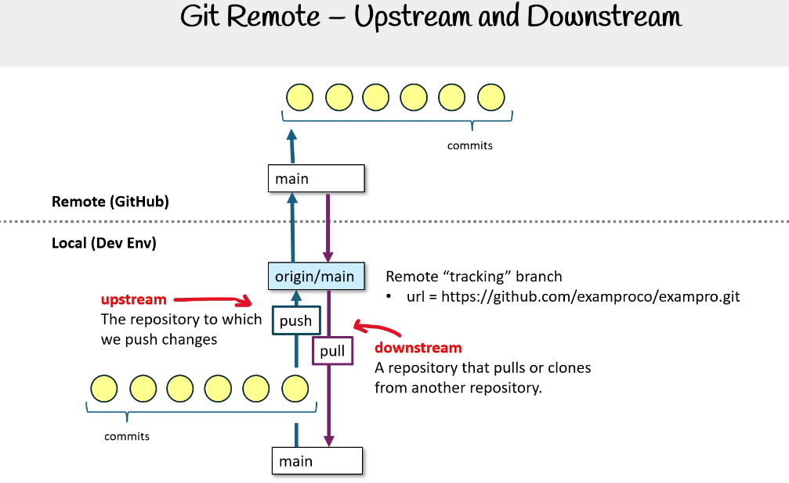
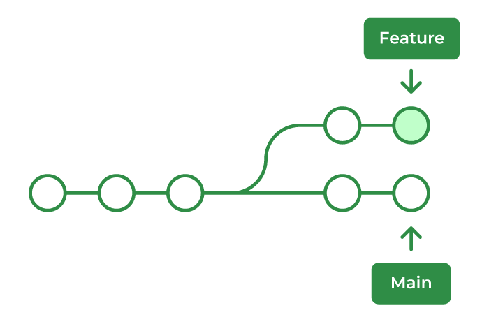

### VCS (version control system)
-  tool that helps manage and track changes in code and maintain history of the changes, documents, or other digital files over time

### Git
- one of VCS
- there are others VCS like git
- collaboration tool among developers
- repository sytem

### GitHub
- server where can i store code

### Git Setup & Configuration

#### How to setup git

```
git branch -m master
git config --global user.name "saifurrahman1193"
git config --global user.email "saifur.rahman1193@gmail.com"

# generate ssh key. ssh key has 1 private key and 1 public key
ssh-keygen

# setup ssh key in your github account

# test authentication
ssh -T git@github.com
```


#### Username and email setup

```
git config
git config -l
git config --global user.name "saifurrahman1193"
git config --global user.email "saifur.rahman1193@gmail.com"
```

#### Basic commands
```
git init
git init --help
ls 
ls -a
touch file.txt

```

- add (means to track the file)

```
git init
git add .
git commit -m "first commit"
git status
git branch
git checkout branch
```


### git init
  - Initializes a new Git repository in the current directory. 
  - This command creates a .git folder where Git stores version history.


### .git folder
  - containing all information, history, and settings for managing and tracking changes to your files
  - It's like a DB
  - Key Contents
    1. HEAD
    2. config
    3. index
    4. hooks/
    5. logs/
    6. objects/
    7. refs/
    8. packed-refs

### git add
- Stages Changes: Prepares changes for a commit by adding them to the staging area.
- Selective Staging: You can stage individual files or specific portions of files.
- Common Commands:
  - Add a Specific File: ```git add <file-name>```
  - Add All Changes in Directory:```git add .```
  - Add Specific Directory: ```git add <directory-name>```

Required Before Commit: Changes must be added to the staging area with git add before they can be committed.


### Commit
- Meaningful, must be present sentence not past sentence
- Snapshot of Changes: A commit records all staged changes in the project.
- Unique ID (SHA-1 Hash): Each commit is uniquely identified by a hash, making it easy to track and reference.
- Commit Message: A message describing what changes were made, added with the -m flag (e.g., git commit -m "Description").
- Building Project History: Each commit builds on the previous, creating a timeline of changes.
- must be added first (tracking)
- after commit files goes from staging environment then move changes  to the repositoryvc
- mainly save the files

Key Command:

```
git commit -m "commit message"
git commit -m "commit message" -m "commit message details"
```
Amending a Commit: You can modify the last commit with git commit --amend (useful for updating messages or adding files).


#### GIT commit types
```
feat: New feature for the user.
fix: Bug fix.
style: Code Style Changes.
refactor: Code Refactoring.
build: Build System Changes.
ci: Continuous Integration Changes.
perf: Performance Improvements.
revert: Revert a Previous Commit.
docs: Documentation changes.
test: Adding or modifying tests.
chore: Routine tasks, maintenance, or housekeeping.
```


```
<type>(<scope>): <short description>

[optional body]

[optional footer]
```

```
git commit -m "<type> (<scope>): <short description>" -m "<commit details>" -m "<footer note>"
```

#### Types:
- feat: A new feature.
- fix: A bug fix.
- chore: Changes to the build process or auxiliary tools and libraries.
- docs: Documentation changes.
- style: Code style changes (white-space, formatting, etc.).
- refactor: Code refactoring without adding features or fixing bugs.
- perf: Performance improvements.
- test: Adding or updating tests.


#### Scope (optional): This specifies what part of the codebase the change affects, e.g., auth, api, or database.

#### Examples:
```
feat(auth): add login endpoint
fix(api): handle null values in response
docs(readme): update contributing guidelines
refactor(database): optimize query performance

Fix typo in user profile page
Add error handling to signup form
Optimize image loading on the homepage

✨ feat: add new dashboard component
🐛 fix: resolve layout bug in header
📝 docs: update API usage instructions
```


### Branch
- Branches allow isolated work on features, fixes, or experiments.
- tree root
```
git branch

```

### checkout

- Switch Branches: Changes the current branch to another existing branch.
  ```
    git checkout <branch-name>
  ```
- Create and Switch to a New Branch:
    ```
    git checkout -b <new-branch-name>
    ```

- Restore Files: Replaces changes in the working directory with the version from the last commit, or from a specified commit.
    ```
    git checkout <file-name>
    ```

    This will discard any uncommitted changes in that file.

- Detached HEAD State:

    If you checkout a specific commit (not a branch), Git enters a "detached HEAD" state, where HEAD points directly to that commit. Changes made in this state won't be associated with any branch unless a new branch is created

### head
- Tracks the Current Position: HEAD points to the most recent commit in your current branch.
- has an address

### staging
- after use ```git add file_name or folder_name or (.)```
- Staging Area: A temporary space that holds changes you plan to commit.
- Selective Commits: You can choose specific changes to include in each commit by staging only certain files or portions of files.
- Staging Changes: Use git add to add changes to the staging area.
- Viewing Staged Changes: Use git status to see which changes are staged vs. unstaged.
- Making a Commit: Once staged, you commit the changes with git commit, which moves them from the staging area to the repository’s history.


### Alias
An alias is a shortcut for longer or commonly used Git commands. 
Key Points about Git Aliases

Aliases are set using the git config command.

```
git config --global alias.<alias-name> "<git-command>"
```

Examples of Common Aliases:

git st for git status:

```
git config --global alias.st "status"
```

git co for git checkout:
```
git config --global alias.co "checkout"
```

git cm for git commit -m:

```
git config --global alias.cm "commit -m"
```

git br for git branch:

```
git config --global alias.br "branch"
```

git lg for a formatted git log:

```
git config --global alias.lg "log --oneline --graph --all"
```

Viewing Aliases:

To see all configured aliases:
```
git config --global --get-regexp alias
```

Editing Aliases:
You can edit aliases directly in the Git configuration file (~/.gitconfig), under the [alias] section.

**Summary**

Purpose: Aliases simplify Git commands, making them faster to type.

Usage: Customize your workflow with aliases for frequently used commands.

Configuration: Set globally with ```git config --global alias.<name> "<command>".```


### git ssh
- Using SSH with Git allows you to securely connect to remote repositories without entering your username and password each time.
- 

### Git Remote

To generate an SSH key in Ubuntu, follow these steps:

Generate the SSH Key Pair: use the ssh-keygen command to create a new SSH key pair.

```
ssh-keygen -t rsa -b 4096 -C "saifur.rahman1193@gmail.com"
```

Options:

rsa: Specifies the type of key to create (RSA is commonly used).
4096: Sets the key length (4096 bits for better security).
"your_email@example.com": Adds a label (usually your email) to identify the key.

Save the Key:

You’ll be prompted to choose a file to save the key (default is ~/.ssh/id_rsa). Press Enter to accept the default location.

Set a Passphrase (optional):

You can enter a passphrase for added security, or leave it blank for no passphrase.

Add the SSH Key to the SSH Agent:

Start the ssh-agent in the background.

bash

eval "$(ssh-agent -s)"

Add your SSH key to the ssh-agent.

bash

ssh-add ~/.ssh/id_rsa

Copy the SSH Key:

Use this command to copy the public key to your clipboard.

bash

t ~/.ssh/id_rsa.pub

u can now paste the public key into platforms like GitHub, GitLab, or any server you want to connect to via SSH.

Summary

After following these steps, your SSH key pair is ready, and you can use it for secure access to remote servers and repositories.

```
git remote
git remote -v
git config --global alias.graph 'log --all --decorate --oneline --graph'
git graph
```

```
git fetch  
```


```
git remote -v

origin  https://saifurrahman1193@github.com/saifurrahman1193/devops.git (fetch)
origin  https://saifurrahman1193@github.com/saifurrahman1193/devops.git (push)


```

- v = verbose


```
git remote add test https://github.com/saifurrahman1193/microservice-rabbitmq.git
git remote -v
git remote remove test
```

#### to add known hosts
```
ssh -T git@github.com
```


### Upstream

What is Upstream?

- git fetch 2 ways
  - Upstream Branch: 
    - branch focused
    - The branch that your current branch is tracking for updates. When you pull changes, they usually come from the upstream branch.
  - Upstream Repository: 
    - repository focused
    - forked based
    - multiple repository based
    - The main or original repository from which your repository was forked, often used in open-source projects.

### Downstream





| Term       | Meaning                                                                        |
| ---------- | ------------------------------------------------------------------------------ |
| Upstream   | The main source branch or repository from which changes are pulled or fetched. |
| Downstream | The target branch or repository where changes are pushed or applied.           |


### log 
```
git log
```

### amend
```
git add .
git commit --amend
git push --force
```


### git rebase

- used to merge branches
- “moving the base of a branch onto a different position”. Think of it like a redo — “I meant to start here.” 


- to maintain a progressively straight and cleaner project history
- gives rise to a perfectly linear project history
- To integrate the feature branch into the main branch in two ways. 
  1. merging directly into a main branch
  2.  or first rebasing and then merging



#### Interactive Rebase for History Rewriting

##### Interactive rebase allows you to modify, combine, or reorder commits.


This opens an editor to rewrite the last 3 commits, where you can:

- Pick: Keep the commit as is.
- Reword: Edit the commit message.
- Squash: Combine commits.
- Drop: Delete a commit.

##### Reword
```
git rebase -i HEAD~3
git rebase --edit-todo
reword 17b1009 Add instruction class details on devops architecture changes rweord
ctrl x
y
enter
git rebase --continue
```

```
git add .
git rebase --continue
git push --force origin feature-branch
```

If you want to skip a conflicting commit:
```
git rebase --skip
```

If you need to abort the rebase and return to the original branch state:
```
git rebase --abort
```


#### common use cases

- **Keeping a clean and linear commit history:** Git rebasing is mainly used for maintaining a linear history of commits, where commits are interrelated to the co-existing one. it makes it easy to understand code.
- **Updating a feature branch:** By rebasing the feature branch will help us to maintain updates because it is generated from the main branch. The main branch will always be up to date.
- Rebasing the feature branch can bring it up to date with the most recent changes in the main branch if it was generated from a main branch (such as master) and the main branch has since been updated with new commits.
- **Resolving merge conflicts:** Git rebase will help us to resolve merge conflicts. It enables conflicts to be settled at each stage, leading to a cleaner merge, by applying each commit from the branch being rebased separately.


#### git rebase master : analysis 1
1. Move your current branch's commits to the top of the master branch.
2. Reapply each commit from your current branch on top of the latest commits in master.

This essentially brings your branch up to date with master without creating a merge commit, 


#### git rebase master : analysis 2
**Here's a breakdown of what it does:**

- Finds the common ancestor: Git identifies the common ancestor between your current branch and the master branch.
- Replays commits: It takes each commit from your branch, one by one, and applies it to the latest commit of the master branch.
- Resolves conflicts: If there are any conflicts during the replay process, you'll need to resolve them manually.
- Creates new commits: Once all commits are replayed and conflicts are resolved, Git creates new commits on top of the master branch.

**Why use git rebase master?**
- master branch to feature branch merge 
- Cleaner commit history: It can help create a more linear and easier-to-understand commit history.
- Avoids merge commits: By replaying commits, you can avoid creating unnecessary merge commits.
- Updates your branch: It brings your branch up-to-date with the latest changes from the master branch.


#### Bringing a Feature Branch Up-to-Date : Scenario : master to feature branch up-to-date

If your feature-branch is based on master and master has received new commits since you started, rebasing allows you to incorporate those updates cleanly:
```
git checkout feature-branch
git rebase master
```


**git rebase feature-branch?**
- moves all changes history/log from feature-branch to master branch
- merge feature-branch to master branch

```
git checkout master
git rebase feature-branch
```


### git reset

1. --soft: Undo the commit, keep changes staged.
2. --mixed: (default) Undo the commit, unstage changes, keep them in the working directory.
3. --hard: Undo the commit and delete all changes.


```
git reset --soft <commit>
git reset --soft HEAD~1
```

```
git reset --mixed <commit>
git reset --mixed HEAD~1
```

```
git reset --hard <commit>
git reset --hard HEAD~1
```


### git push
- To push your changes to a remote Git repository
  
```
# git push <remote-url> <branch-name>
git push origin master
git push origin master
```

#### Push to a specific remote URL (if you haven’t set it as origin):

```
git push https://github.com/username/repository.git main
```

#### Push to a different remote name (e.g., if you’ve added a remote named upstream):
```
git push upstream main
```

#### Force Pushes and Safety Options
- Force push (use with caution as it can overwrite history):

```
git push --force origin main
```

#### Setting Upstream Branch
- Set an upstream branch while pushing (useful for the first push of a new branch):

```
git push -u origin new-branch
```

### git reflog


### git forking


- Forking: Creating a personal copy of another user’s repository on your account.
- Clone: Downloading your fork to your local machine.
- Branch: Separate version of your code for making changes.
- Commit: Saving changes with a descriptive message.
- Push: Uploading your branch with changes to your fork on GitHub.
- Pull Request (PR): Request for your changes to be reviewed and merged into the original repo.
- Upstream: The original repository from which you forked.
- Syncing Fork: Updating your fork with changes from the upstream repository.


#### Why Fork a Repository?
Forking is useful when:
- You want to contribute to an open-source project but need a personal space to work on changes.
- You need to experiment with code or configurations without impacting the original codebase.
- You want to keep a copy of a repository in your account for personal use or modification.

Steps to Fork a Repository
1. Navigate to the Original Repository: Go to the repository you want to fork on GitHub (or another hosting platform).
2. Click the “Fork” Button: Usually, you’ll find a “Fork” button at the top-right corner of the repository page. Click it to create a copy of the repository under your account.
3. Clone the Forked Repository:
   1. After forking, go to your forked repository (now under your account) and click the “Code” button. Copy the URL and clone it locally using Git:
        ```
        git clone <your-fork-url>
        ```
4. Create a Branch:
   1. Creating a new branch to make changes is a good practice, especially if you plan to submit a pull request.
        ```
        git checkout -b <your-branch-name>
        ```
5. Make Changes and Commit:
   1. Edit files as needed, and then stage and commit your changes:
        ```
        git add .
        git commit -m "Describe your changes"
        ```
6. Push Changes to Your Fork:
   1. Push your branch to your forked repository on GitHub:
      ```
      git push origin <your-branch-name>
      ```
7. Create a Pull Request:
   1. On your forked repository page, GitHub will often display an option to “Compare & pull request.”
   2. Click this to open a pull request (PR) back to the original repository. This allows the project maintainers to review and potentially merge your changes.

#### Keeping Your Fork Updated

To ensure your fork stays up-to-date with the original repository, you should add the original repository as a remote and regularly fetch and merge changes:

1. Add the Original Repository as a Remote:
      ```
      git remote add upstream <original-repo-url>
      ```
2. Fetch and Merge Changes:
   1. Fetch changes from the upstream repository:
      ```
      git fetch upstream
      ```
   2. Merge changes from the upstream branch (often main or master) into your branch:
      ```
      git checkout main
      git merge upstream/main
      ```

#### Summary
```
fork lazygit repo using panel
git clone my_repo 
# which is just forked/duplicated/created from original lazygit repo
git remote -v
git remote add jesse lazygit_original_repo
git remote -v
git remote add saifur my_repo
git remote -v
git checkout -b dev_saifur
git push saifur dev_saifur
git fetch jesse master
git checkout master
git rebase jesse/master

```


### Merge Pull request

Types
1. Create a merge commit (Avoid)
2. Squash and merge (Avoid)
3. Rebase and merge (always do that)


#### Create a merge commit (Avoid)

```
git merge feature-branch
```

Pros:

    Preserves the entire commit history.
    Makes it easy to trace back and understand how changes were merged.

Cons:

    The commit history can become cluttered if there are many small commits in the source branch.

#### Squash and merge (Avoid)
```
git checkout main
git merge --squash feature-branch
git commit -m "Feature XYZ implementation"
```
Pros:

    Simplifies commit history by consolidating changes into one commit.
    Useful for cleaning up messy commit histories from feature branches.

Cons:

    Loses the detailed history of individual commits from the source branch.


#### Rebase and merge (***********) (Always do that)
```
git checkout feature-branch
git rebase main
git rebase --continue
git checkout main
git merge feature-branch
git rebase --continue
```
Pros:

    Results in a clean, linear commit history.
    Easier to follow the project history without merge commits.

Cons:

    Can rewrite commit history, making it harder to trace the original branch.
    Not ideal if multiple developers are working on the same branch (could lead to conflicts).
