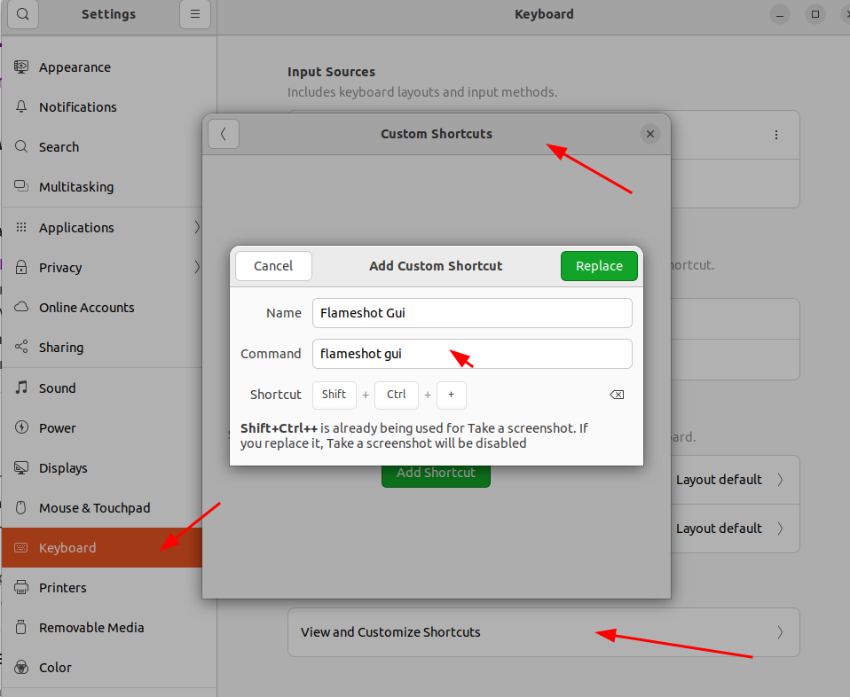
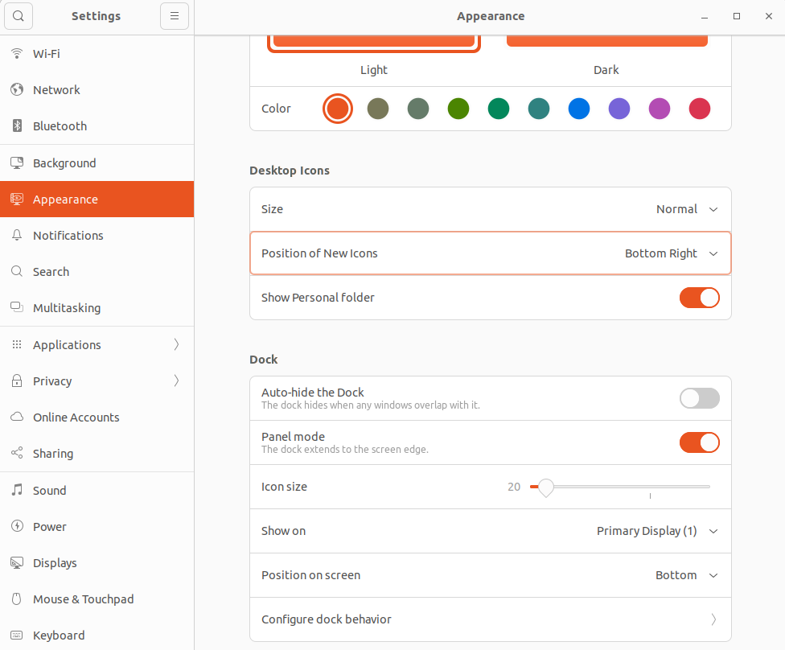
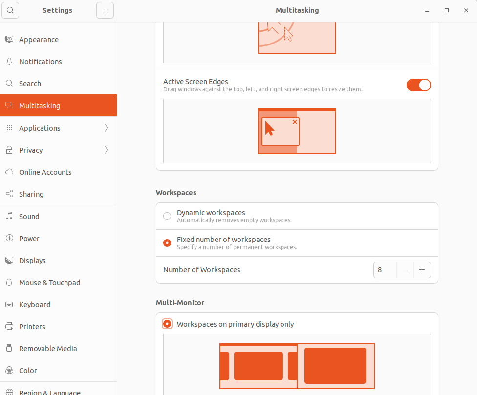
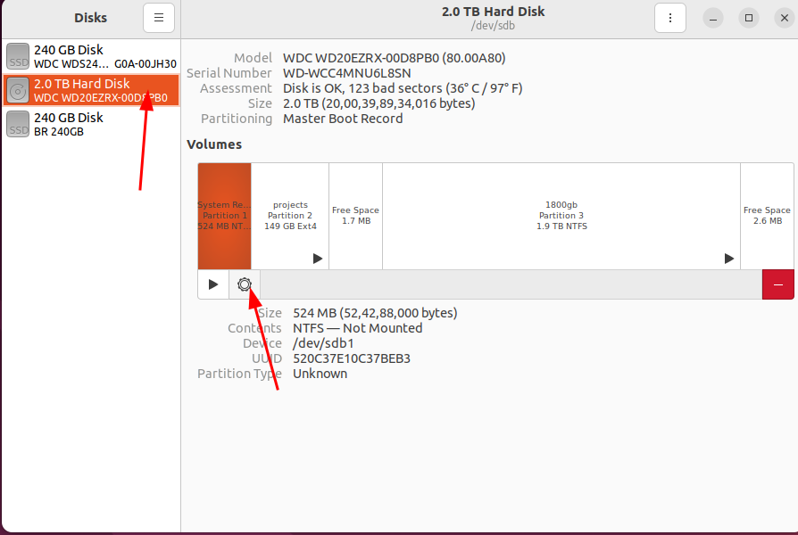
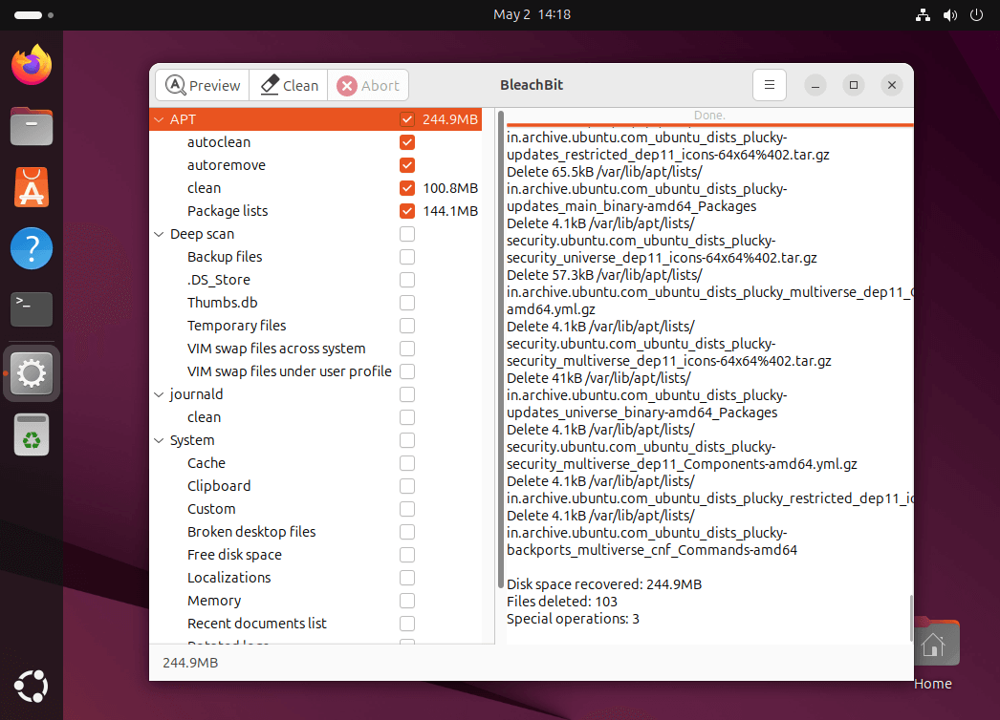
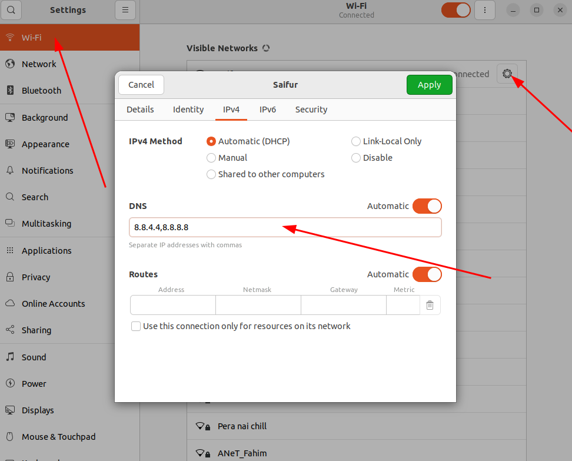

# update and upgrade
```
 sudo apt update -y; sudo apt upgrade -y;

 sudo apt install software-properties-common apt-transport-https wget

wget -qO- https://packages.microsoft.com/keys/microsoft.asc | sudo apt-key add -

```

# Some installtion
```
sudo apt install vlc gimp gparted snap

sudo snap install telegram-desktop
sudo snap install chromium
sudo snap install opera
sudo snap install whatsapp-desktop-client
sudo apt-get install git
sudo apt install preload
sudo apt install ubuntu-restricted-extras
```

---


# Swap
It looks like you already have a **2 GB swap file** enabled, but you'd like to increase it to **16 GB**. Since your current swap file is 2 GB, you'll need to create a new, larger swap file and remove the old one.

Here's how to proceed:

### 1. **Turn off the current swap file**:

To modify the current swap file, you first need to turn it off.

```bash
sudo swapoff /swapfile
```

### 2. **Remove the old swap file** (optional):

If you're replacing the current swap file, you can remove the old one:

```bash
sudo rm /swapfile
```

### 3. **Create a new swap file of 16 GB**:

Now, let's create a new swap file of **16 GB**:

```bash
sudo fallocate -l 16G /swapfile
```

If `fallocate` doesn't work or if you prefer a more reliable method, you can use `dd`:

```bash
sudo dd if=/dev/zero of=/swapfile bs=1M count=16384
```

### 4. **Set the correct permissions**:

Set the right permissions for the swap file to ensure only root can access it:

```bash
sudo chmod 600 /swapfile
```

### 5. **Format the new swap file**:

Now, format the swap file to make it usable:

```bash
sudo mkswap /swapfile
```

### 6. **Activate the new swap file**:

Enable the swap file:

```bash
sudo swapon /swapfile
```

### 7. **Make the swap permanent** (optional but recommended):

To ensure the swap is enabled on boot, add it to `/etc/fstab`.

Open `/etc/fstab` for editing:

```bash
sudo nano /etc/fstab
```

Add the following line to the end of the file:

```
/swapfile none swap sw 0 0
```

Save the file and exit (`Ctrl + X`, then `Y`, and `Enter`).

### 8. **Check the swap space**:

Finally, confirm that the new swap file is active and has the correct size:

```bash
swapon --show
```


---

# Firefox


```bash
sudo snap remove firefox
sudo apt remove firefox
sudo apt purge firefox
sudo apt autoremove
rm -rf ~/.mozilla
rm -rf ~/.cache/mozilla
sudo snap install firefox
```

---


# Git
```
sudo apt install git -y
```
---

# Vscode
## Download then run
```
sudo snap install code --classic
```
---

# sublime
```
sudo snap install sublime-text --classic

```
---

# Docker
```
for pkg in docker.io docker-doc docker-compose docker-compose-v2 podman-docker containerd runc; do sudo apt-get remove $pkg; done


# Add Docker's official GPG key:
sudo apt-get update
sudo apt-get install ca-certificates curl
sudo install -m 0755 -d /etc/apt/keyrings
sudo curl -fsSL https://download.docker.com/linux/ubuntu/gpg -o /etc/apt/keyrings/docker.asc
sudo chmod a+r /etc/apt/keyrings/docker.asc

# Add the repository to Apt sources:
echo \
  "deb [arch=$(dpkg --print-architecture) signed-by=/etc/apt/keyrings/docker.asc] https://download.docker.com/linux/ubuntu \
  $(. /etc/os-release && echo "${UBUNTU_CODENAME:-$VERSION_CODENAME}") stable" | \
  sudo tee /etc/apt/sources.list.d/docker.list > /dev/null
sudo apt-get update


sudo apt-get install docker-ce docker-ce-cli containerd.io docker-buildx-plugin docker-compose-plugin


sudo systemctl status docker

sudo systemctl start docker


```

---


# Workbench
```
sudo snap install mysql-workbench-community
```

---


# Wine

### Step 1: Enable 32-bit Architecture (if not already done)

Wine requires 32-bit libraries, even on a 64-bit system. So, first, enable the 32-bit architecture if you're on a 64-bit version of Ubuntu.

```bash
sudo dpkg --add-architecture i386
```

### Step 2: Add the WineHQ Repository

WineHQ maintains the latest stable version of Wine. To install Wine from their repository, follow these steps:

1. **Add the WineHQ repository**:

   * First, install the necessary dependencies:

     ```bash
     sudo apt update
     sudo apt install software-properties-common
     ```

   * Then, add the WineHQ signing key:

     ```bash
     sudo wget -qO - https://dl.winehq.org/wine-builds/winehq.key | sudo apt-key add -
     ```

   * Add the Wine repository to your system:

     ```bash
     sudo apt-add-repository 'deb https://dl.winehq.org/wine-builds/ubuntu/ focal main'
     ```


2. **Update your package list**:

   ```bash
   sudo apt update
   ```

### Step 3: Install Wine

Now, you can install Wine. There are a few different versions you can choose from, depending on your needs.

#### 1. **Stable version** (recommended for most users):

```bash
sudo apt install --install-recommends winehq-stable
```


### Step 4: Verify Installation

After installation, verify that Wine is correctly installed by running:

```bash
wine --version
```

This should show the installed version of Wine.

### Step 5: Configure Wine (Optional)

Once Wine is installed, you'll need to configure it before running Windows applications.

1. To set up Wine for the first time:

   ```bash
   winecfg
   ```

2. This will create the Wine prefix (the "C:" drive) in your home directory (`~/.wine`) and open the Wine configuration window. You can adjust settings such as Windows version compatibility and graphics settings here.

### Step 6: Running Windows Applications with Wine

To run a Windows application with Wine, navigate to the folder containing the `.exe` file and run:

```bash
wine application.exe
```

---

# remmina
```
sudo snap install remmina
```

# beekeeper studio
```
sudo snap install beekeeper-studio
```

# jupyter notebook
```
sudo snap install jupyterlab-desktop --classic
```

# whatsapp
```
sudo snap install whatsapp-linux-app
```

# gimp
```
sudo snap install gimp
```

# flameshot
```
sudo apt install flameshot
```



# kazam
```
sudo apt install kazam
```


# dbeaver
```
sudo snap install dbeaver-ce
```

# filezilla
```
sudo apt-get install filezilla
```

# putty

```
sudo add-apt-repository universe
sudo apt install -y putty
putty --version
```


# anydesk
```
wget -qO - https://keys.anydesk.com/repos/DEB-GPG-KEY | sudo apt-key add -
echo "deb http://deb.anydesk.com/ all main" | sudo tee /etc/apt/sources.list.d/anydesk-stable.list
sudo apt update
sudo apt install anydesk
```


# workspace
```
sudo apt install gnome-tweaks
gnome-tweaks

gnome-tweaks -> Extensions -> workspace grid
	- dynamic work-spaces to static workspace
	- number of workspace 6

```

# obsstudio
```
sudo apt install ffmpeg

sudo snap install obs-studio


```

## edit
```
/etc/gdm3/custom.conf

#WaylandEnable=false

to
WaylandEnable=false

```


# thunderbird
```
sudo snap install thunderbird
```

# appearance





# Disk mount


# Dock
```
add to fabourite
vlc
vscode
thunderbird
terminal
firefox

```

# bleachbit
```
sudo apt install bleachbit
```



# wifi dns

