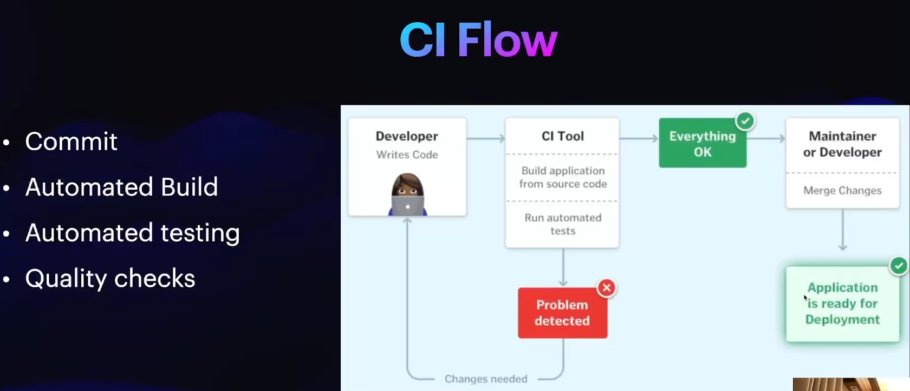
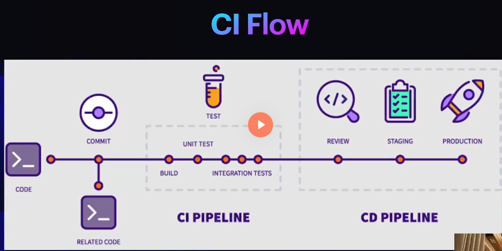
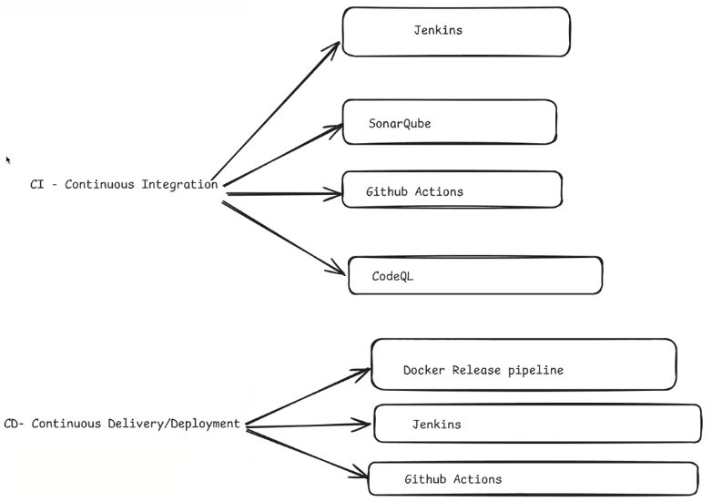

# CI

**P**lease **C**ome **B**ack, **R**emember **D**reams **O**f **M**orning.


# CI Flows




# CI Tools


# Practical
- https://github.com/Vikmanatus/flask-docker-starterkit

# CI/CD





CI/CD stands for Continuous Integration and Continuous Deployment (or Continuous Delivery). It's a set of practices and tools designed to improve the software development process by automating builds, testing, and deployment, enabling you to ship code changes faster and reliably.

- **Continuous integration (CI)**: Automatically builds, tests, and integrates code changes within a shared repository
- **Continuous delivery (CD)**: automatically delivers code changes to production-ready environments for approval
- **Continuous deployment (CD)**: automatically deploys code changes to customers directly

CI/CD comprises of continuous integration and continuous delivery or continuous deployment. Put together, they form a “CI/CD pipeline”—a series of automated workflows that help DevOps teams cut down on manual tasks.


## CI/CD Workflows

- Developers open pull requests to trigger initial builds and unit tests
- Approved commits are deployed to a preview environment
- Custom-built GitHub Actions install the mabl CLI and run headless tests
- GitHub Apps provide live check results within pull requests
- Approved commits are merged to the main branch for additional tests or deployed to production


-------------
# *** Github Actions
## set up CI/CD with GitHub Actions
- Create a ```.github/workflows``` Directory
- Create a ```Workflow``` File
  - Inside the ```.github/workflows``` directory, create a YAML file for your workflow. For example, you could name it ```ci-cd.yml```.
------------


# Doc
- https://github.com/resources/articles/devops/ci-cd
- https://docs.github.com/en/actions/about-github-actions/understanding-github-actions