# DFS
## DFS Simultion 1
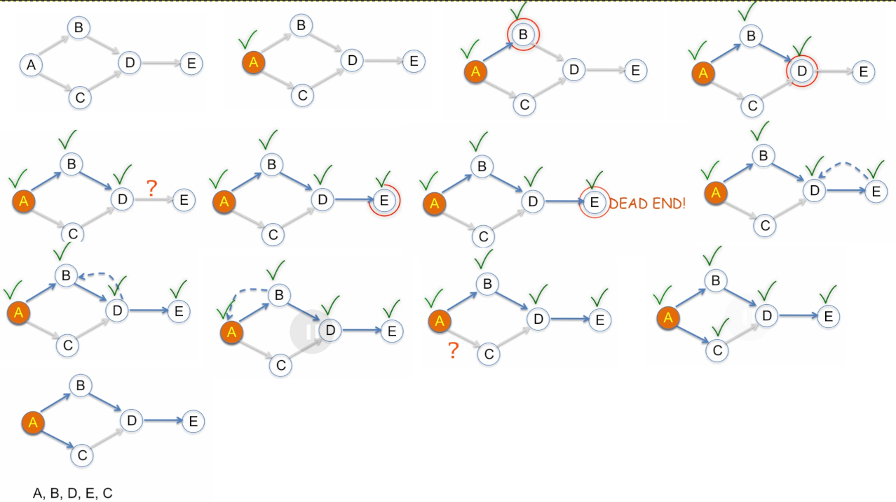

## DFS Simultion 2
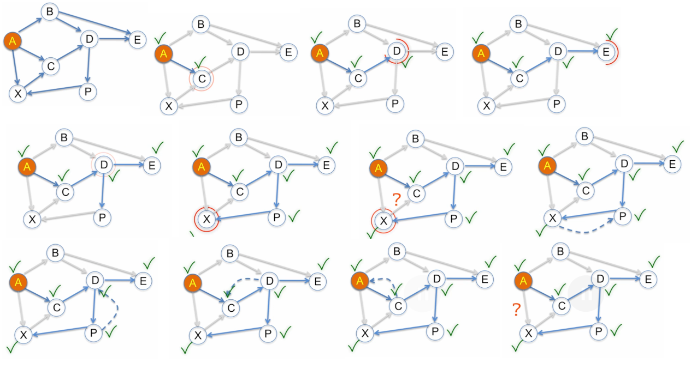
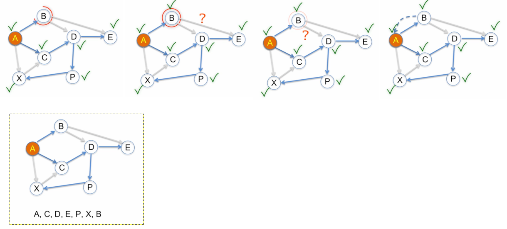

## DFS Simultion 3 
### Disconnected Graph
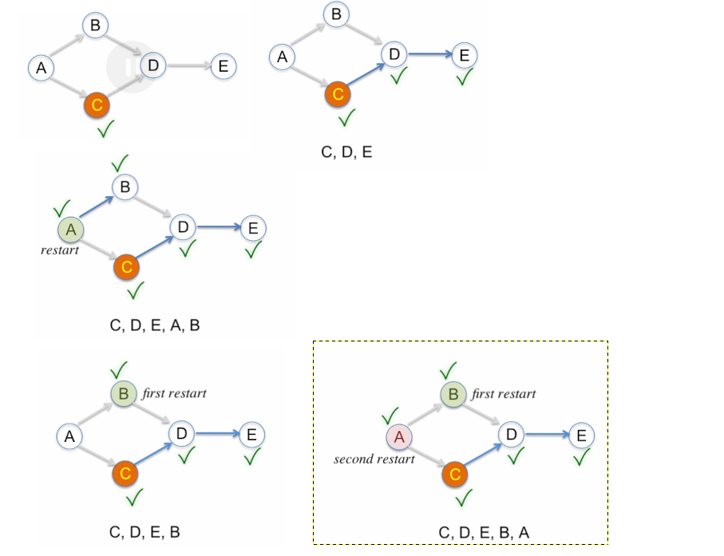

## DFS Simultion 4 
### Disconnected Graph : needs to restart from the unvisited disconnected node
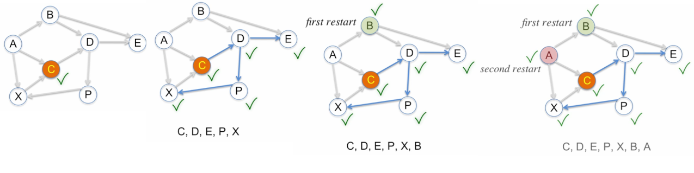

## DFS Simultion 5 
### Disconnected Graph : needs to restart from the unvisited disconnected node
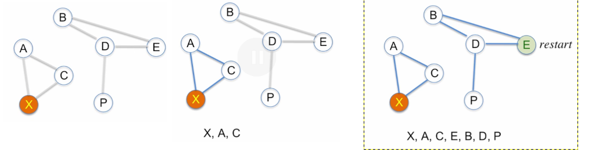

# BFS
## BFS Simultion 1
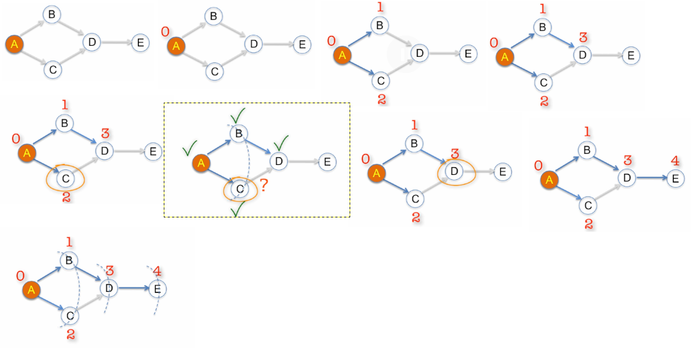

## BFS Simultion 2
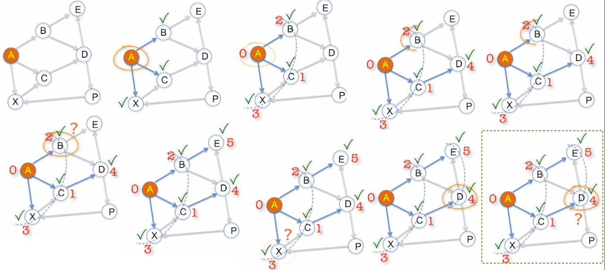
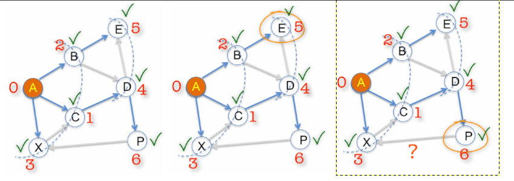

## BFS Simultion 3
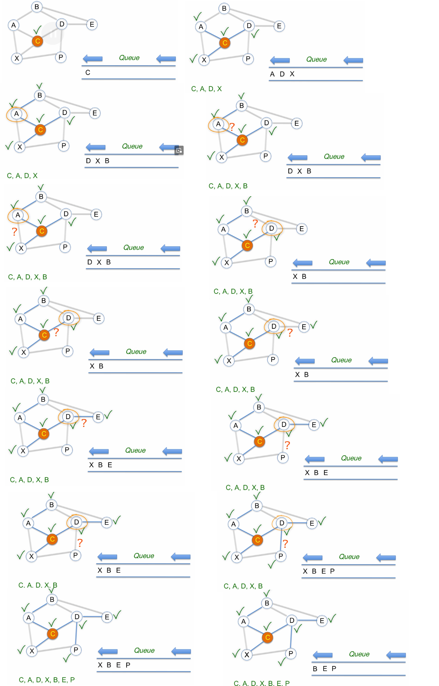
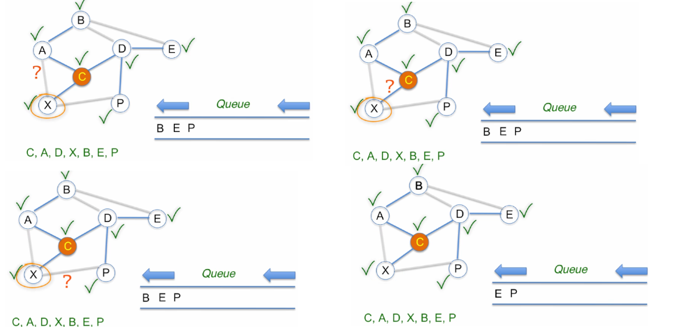
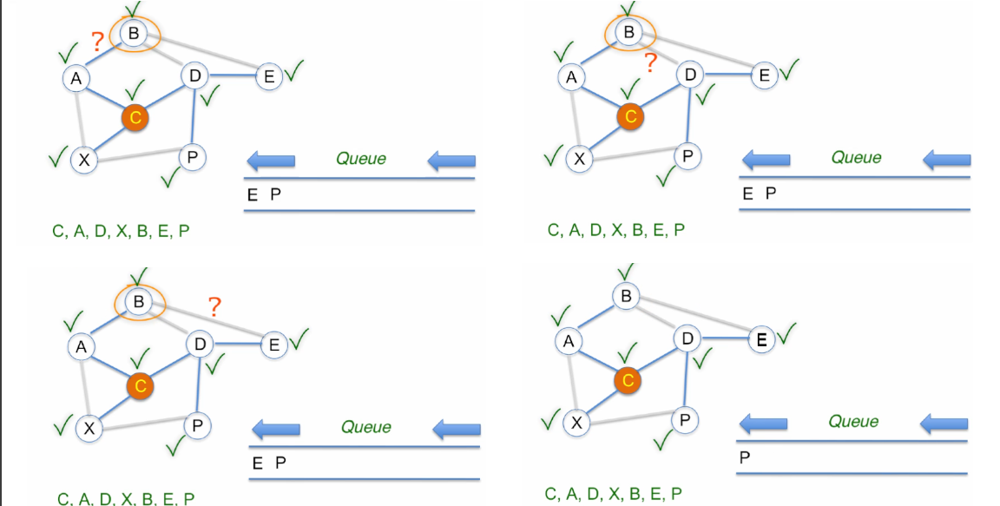
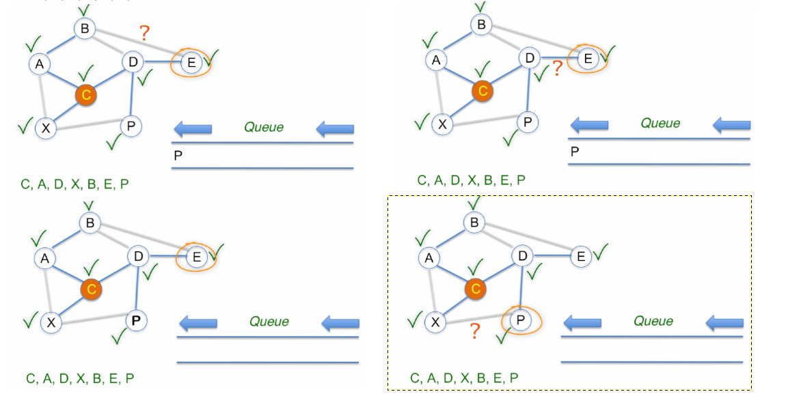
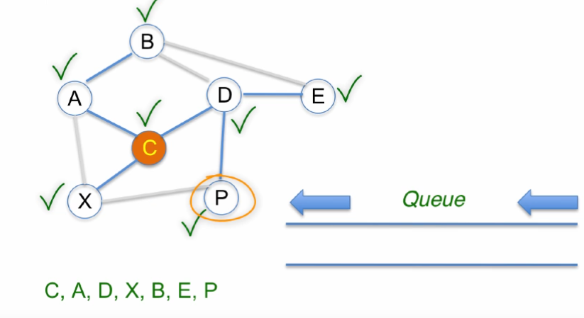

## BFS Simultion 4
### Disconnected Graph : needs to restart from the unvisited disconnected node
