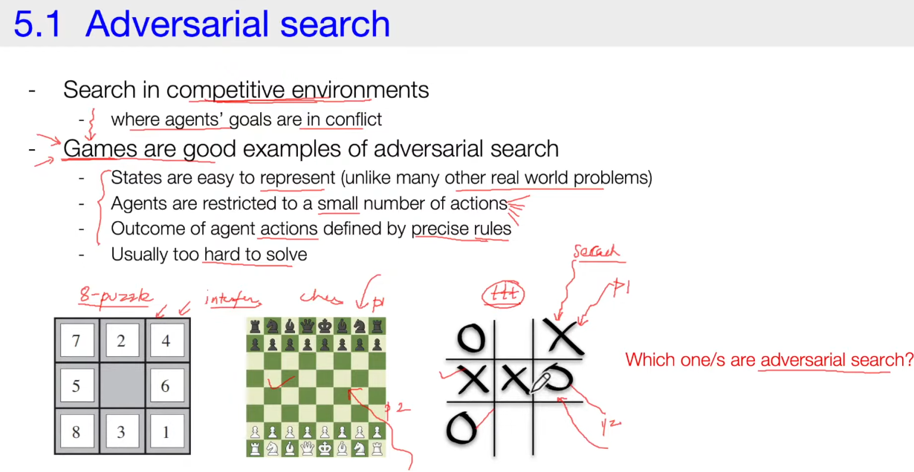

---
# Minimax Search Algorithm
---


---

##  What is Minimax?

The **Minimax algorithm** is a classic decision-making algorithm used in **two-player, zero-sum games** like Tic-Tac-Toe, Chess, or Checkers.

* One player is the **Maximizer (When self move/your turn)**: tries to maximize the score (utility).
* The other is the **Minimizer (When opponent move/opponent turn)**: tries to minimize the score.
* Both players are assumed to play **optimally**.

The game is represented as a **game tree**, where nodes = game states and edges = moves.

---

###  How it Works

1. **Generate the game tree** from the current position down to some depth (possibly to the end of the game).
2. **Evaluate terminal states** (leaf nodes) using:

   * a payoff function (e.g., +1 = win, −1 = loss, 0 = draw), or
   * a heuristic evaluation if the game is too complex to search fully.
3. **Propagate values upward**:

   * At a **Max node** (your turn), pick the child with the **maximum value**.
   * At a **Min node** (opponent’s turn), pick the child with the **minimum value**.
4. At the root, choose the move corresponding to the best value.

---

###  Example (Tic-Tac-Toe)

Suppose we’re at a state where X is to move, and the algorithm expands all possible moves:

* If a move leads to a win → leaf score = `+1`
* If a move leads to a loss → leaf score = `−1`
* If a move leads to a draw → leaf score = `0`

The values are propagated back:

* If X (Max) finds any path with `+1`, it will choose it.
* If O (Min) finds any path with `−1` (good for O, bad for X), it will enforce it.

Thus, the algorithm guarantees the best outcome **assuming both play perfectly**.

---

###  Complexity

* **Time complexity:** $O(b^d)$

  * $b$ = branching factor (average number of moves)
  * $d$ = depth of the tree
* **Space complexity:** $O(bd)$ or $O(d)$ with depth-first recursion

This grows very fast — which is why optimizations like **alpha-beta pruning** are usually applied.

---

✅ **Summary**:
Minimax is the foundation of adversarial search — it searches the game tree, assumes optimal play, and chooses the move that maximizes your minimum guaranteed payoff.

---


### **Minimax search is almost always implemented using Depth-First Search (DFS)**. Let me explain how and why.

---

#### Why DFS for Minimax?

* The game tree can be *huge* (e.g., chess has branching factor ~35 and depth ~80).
* We don’t want to store the whole tree in memory → DFS explores one branch fully, then backtracks.
* This gives **low space complexity**: only $O(d)$, where $d$ = depth.
* It fits naturally with the recursive definition of minimax.

---


#### Example (DFS in Minimax Tree)

Imagine a depth-2 game tree:

```
         (root, Max)
        /           \
     (Min)         (Min)
    /   \         /    \
  +3    −1     +2     0
```

DFS order (left to right):

1. Explore left Min → child +3 → return +3
2. Still in left Min → explore child −1 → return −1 → Min picks **min(+3, −1) = −1**
3. Backtrack → right Min → child +2 → return +2
4. Then child 0 → return 0 → Min picks **min(+2, 0) = 0**
5. Finally, Max picks **max(−1, 0) = 0**

So the best move for Max at root is **value = 0**.

---

#### Time and Space

* **Time complexity:** still $O(b^d)$, because DFS must visit all nodes.
* **Space complexity:** only $O(d)$ (stack depth), much better than storing the entire tree.

---

✅ **Summary**:
Minimax is naturally implemented with **DFS recursion**: go down one path to depth, evaluate, backtrack, and propagate scores up. This makes it memory-efficient, but still exponential in time without optimizations (like alpha-beta pruning).

---


### Complexity Analysis of Minimax Search Algorithm (with DFS)
#### **Assumptions**

* Two-player, zero-sum game (e.g., Tic-Tac-Toe, Chess).
* Branching factor = $b$ (average legal moves per position).
* Depth = $d$ (how many moves ahead we search).
* Evaluation function used at depth limit if game not finished.

---

#### **Time Complexity**

* Minimax with DFS explores the entire game tree to depth $d$.
* Number of nodes in the tree is about:

  $$
  O(b^d)
  $$
* Why: At depth 1 → $b$ nodes; depth 2 → $b^2$; … depth $d$ → $b^d$.
* Total work ≈ geometric series → dominated by $b^d$.

**Examples:**

* Tic-Tac-Toe ($b \approx 9, d \approx 9$): feasible, ~$9^9 \approx 387M$ nodes max, but many are cut early.
* Chess ($b \approx 35, d \approx 80$): impossible to compute fully — need heuristics + pruning.

---

#### **Space Complexity**

* DFS implementation → only need to store one path at a time.
* Maximum call stack depth = $d$.

$$
O(d)
$$

* If you generate all children at once, memory = $O(b \cdot d)$.

---

#### **Optimality**

* If the game tree is searched to terminal states → **Minimax always finds the optimal move** (guarantees best outcome with perfect play).
* If search depth is limited → optimality depends on **quality of evaluation function** at cut-off depth.

---

#### **Practical Performance Issues**

* **Exponential growth**: even small increases in depth cause big increases in time.
* **Branching factor sensitivity**: games with high $b$ (like Go, $b \approx 250$) are nearly impossible for raw minimax.
* **Symmetries & repetitions**: wasted effort if not cached (use **transposition tables**).
* **Move ordering**: doesn’t matter in plain minimax, but critical when adding **alpha-beta pruning** (to maximize pruning efficiency).

---

####  **With Alpha-Beta Pruning**

* Best case (perfect move ordering):

  $$
  O(b^{d/2})
  $$

  → effectively doubles the depth you can search.
* Worst case: still $O(b^d)$.
* Space remains $O(d)$.

---

✅ **Summary Table**

| Algorithm            | Time Complexity                   | Space Complexity | Notes                                  |
| -------------------- | --------------------------------- | ---------------- | -------------------------------------- |
| Minimax (DFS)        | $O(b^d)$                          | $O(d)$           | Guarantees optimal move if full search |
| Minimax + Alpha-Beta | $O(b^{d/2})$ best, $O(b^d)$ worst | $O(d)$           | Same result, faster in practice        |

---


### **Q&A sheet with short answers** for performance analysis of **Minimax (DFS)** and its variants:

---

#### 1. Complexity & Efficiency

**Q:** What is the time complexity of minimax?
**A:** $O(b^d)$, where $b$ = branching factor, $d$ = depth.

**Q:** What is the space complexity (DFS)?
**A:** $O(d)$ for recursion stack (or $O(bd)$ if children stored).

**Q:** Why exponential time?
**A:** Each depth multiplies nodes by $b$; total grows as $b^d$.

**Q:** How do $b$ and $d$ affect performance?
**A:** Large $b$ or $d$ quickly make search infeasible.

**Q:** Compare minimax vs. alpha-beta.
**A:** Same result, but alpha-beta prunes nodes → faster.

**Q:** Best case complexity of alpha-beta?
**A:** $O(b^{d/2})$, doubling effective depth.

---

#### 2. Practical Game Scenarios

**Q:** Why feasible for Tic-Tac-Toe but not Chess?
**A:** Tic-Tac-Toe has small tree; Chess has huge $b$ and $d$.

**Q:** How many nodes for $b=10, d=5$?
**A:** $10^5 = 100,000$.

**Q:** If $b=30$, how deep in 1 second?
**A:** Very shallow (~3–4 moves), since $30^4 = 810,000$.

**Q:** Why use depth-limited search + heuristics?
**A:** Full search is too large; heuristics approximate evaluation.

---

#### 3. Optimality & Limitations

**Q:** When does minimax guarantee optimal move?
**A:** If search reaches all terminal states.

**Q:** Why does depth limit reduce optimality?
**A:** Cut off before endgame → rely on imperfect heuristics.

**Q:** Role of evaluation function?
**A:** Determines accuracy at cut-off depth; better function = stronger play.

**Q:** Can minimax handle non-zero-sum games?
**A:** No, it assumes zero-sum; need variants like Maxⁿ.

---

#### 4. Optimizations & Improvements

**Q:** How does alpha-beta improve performance?
**A:** Prunes branches that can’t affect final decision.

**Q:** What affects pruning amount?
**A:** Move ordering (good ordering = more pruning).

**Q:** Why is move ordering important?
**A:** Good moves first → earlier cutoffs → fewer nodes explored.

**Q:** What is iterative deepening?
**A:** Repeatedly deepen search; ensures best found move if time runs out.

**Q:** What are transposition tables?
**A:** Cache evaluated positions; avoid re-computation.

---

#### 5. Theoretical & Applied

**Q:** Why is minimax a DFS algorithm?
**A:** It explores one branch fully before backtracking.

**Q:** Compare minimax vs. negamax.
**A:** Negamax is a simplified implementation (same logic, symmetric evaluation).

**Q:** Compare minimax vs. expectimax.
**A:** Expectimax handles randomness (e.g., dice games) using expected values.

**Q:** How does performance relate to real-time constraints?
**A:** Must cut depth + use heuristics, since full search is too slow.

**Q:** How to measure minimax performance experimentally?
**A:** Count nodes expanded, measure runtime, compare pruning efficiency.

---

✅ Now you have **short, exam-style answers** to the key performance analysis questions.

Do you want me to turn this into a **condensed revision sheet (one-page summary)** for quick study?


---
# minimax and alpha-beta pruning
---


Got it 👍 — let’s go over **Alpha–Beta pruning**, the standard optimization of minimax.

---

#### What is Alpha–Beta Pruning?

* An **optimization** of the minimax algorithm.
* It **cuts off (prunes)** branches of the game tree that cannot possibly influence the final decision.
* This does **not change the result** of minimax — only reduces the number of nodes explored.

---

#### Key Idea

* Two values are tracked during DFS search:

  * **α (alpha):** the best (highest) score the maximizer can guarantee so far.
  * **β (beta):** the best (lowest) score the minimizer can guarantee so far.
* If at any point **α ≥ β**, further exploration of that branch is **useless** → prune.

---


#### Example (Pruning)

```
          MAX
       /       \
    MIN          MIN
   /   \        /   \
  3     5      2     ?
```

* Left MIN → chooses min(3, 5) = 3.
* Root MAX now has α = 3 (best so far).
* Right MIN → first child = 2, so β = 2.
* Now α (3) ≥ β (2) → prune the `?` branch (no need to check).

---

#### Performance

* **Worst case:** same as minimax → $O(b^d)$.
* **Best case (perfect ordering):**

  $$
  O(b^{d/2})
  $$

  → effectively doubles the depth you can search.
* **Space complexity:** $O(d)$ (DFS recursion).

---

#### Summary

* **Minimax explores all nodes** → exponential blow-up.
* **Alpha–Beta skips useless branches** → big speed-up.
* Works best when **good move ordering** is applied.

---
