# Lecture 1: Introduction to Data Analysis & Data Preprocessing

# 📊 What is Data Analysis?

Data Analysis is the process of: **[ICTM]**

    🔍 Inspecting,

    🧹 Cleaning,

    🔄 Transforming, and

    🧠 Modeling data

- Business: Customer segmentation, demand forecasting, fraud detection.
- Healthcare: Predicting disease outbreaks, patient diagnostics, personalized treatments.
- Finance: Credit risk assessment, stock price prediction, fraud detection.
- Science & Research: Climate change analysis, genomics, space exploration.
- Social Media & Marketing: Sentiment analysis, targeted advertising, user behavior
insights.


## 📊 Types of Data Analysis **[DaDdy PaPi]**
### 1️⃣ Descriptive Analysis

    Purpose: Understand what has happened in the past.

    Examples: Averages, totals, counts, histograms, summary statistics.

    📘 "What happened?"

### 2️⃣ Diagnostic Analysis

    Purpose: Discover why something happened.

    Methods: Drill-down, correlations, trend patterns.

    📘 "Why did it happen?"

### 3️⃣ Predictive Analysis

    Purpose: Forecast what is likely to happen in the future.

    Techniques: Regression, classification, machine learning models.

    📘 "What could happen?"

### 4️⃣ Prescriptive Analysis

    Purpose: Suggest what actions to take for optimal outcomes.

    Tools: Optimization algorithms, decision trees, scenario analysis.

    📘 "What should we do?"
    


# 📚 Understanding Data
## 🧩 Types of Data
### 1️⃣ Structured Data

    🔹 Definition: Well-organized and stored in tabular formats.

    🗂️ Examples:

        Relational databases (MySQL, PostgreSQL)

        Excel spreadsheets

### 2️⃣ Unstructured Data

    🔹 Definition: Data without a predefined model or organization.

    🖼️ Examples:

        Images, videos

        Social media posts

        Emails

### 3️⃣ Semi-structured Data

    🔹 Definition: Contains some structure, but not in a strict tabular format.

    🔸 Examples:

        JSON

        XML

# 📏 Quantitative vs. Qualitative Data
## 🔢 Quantitative Data

    Definition: Numerical data that can be measured and analyzed statistically.

    Examples: Revenue, temperature, age

## 📝 Qualitative Data

    Definition: Descriptive data representing categories or labels.

    Examples: Gender, nationality, product category

### 🔹 Nominal Data

    Categories without order

    Examples: Colors, countries, departments

### 🔸 Ordinal Data

    Categories with a meaningful order

    Examples: Customer satisfaction (low, medium, high), education level


# 3. Data Preprocessing

Data preprocessing is a crucial step to ensure data quality and reliability before analysis.

---

## Steps in Data Preprocessing

1. **Data Cleaning**  
   Removing inaccuracies, fixing typos, and handling inconsistencies.

2. **Handling Missing Values**  
   Identifying and addressing missing data points.

3. **Removing Duplicates**  
   Ensuring data integrity by removing redundant records.

4. **Outlier Detection and Handling**  
   Identifying extreme values that could skew analysis.

5. **Feature Scaling and Transformation**  
   Normalizing or standardizing data for model compatibility.

---

## Data Cleaning

- Fix typos (`"N/A"` vs `"NA"` vs `"null"` vs empty strings `""` convert them to `NAN`).
- Correct formatting (e.g., date formats like DD/MM/YYYY → YYYY-MM-DD).
 - **Case Inconsistencies**  
  Values like `"Yes"`, `"yes"`, `"YES"` should be unified.
    - **Fix:** Convert all text to lowercase or uppercase. 
- **Spelling Errors and Typos**  
     Common in categorical data (e.g., `"Male"`, `"male"`, `"mael"`).
     - **Fix:** Use mapping or fuzzy matching to correct.  
- - **Whitespace and Formatting Issues**  
     Extra spaces before/after text can cause mismatches.
     - **Fix:** Strip whitespace from strings.  
- - **Incorrect Data Types**  
     Numeric columns stored as strings or dates not in datetime format.
     - **Fix:** Convert columns to appropriate types.  
    
## Handling Missing Values

- **Causes:** Data entry errors, system failures, data corruption.

- **Methods to Handle Missing Data:**
  - **Deletion:** Remove rows or columns with missing values  
    _Example: `df.dropna()`_
  - **Imputation:** Fill missing values using mean, median, mode, or interpolation
  - **Forward Fill / Backward Fill:** Use previous or next values in time series data
  - **Predictive Imputation:** Use machine learning models to estimate missing values
---

## Removing Duplicates

- Duplicate records can arise from multiple data entry points or merging datasets.
- Use the following to eliminate redundant data:  
  _`df.drop_duplicates(inplace=True)`_

---

## Outlier Detection and Handling

- **Why Outliers Matter:**  
  Extreme values can bias statistical analysis and machine learning models.

- **Detection Methods:**
  - **Z-score method:** Identifies values that deviate significantly from the mean
  - **Interquartile Range (IQR):** Identifies values beyond 1.5 times the IQR

- **Handling Outliers:**
  - Remove extreme values
  - Cap values within a threshold
  - Apply transformations (e.g., log transformation)

---

## Feature Scaling and Transformation

- Ensures uniformity in numerical features and improves model convergence.

- **Types of Scaling:**
  - **Standardization:**  
    \[(X - \text{mean}) / \text{std\_dev}\]  
    Ensures zero mean and unit variance

  - **Normalization:**  
    \[(X - \text{min}) / (\text{max} - \text{min})\]  
    Scales values between 0 and 1

  - **Log Transformation:**  
    Used for skewed data to reduce variance

# Data Preprocessing Steps
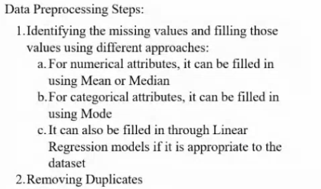
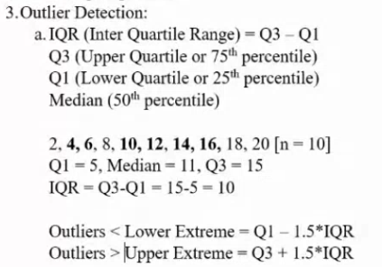
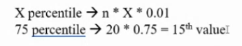


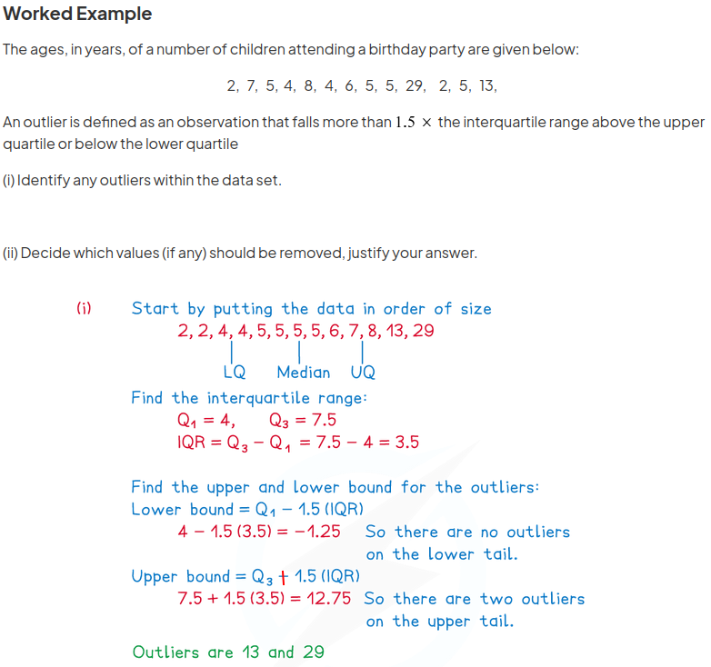
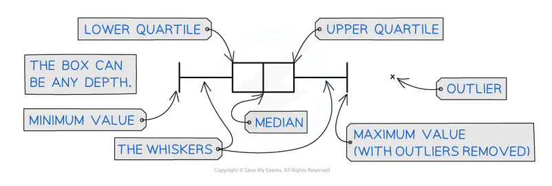


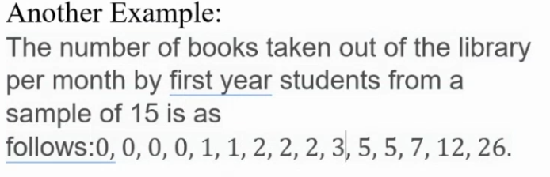
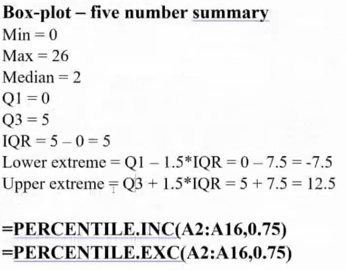


## Outlier Detection
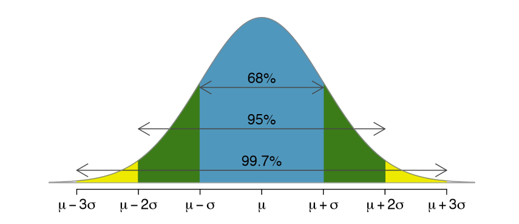

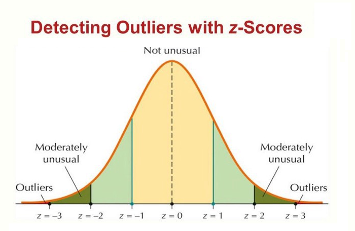
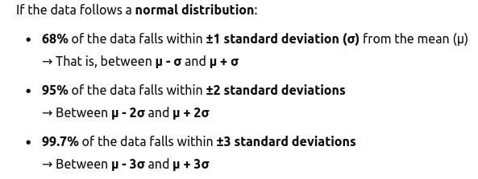
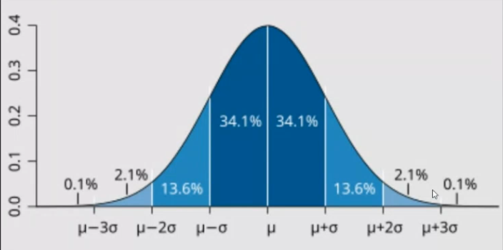
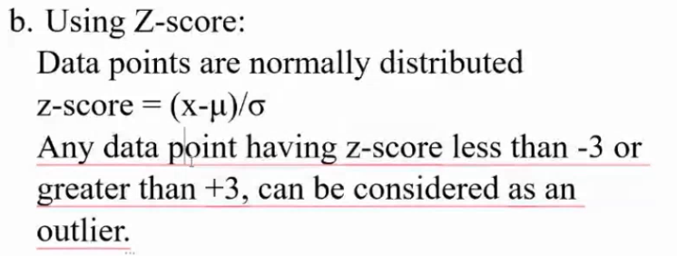
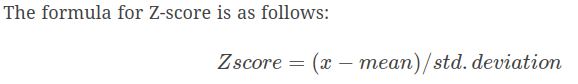

### how to find normally distributed
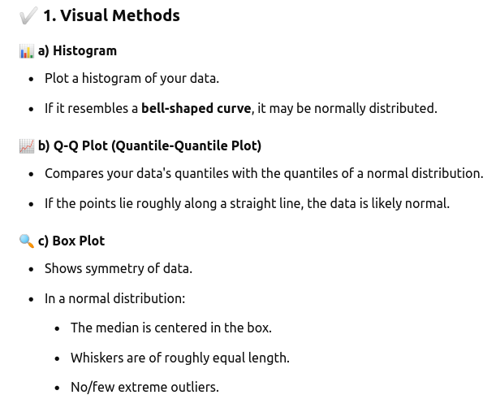

```
z = (X — μ) / σ​

Here’s what each component means:

    Z is the Z-score we’re calculating.
    X is the specific data point we want to evaluate.
    μ (mu) is the mean (average) of the dataset.
    σ (sigma) is the standard deviation, which measures how spread out the data is.
```

# Documents
- https://www.savemyexams.com/international-a-level/maths/edexcel/20/statistics-1/revision-notes/data-presentation-and-interpretation/working-with-data/outliers/
- 
