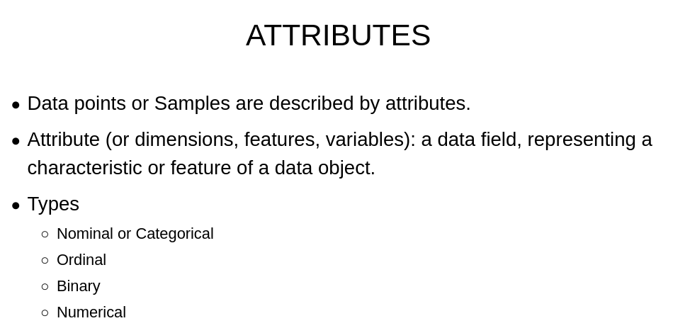
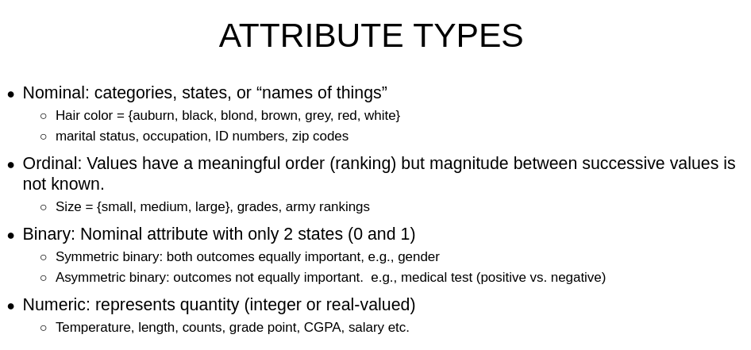
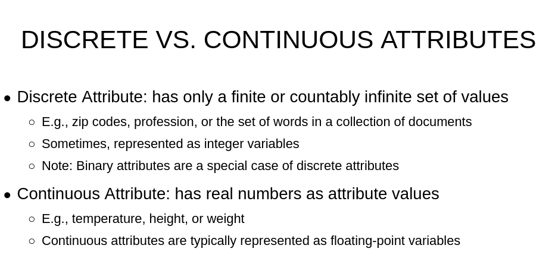
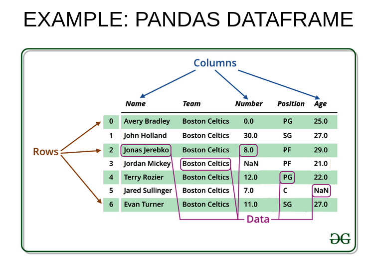
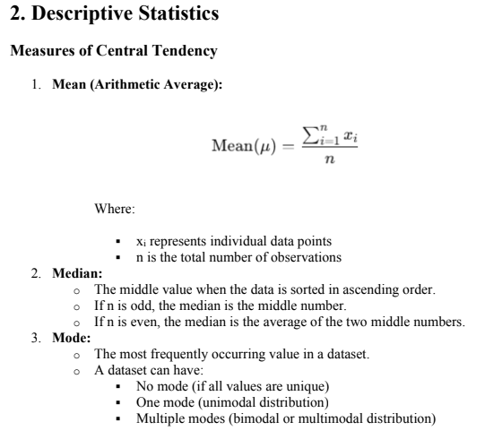
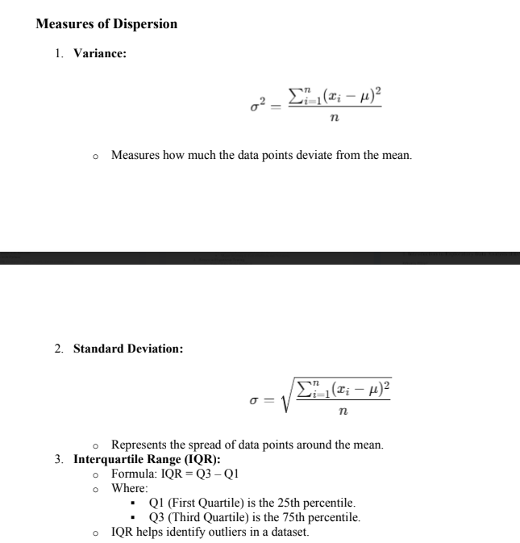
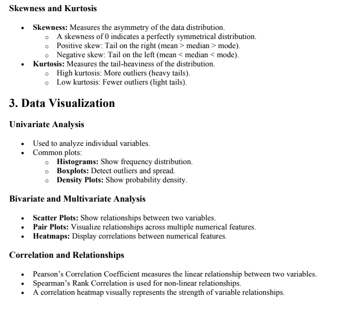

# 📊 Exploratory Data Analysis (EDA)

## What is EDA?

**Exploratory Data Analysis (EDA)** is the process of analyzing and visualizing datasets to:

- Summarize key characteristics of the data
- Identify patterns and trends
- Detect anomalies and outliers
- Understand variable relationships
- Prepare the data for machine learning models

---

## ✅ Why is EDA Important?

- Helps understand the **structure and distribution** of the data
- Detects **anomalies**, **outliers**, and **missing values**
- Identifies **relationships between variables** for feature selection
- Guides **feature engineering** and **model selection**
- Improves understanding of potential issues before model training

---

## 🔧 Common EDA Techniques

### 🔹 Visual Techniques

- **Histograms** – Understand distribution of numerical features
- **Box Plots** – Identify outliers
- **Bar Charts / Pie Charts** – Analyze categorical variables
- **Scatter Plots** – Explore relationships between variables
- **Heatmaps** – Show correlation between numerical variables

### 🔹 Statistical Techniques

- **Descriptive Statistics** – Mean, median, mode, standard deviation
- **Value Counts** – Frequency of unique values
- **Skewness & Kurtosis** – Distribution shape
- **Correlation Matrix** – Strength of linear relationships
- **Missing Value Analysis** – Locate null or NaN values

---

# 🔍 EDA vs. Data Preprocessing

| **Aspect**         | **EDA (Exploratory Data Analysis)**                | **Data Preprocessing**                       |
|--------------------|----------------------------------------------------|----------------------------------------------|
| **Purpose**        | Understand data patterns and relationships         | Clean and prepare data for modeling          |
| **Techniques Used**| Visualization, descriptive statistics, correlations| Handling missing values, scaling, encoding   |
| **Focus**          | Interpretation and discovery                       | Data cleaning and transformation             |
| **Outcome**        | Insights and hypotheses                            | A ready-to-use dataset for machine learning  |
| **Tools Commonly Used** | `pandas`, `seaborn`, `matplotlib`             | `pandas`, `sklearn.preprocessing`, `numpy`   |
| **When Performed** | Before modeling, during exploration phase          | Before model training, after EDA             |

---

EDA and Data Preprocessing are **complementary steps** in the data science workflow:

- 🔹 **EDA** helps you understand **what the data is telling you**.
- 🔹 **Preprocessing** helps you **clean and shape** the data for models to understand it.

# 📊 Descriptive Statistics

## 📌 Measures of Central Tendency

Central tendency refers to values that represent the center or typical value of a dataset. The three main measures are:

A dataset can have:
- **No mode** (if all values are unique)  
- **One mode** → *unimodal distribution*  
- **Two modes** → *bimodal distribution*  
- **More than two modes** → *multimodal distribution*

---

## 💡 Summary

| Measure | Description                          | Sensitive to Outliers? |
|---------|--------------------------------------|------------------------|
| Mean    | Arithmetic average                   | ✅ Yes                 |
| Median  | Middle value                         | ❌ No                  |
| Mode    | Most frequent value                  | ❌ No                  |

---
# 📈 Pearson Correlation Coefficient [*** Most important]
# full calculation of the Pearson correlation coefficient $r$

## ✅ Pearson Correlation Coefficient Formula

$$
r = \frac{\sum (X_i - \bar{X})(Y_i - \bar{Y})}{(n - 1) \cdot s_x \cdot s_y}
$$

Alternatively (common form):

$$
r = \frac{\sum (X_i - \bar{X})(Y_i - \bar{Y})}{\sqrt{\sum (X_i - \bar{X})^2} \cdot \sqrt{\sum (Y_i - \bar{Y})^2}}
$$

## 🧮 Step-by-Step with Your Data

### 🔢 1. Raw X and Y values

| X  | Y  |
| -- | -- |
| 43 | 99 |
| 21 | 65 |
| 25 | 79 |
| 42 | 75 |
| 57 | 87 |
| 59 | 81 |

### 🔢 2. Calculate Means

$$
\bar{X} = \frac{43 + 21 + 25 + 42 + 57 + 59}{6} = \frac{247}{6} \approx 41.1667
$$

$$
\bar{Y} = \frac{99 + 65 + 79 + 75 + 87 + 81}{6} = \frac{486}{6} = 81
$$

### 🔢 3. Compute deviations and squares

| X  | Y  | $X_i - \bar{X}$ | $Y_i - \bar{Y}$ | $(X_i - \bar{X})^2$ | $(Y_i - \bar{Y})^2$ | Product $(X_i - \bar{X})(Y_i - \bar{Y})$ |
| -- | -- | --------------- | --------------- | ------------------- | ------------------- | ---------------------------------------- |
| 43 | 99 | 1.8333          | 18              | 3.3611              | 324                 | 33.0000                                  |
| 21 | 65 | -20.1667        | -16             | 406.6944            | 256                 | 322.6672                                 |
| 25 | 79 | -16.1667        | -2              | 261.3611            | 4                   | 32.3334                                  |
| 42 | 75 | 0.8333          | -6              | 0.6944              | 36                  | -5.0000                                  |
| 57 | 87 | 15.8333         | 6               | 250.6944            | 36                  | 95.0000                                  |
| 59 | 81 | 17.8333         | 0               | 318.0278            | 0                   | 0.0000                                   |

### 🔢 4. Compute sums

$$
\sum (X_i - \bar{X})^2 = 3.3611 + 406.6944 + 261.3611 + 0.6944 + 250.6944 + 318.0278 = \boxed{1240.8332}
$$

$$
\sum (Y_i - \bar{Y})^2 = 324 + 256 + 4 + 36 + 36 + 0 = \boxed{656}
$$

$$
\sum (X_i - \bar{X})(Y_i - \bar{Y}) = 33 + 322.6672 + 32.3334 - 5 + 95 + 0 = \boxed{478.0006}
$$

### 🔢 5. Compute standard deviations

$$
s_x = \sqrt{ \frac{\sum (X_i - \bar{X})^2}{n - 1} } = \sqrt{ \frac{1240.8332}{5} } = \sqrt{248.1666} \approx \boxed{15.7533}
$$

$$
s_y = \sqrt{ \frac{\sum (Y_i - \bar{Y})^2}{n - 1} } = \sqrt{ \frac{656}{5} } = \sqrt{131.2} \approx \boxed{11.4543}
$$

### 🔢 6. Final Pearson correlation calculation

$$
r = \frac{478.0006}{(5)(15.7533)(11.4543)} = \frac{478.0006}{902.6756} \approx \boxed{0.5296}
$$

## ✅ Final Answer

$$
\boxed{r \approx 0.530}
$$

This indicates a **moderate positive correlation** between X and Y.
