# 📊 Exploratory Data Analysis (EDA)

## What is EDA?

**Exploratory Data Analysis (EDA)** is the process of analyzing and visualizing datasets to:

- Summarize key characteristics of the data
- Identify patterns and trends
- Detect anomalies and outliers
- Understand variable relationships
- Prepare the data for machine learning models

---

## ✅ Why is EDA Important?

- Helps understand the **structure and distribution** of the data
- Detects **anomalies**, **outliers**, and **missing values**
- Identifies **relationships between variables** for feature selection
- Guides **feature engineering** and **model selection**
- Improves understanding of potential issues before model training

---

## 🔧 Common EDA Techniques

### 🔹 Visual Techniques

- **Histograms** – Understand distribution of numerical features
- **Box Plots** – Identify outliers
- **Bar Charts / Pie Charts** – Analyze categorical variables
- **Scatter Plots** – Explore relationships between variables
- **Heatmaps** – Show correlation between numerical variables

### 🔹 Statistical Techniques

- **Descriptive Statistics** – Mean, median, mode, standard deviation
- **Value Counts** – Frequency of unique values
- **Skewness & Kurtosis** – Distribution shape
- **Correlation Matrix** – Strength of linear relationships
- **Missing Value Analysis** – Locate null or NaN values

---

# 🔍 EDA vs. Data Preprocessing

| **Aspect**         | **EDA (Exploratory Data Analysis)**                | **Data Preprocessing**                       |
|--------------------|----------------------------------------------------|----------------------------------------------|
| **Purpose**        | Understand data patterns and relationships         | Clean and prepare data for modeling          |
| **Techniques Used**| Visualization, descriptive statistics, correlations| Handling missing values, scaling, encoding   |
| **Focus**          | Interpretation and discovery                       | Data cleaning and transformation             |
| **Outcome**        | Insights and hypotheses                            | A ready-to-use dataset for machine learning  |
| **Tools Commonly Used** | `pandas`, `seaborn`, `matplotlib`             | `pandas`, `sklearn.preprocessing`, `numpy`   |
| **When Performed** | Before modeling, during exploration phase          | Before model training, after EDA             |

---

EDA and Data Preprocessing are **complementary steps** in the data science workflow:

- 🔹 **EDA** helps you understand **what the data is telling you**.
- 🔹 **Preprocessing** helps you **clean and shape** the data for models to understand it.

# 📊 Descriptive Statistics

## 📌 Measures of Central Tendency

Central tendency refers to values that represent the center or typical value of a dataset. The three main measures are:
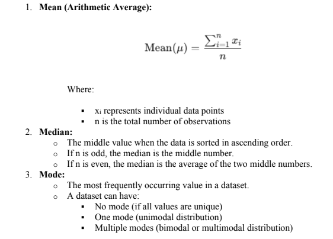

A dataset can have:
- **No mode** (if all values are unique)  
- **One mode** → *unimodal distribution*  
- **Two modes** → *bimodal distribution*  
- **More than two modes** → *multimodal distribution*

---

## 💡 Summary

| Measure | Description                          | Sensitive to Outliers? |
|---------|--------------------------------------|------------------------|
| Mean    | Arithmetic average                   | ✅ Yes                 |
| Median  | Middle value                         | ❌ No                  |
| Mode    | Most frequent value                  | ❌ No                  |

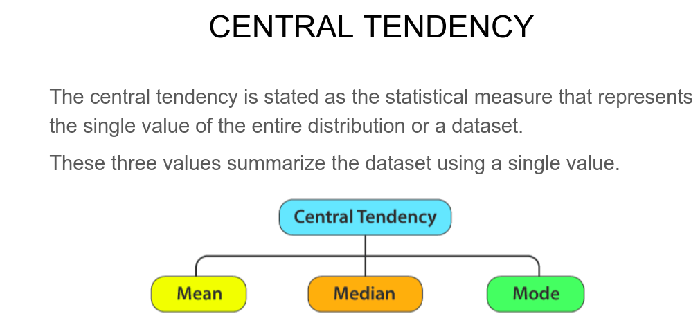
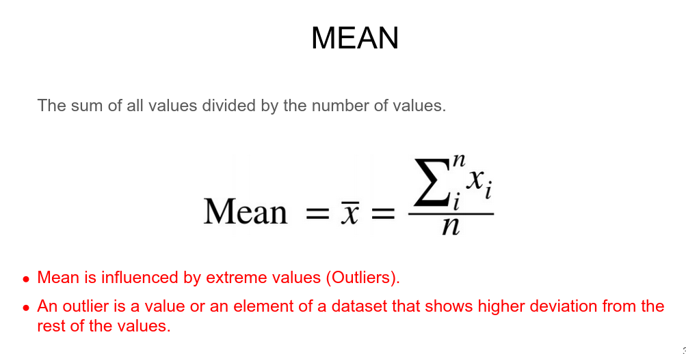

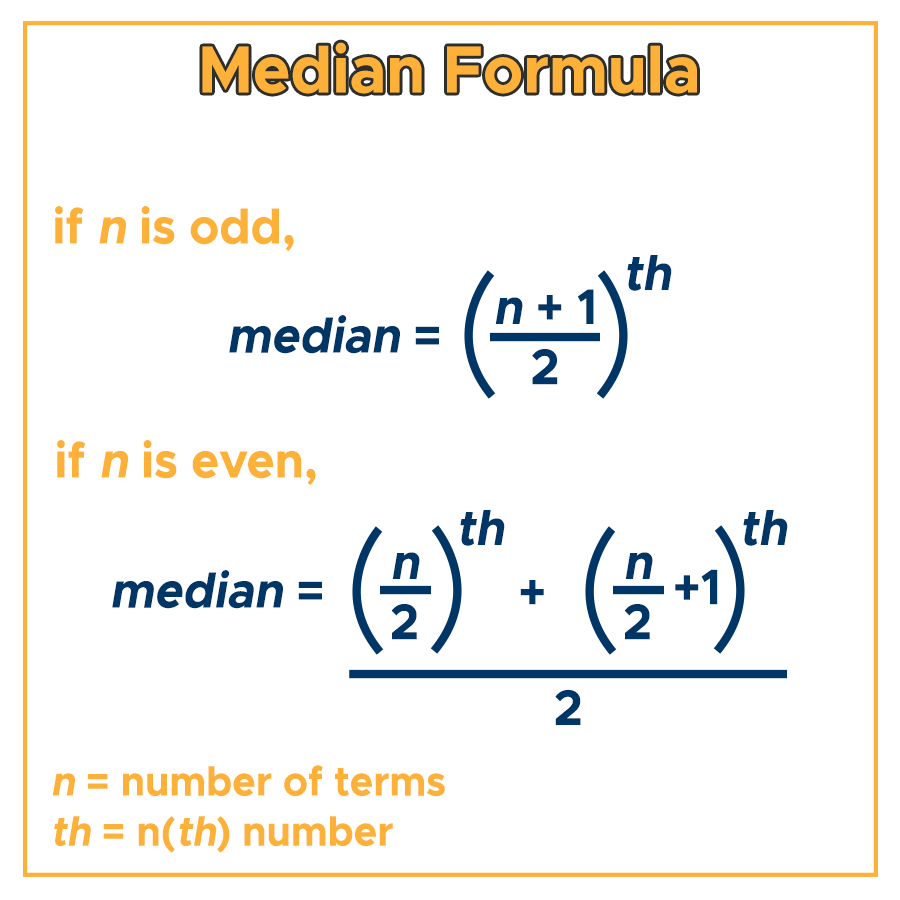
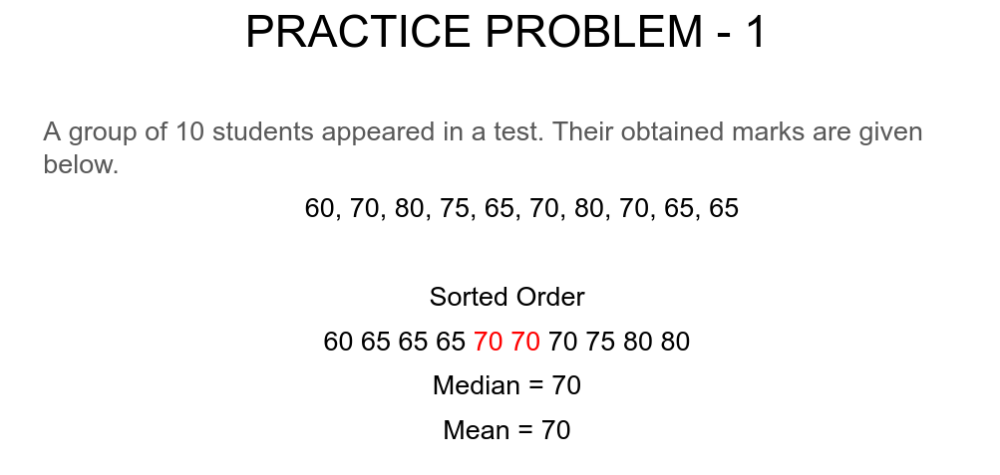
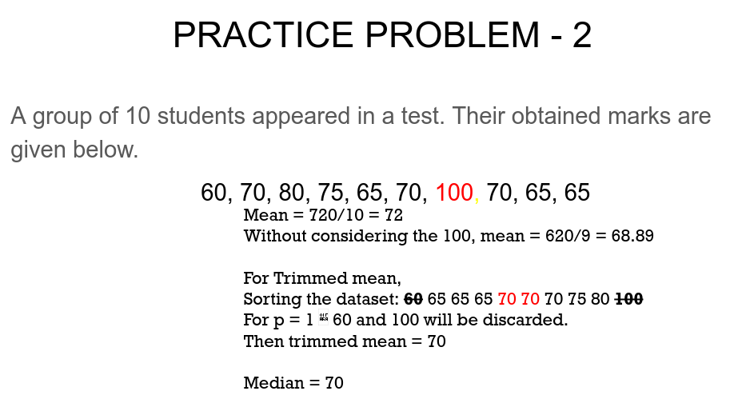
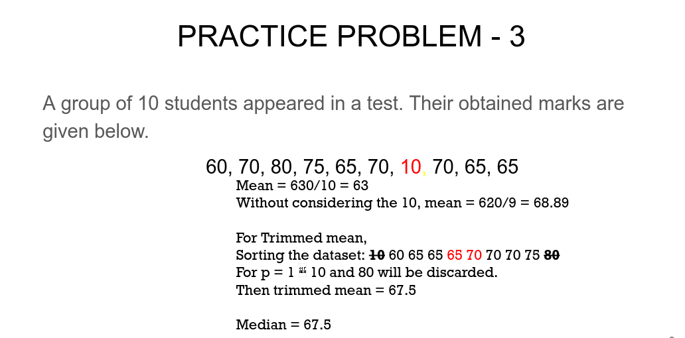
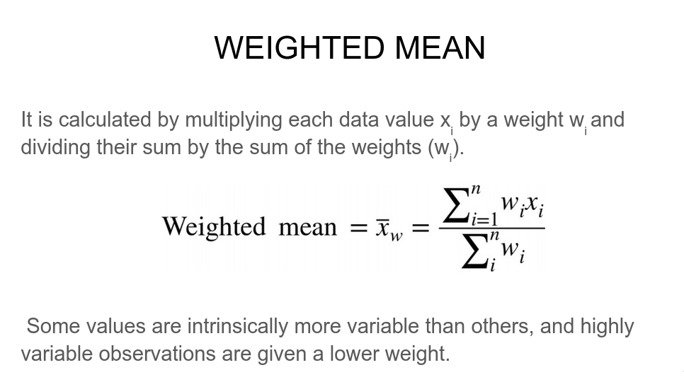

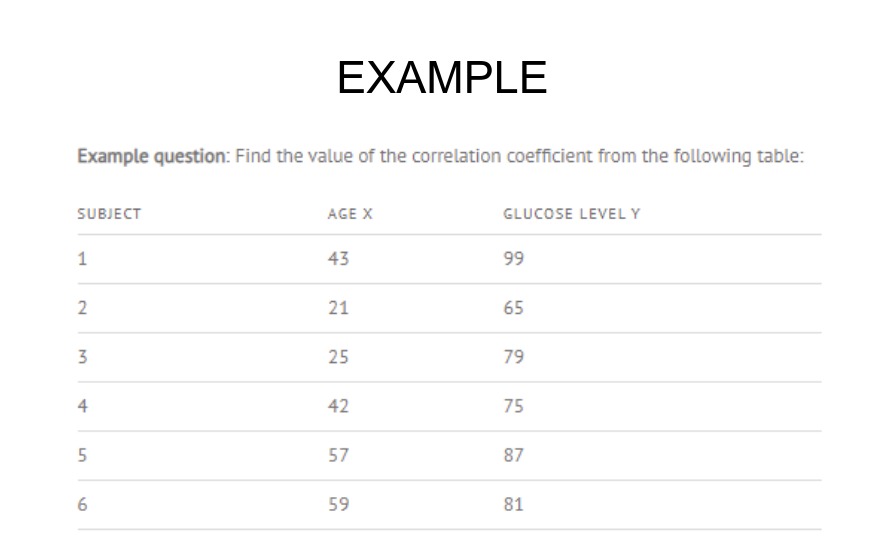
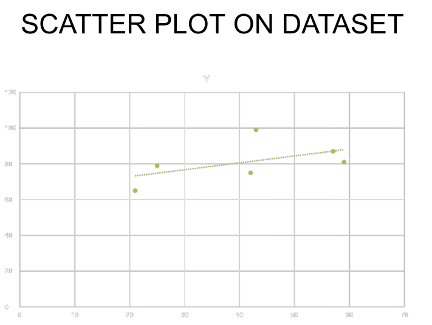
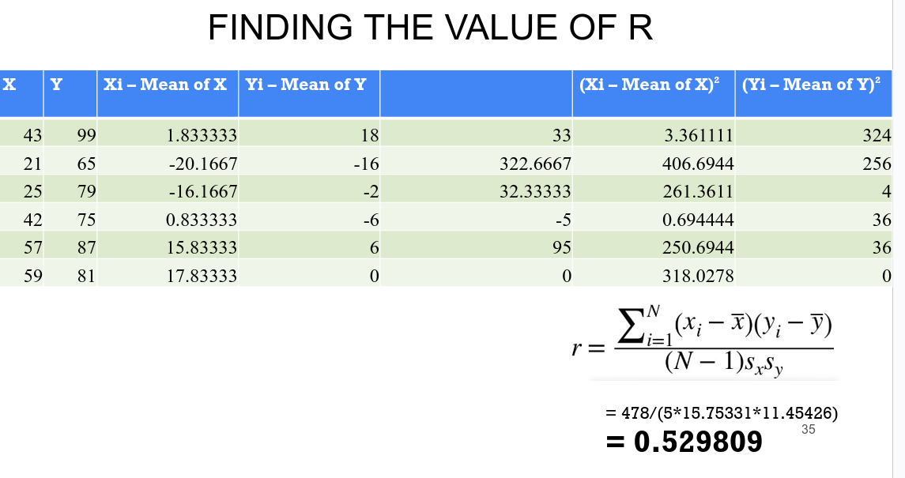
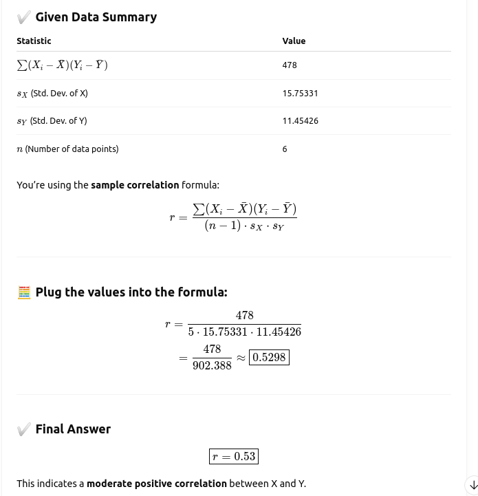