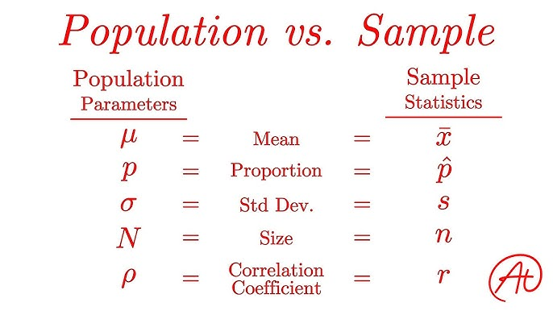
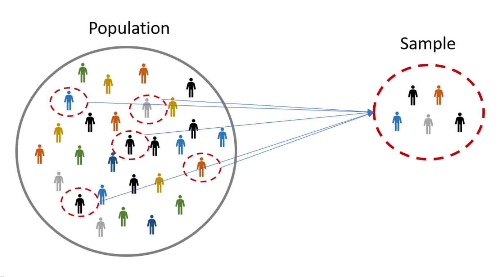
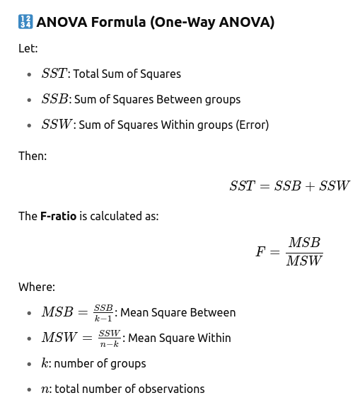
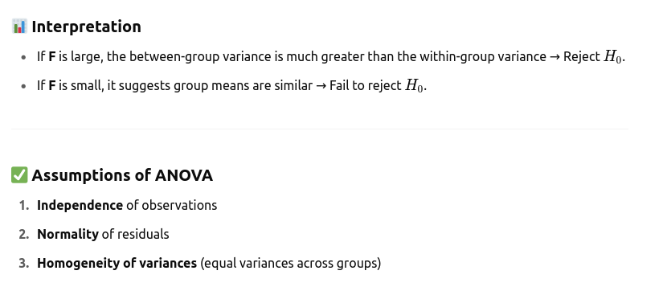
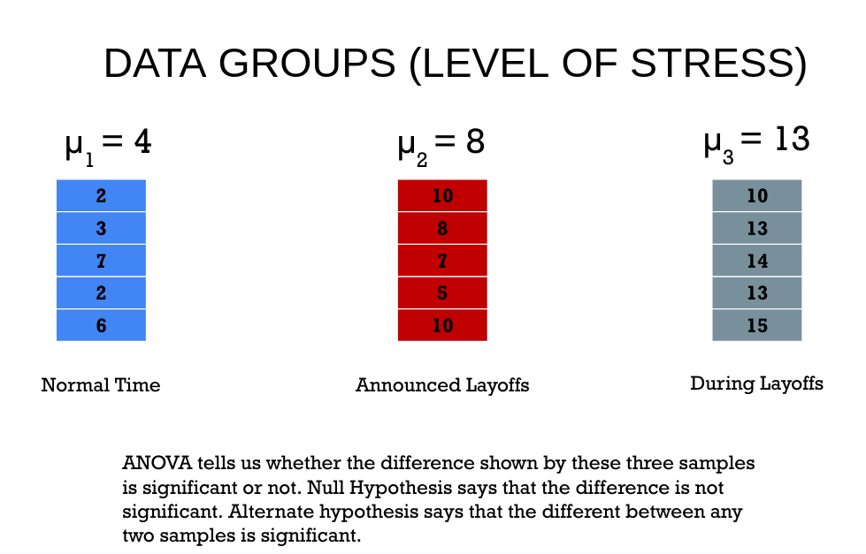
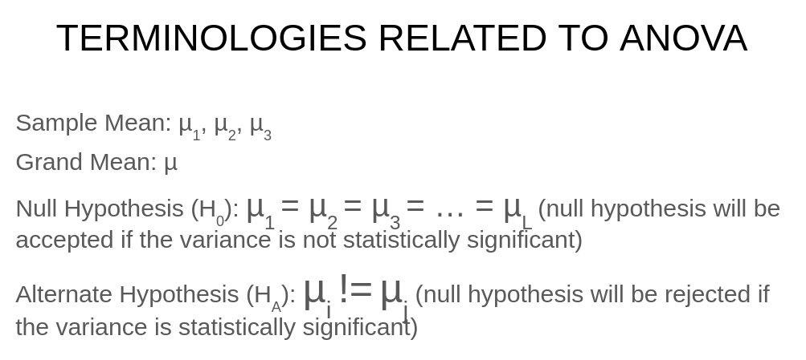
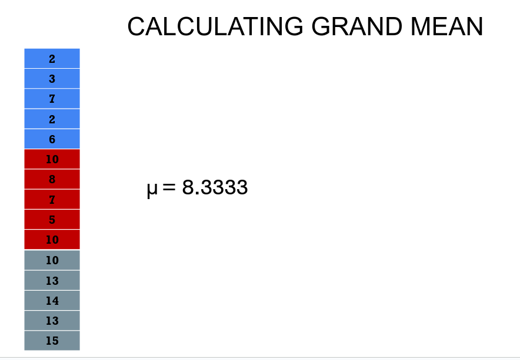
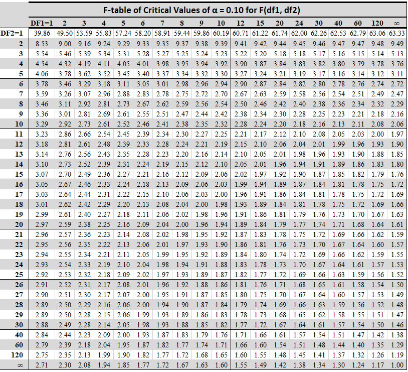
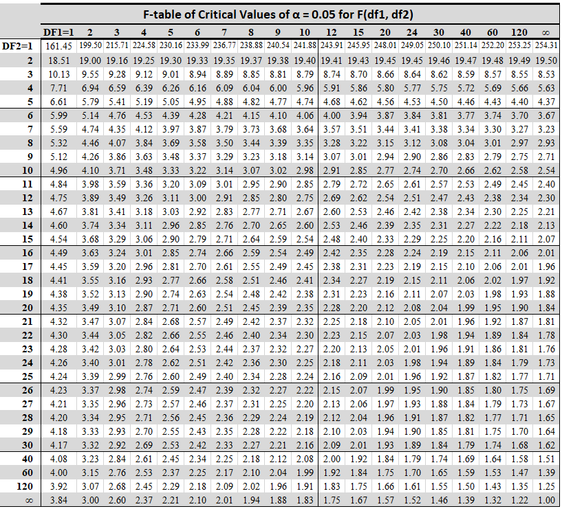
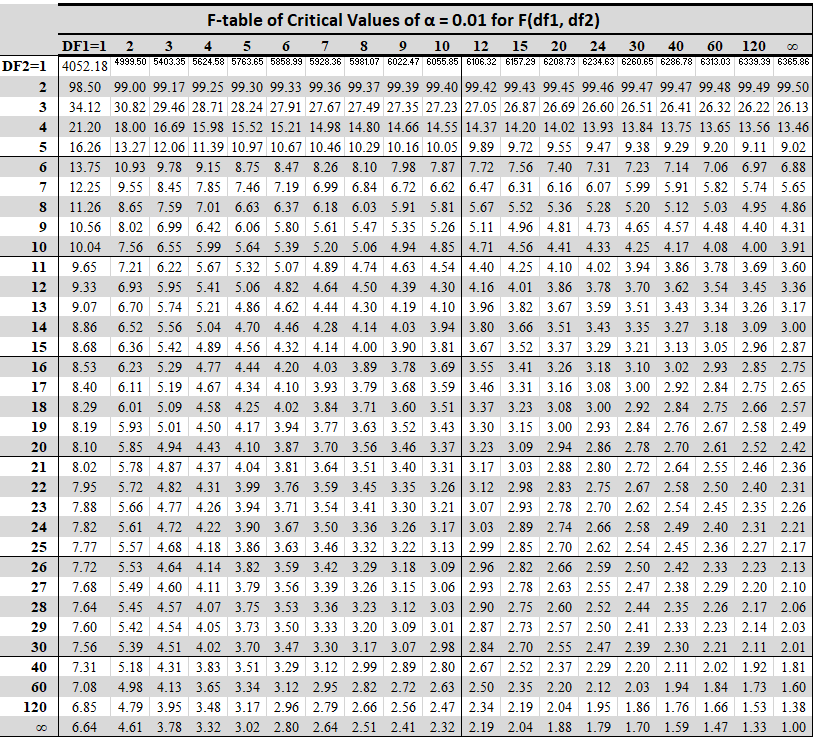

# population vs  sample

## Population vs Sample

| **Aspect**        | **Population**                                       | **Sample**                                              |
|-------------------|------------------------------------------------------|----------------------------------------------------------|
| **Definition**     | Whole Dataset       | A subset of the population    |
| **Definition**     | The entire group you're interested in studying       | A subset of the population used to represent the whole   |
| **Size**          | Usually large (could be infinite)                    | Always smaller than the population                       |
| **Examples**       | All adults in Bangladesh                             | 500 adults randomly selected/picked from Dhaka/population                  |
| **Purpose**        | True data or parameters (e.g., true average income) | To estimate characteristics of the population            |
| **Symbols used**   | μ (mean), σ (standard deviation), N (size)           | x̄ (mean), s (standard deviation), n (size)              |
| **Cost and Time** | Expensive and time-consuming to collect              | Cheaper and quicker to collect                           |
| **Accuracy**      | Provides complete information                         | Provides estimates, subject to sampling error            |

---

# Difference between z-test and t-test

## Z-test vs T-test

| **Aspect**               | **Z-test**                                           | **T-test**                                           |
|--------------------------|------------------------------------------------------|------------------------------------------------------|
| **Used When**            | Population standard deviation (σ) is known          | Population standard deviation is **unknown**         |
| **Sample Size**          | Large sample size (n ≥ 30)                          | Small sample size (n < 30)                          |
| **Distribution Used**    | Standard normal distribution (Z-distribution)       | Student’s t-distribution                            |
| **Test Statistic**       | Z = (x̄ - μ) / (σ / √n)                              | t = (x̄ - μ) / (s / √n)                              |
| **Accuracy**             | More accurate for large samples                     | More accurate for small samples                     |
| **Applications**         | Comparing sample and population means, proportions | Comparing two sample means or paired data           |
| **Example**              | Mean height of 1000 people vs national average      | Exam scores of 25 students vs class average         |

---

### ✅ In Short:
- Use **Z-test** when the sample is **large** and **σ (population SD) is known**.
- Use **T-test** when the sample is **small** and **σ is unknown**.

---------------
---------------
---------------
---------------

# ANOVA
- ANOVA stands for Analysis of Variance. 
- Put simply, ANOVA tells you if there are any statistically significant differences between the means of three or more independent groups.
- ANOVA is a statistical method used to compare three or more group means to determine whether at least one group mean is significantly different from the others. It helps test hypotheses about group differences using variance rather than means directly.
### ✅ Key Idea:

ANOVA decomposes the total variability in the data into:

1. Between-group variability (due to the effect of different treatments or groups)
2. Within-group variability (due to random error or natural differences among individuals within the same group)

Then it compares these two sources of variation to determine whether the observed differences among group means are statistically significant.
- 
- It works by analyzing the levels of variance within the groups through samples taken from each of them.
- 
- 

# F-Table Significance Level(0.10, 0.05, 0.01)
## F-table of Critical Values for Significance Level = 0.10

## F-table of Critical Values for Significance Level = 0.05

## F-table of Critical Values for Significance Level = 0.01

