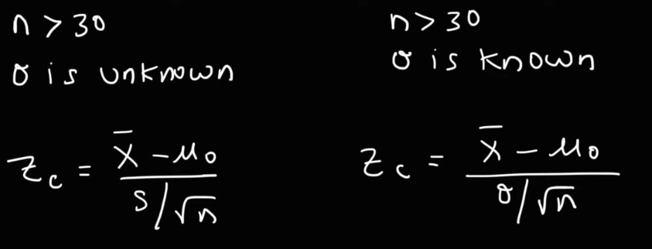

# Null & Alternative Hypothesis

---
# One-Tailed Test

- a distribution is one-sided so that it is
- either greater than or less than a certain value, but not both
- either left-tailed or right-tailed.