# Lecture 3: Hypothesis Testing and Statistical Inference
---

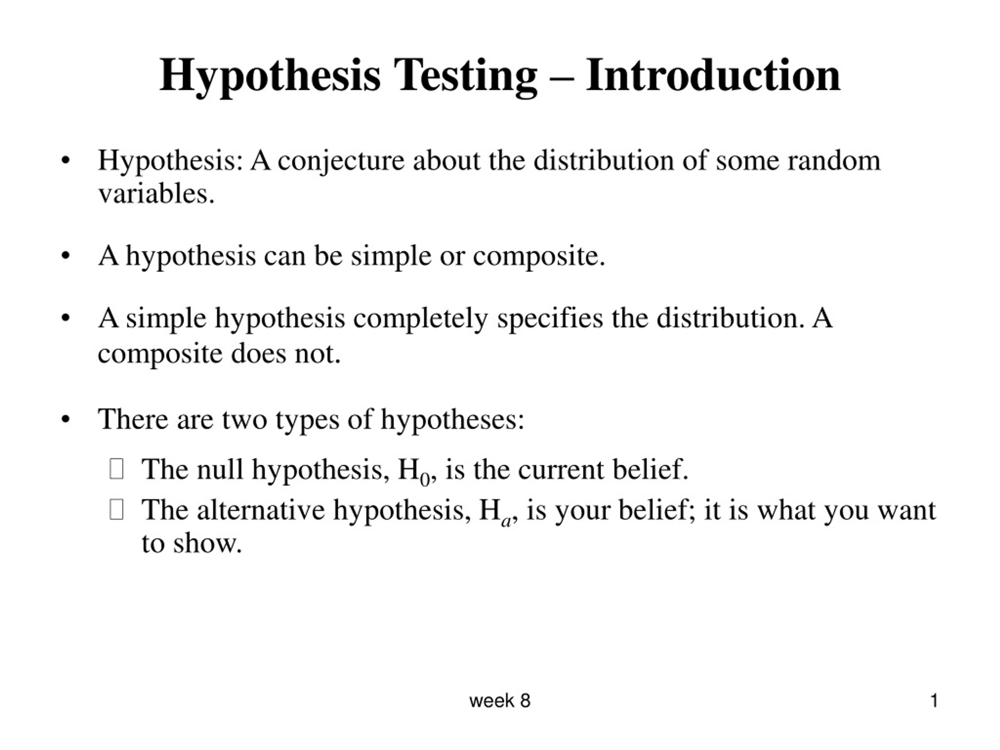

# Null & Alternative Hypothesis

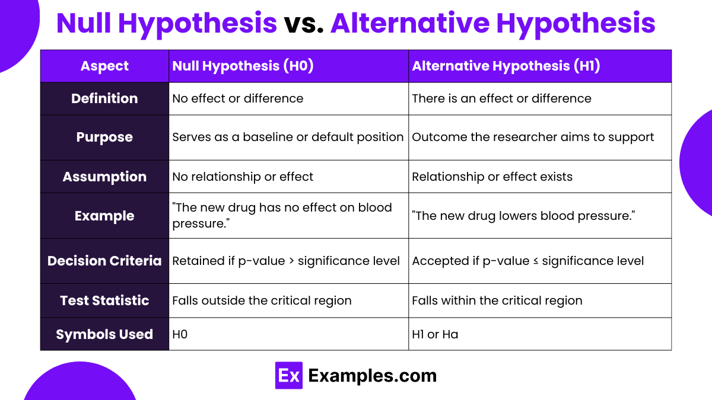

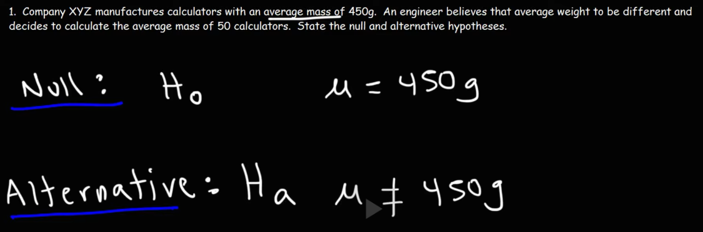
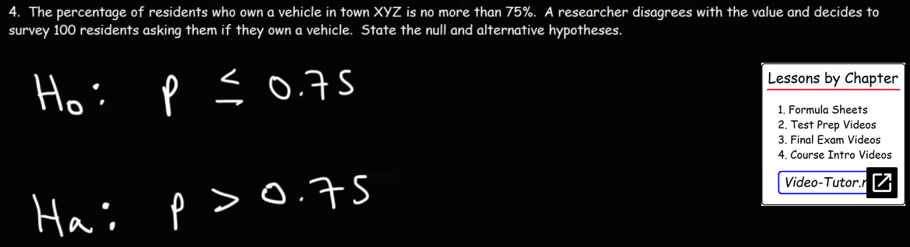

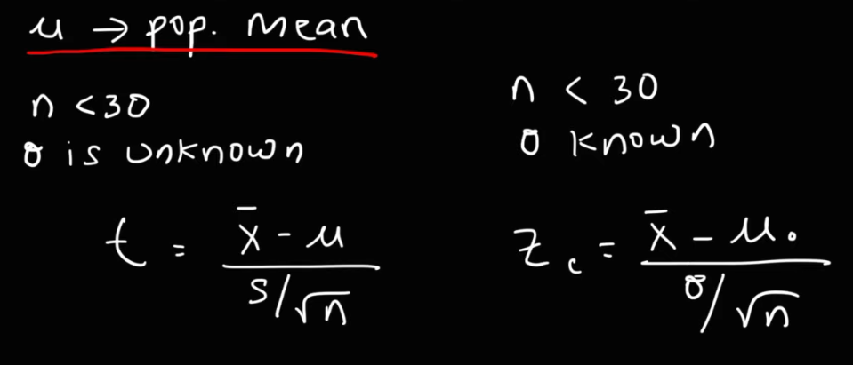

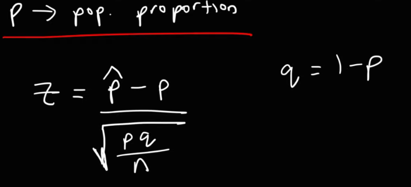

---
# One-Tailed Test

- a distribution is one-sided so that it is
- either greater than or less than a certain value, but not both
- either left-tailed or right-tailed.

## z-critical-value finding
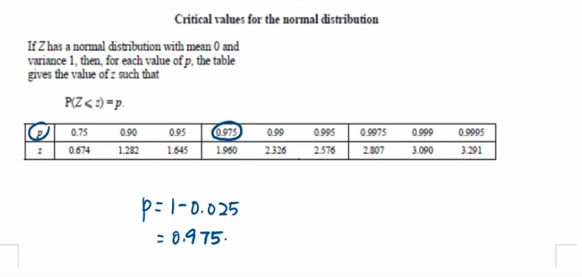
- significance level is given
- 1-significance  = confidence
- then confidence to z-score finding

## Example : Math
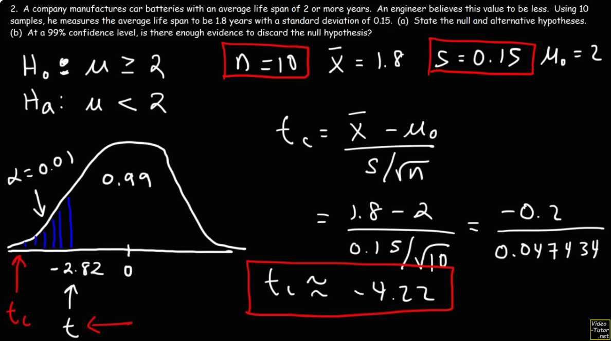
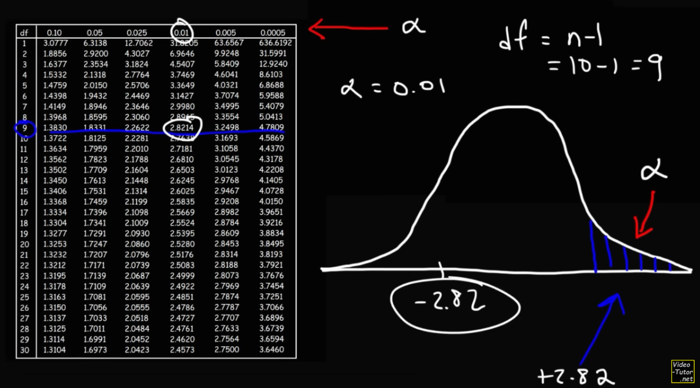

## Example : Math : One tailed test : Left Tailed Test
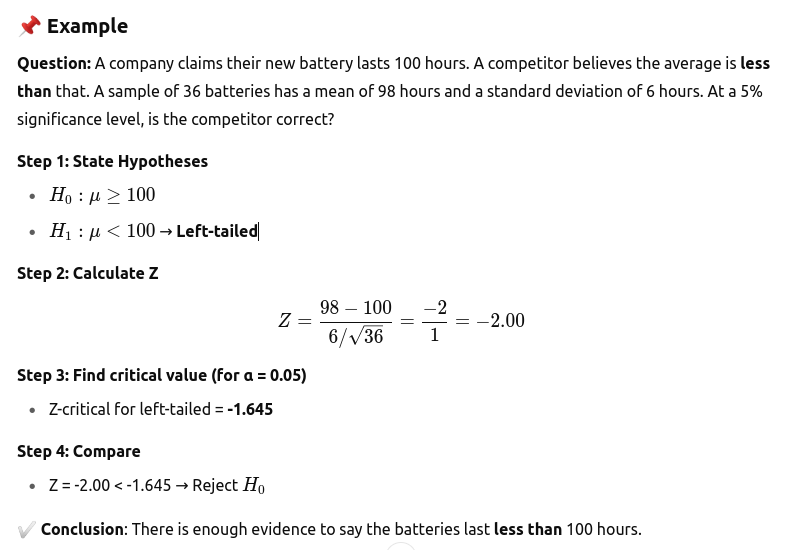

## Example : Math : One tailed test : Left Tailed Test
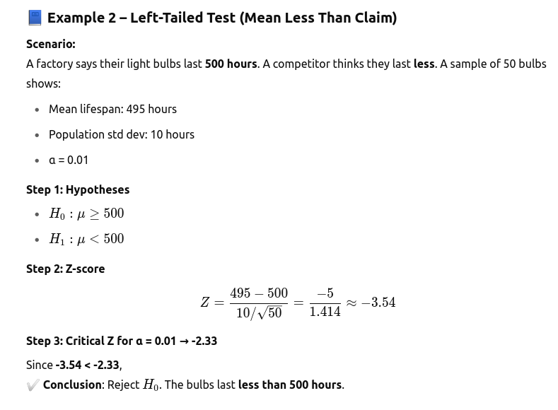

## Example : Math : One tailed test : Right Tailed Test
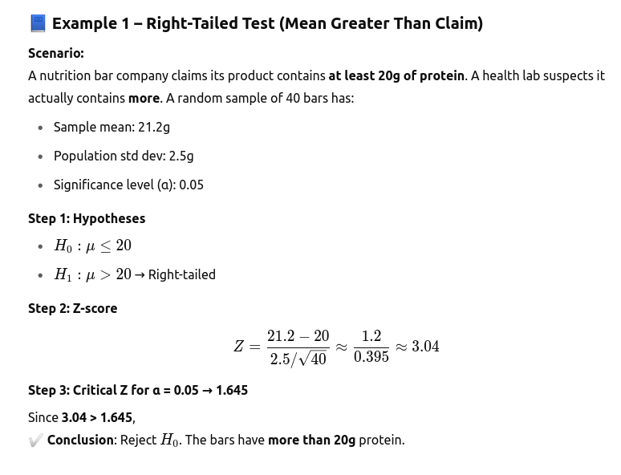

## Example : Math : One tailed test : Right Tailed Test [Poportion]

---
# Two-Tailed Test

## Example : Math
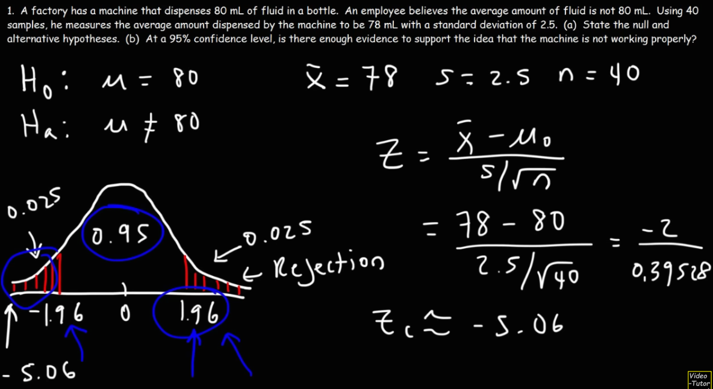
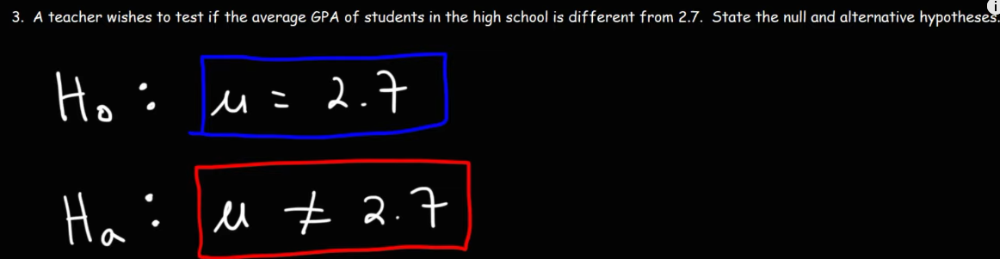

## Example : Math : Traditional Method
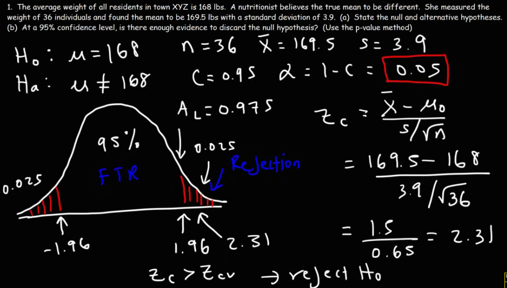
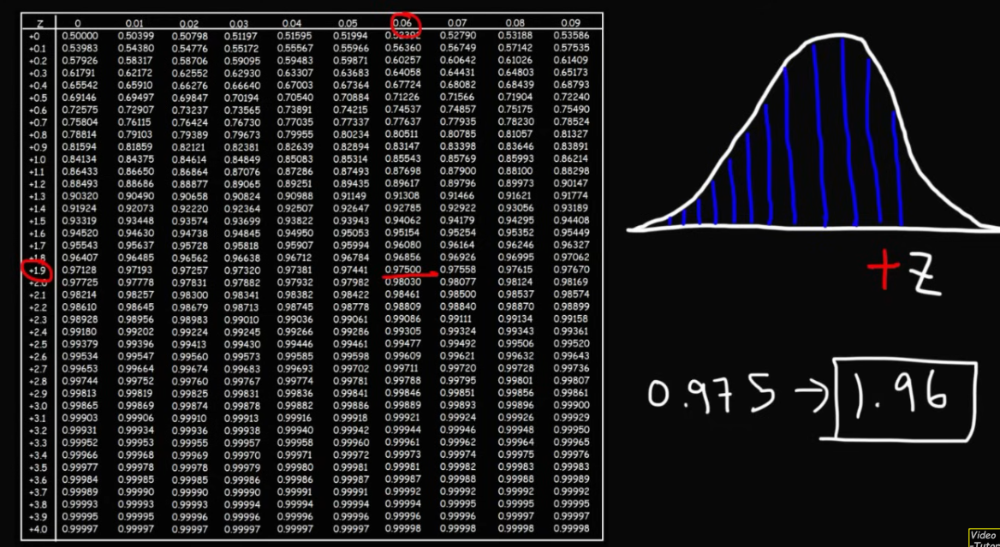

## Example : Math : P-Value Method
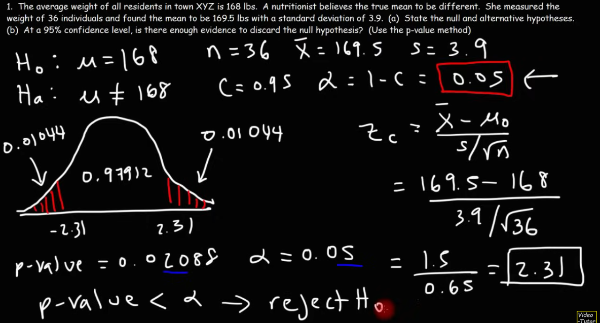
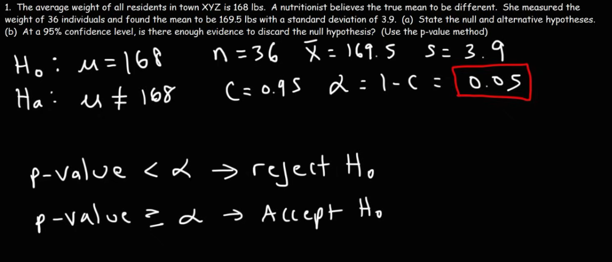

## Example : Math : P-Value Method
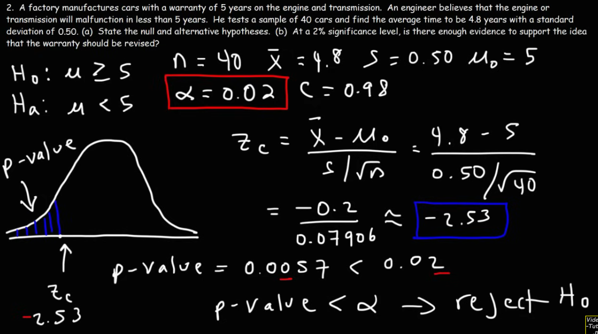

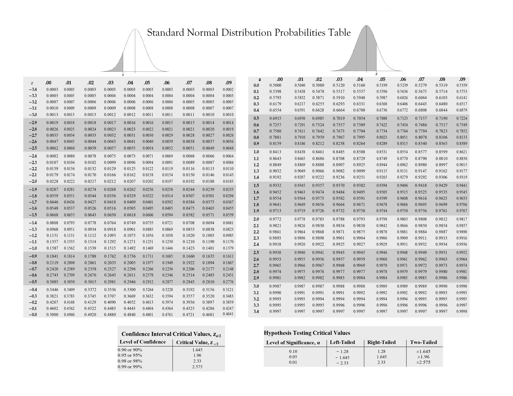
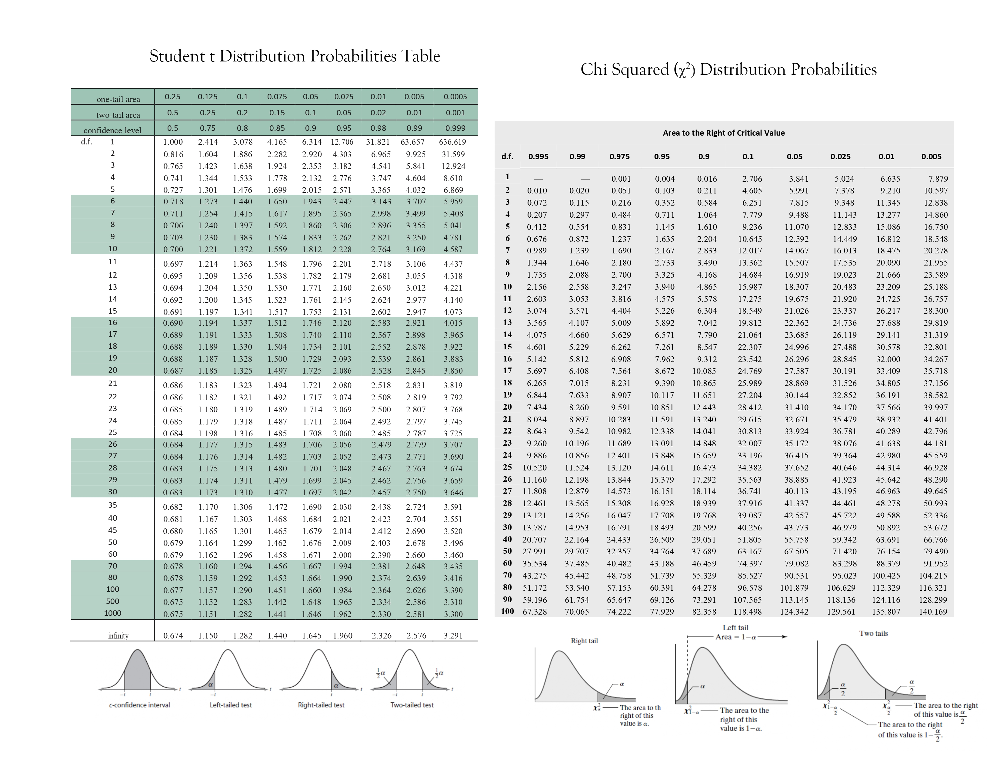