📚 **Table of Contents**
- [📘 Introduction to Regression](#-introduction-to-regression)
  - [🔍 What is Regression?](#-what-is-regression)
  - [💼 Use Cases](#-use-cases)

---

# 📘 Introduction to Regression

## 🔍 What is Regression?

Regression is a **statistical technique** used to:

* **Model and analyze** the relationship between a **dependent variable** (target) and one or more **independent variables** (features).
* **Predict a numeric outcome** based on given input variables.

---

## 💼 Use Cases

Regression is widely used in real-world scenarios such as:

* 🏠 **Predicting house prices**
* 📈 **Forecasting sales or stock returns**
* 🌡️ **Estimating temperature trends**
* 💰 **Estimating customer lifetime value**

---

## 🧠 Types of Regression

| Type                           | Description                                                                                                    |
| ------------------------------ | -------------------------------------------------------------------------------------------------------------- |
| **Simple Linear Regression**   | Models relationship between one independent variable and one dependent variable.                               |
| **Multiple Linear Regression** | Involves two or more independent variables to predict the dependent variable.                                  |
| **Polynomial Regression**      | Models a nonlinear relationship by using polynomial terms.                                                     |
| **Ridge Regression**           | A linear model with L2 regularization to prevent overfitting.                                                  |
| **Lasso Regression**           | Similar to Ridge but uses L1 regularization, which can shrink some coefficients to zero.                       |
| **ElasticNet**                 | Combines L1 and L2 regularization (Ridge + Lasso).                                                             |
| **Logistic Regression**        | Despite the name, used for **classification**, not regression; outputs probabilities for categorical outcomes. |

---

## **Simple Linear Regression:**
* **Description:** Models the relationship between **a single independent variable** and **a dependent variable** using a straight line.
* 1 input/feature 1 output
* 1 independent 1 dependent variable/feature
### 🧮 Equation of Simple Linear Regression

The general form:

$$
y = \beta_0 + \beta_1 x + \varepsilon
$$

* $x$ : Independent variable (input/feature)
* $y$ : Dependent variable (output/response)
* $\beta_0$ : Intercept (value of $y$ when $x = 0$)
* $\beta_1$ : Slope (change in $y$ for a unit change in $x$)
* $\varepsilon$ : Error term

---

## ✅ Assumptions of Simple Linear Regression
- Linear regression relies on several key assumptions to ensure the validity and accuracy of its results. Violating these assumptions can lead to biased or inefficient estimates

1. **Linearity**: The relationship between $x$ and $y$ is linear.
2. **Independence**: Observations are independent of each other.
3. **Homoscedasticity**: Constant variance of residuals across all levels of $x$.
4. **Normality of Residuals**: The residuals (errors) are normally distributed.

Absolutely! Here's a complete and visually intuitive explanation of the **Key Assumptions of Linear Regression**, focusing on **Linearity** — including **positive**, **negative**, and **non-linear (polynomial)** trends.

---

## ✅ Key Assumptions of Linear Regression

### 1. **Assumptions of Linear Regression : Linearity**
- The relationship between the independent variable(s) and the dependent variable is linear.
- **linear relationship** between the independent variable $x$ and the dependent variable $y$.
- The relationship between the independent and dependent variables is linear.


**Example**:
If you're predicting salary based on years of experience:

$$
\text{Salary} = \beta_0 + \beta_1 \cdot \text{Experience} + \epsilon
$$
---

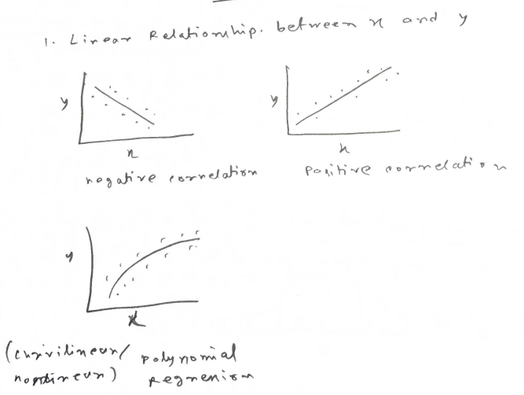
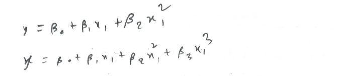

#### 📈 Types of Trends

#### ✅ **Positive Linear Relationship**

* As $x$ increases, $y$ also increases.
* **Suitable** for linear regression.

```
y
↑
|        *
|      *
|    *
|  *
|*
+----------------→ x
```

> Example: Hours studied vs. marks — more study, more marks.

---

#### ✅ **Negative Linear Relationship**

* As $x$ increases, $y$ decreases.
* **Suitable** for linear regression.

```
y
↑
|*
|  *
|    *
|      *
|        *
+----------------→ x
```

> Example: Hours spent gaming vs. sleep quality — more gaming, less sleep.

---

#### ❌ **Curvilinear (Non-Linear / Polynomial) Relationship**

* The relationship curves — may be **quadratic, cubic**, etc.
* **Not suitable** for simple linear regression.

```
y
↑
|     *       *
|   *           *
| *               *
|                   *
+----------------→ x
```

> Example: Age vs. income — income may rise in early career and fall later, forming a curve.

---


Would you like Python/Excel code to visualize this with real data?


#### 📈 **Examples of Polynomial Equations:**

#### ✅ Quadratic (2nd degree):

$$
y = \beta_0 + \beta_1 x + \beta_2 x^2 + \varepsilon
$$

* Forms a **U-shape** or **inverted U-shape** (parabola)

#### ✅ Cubic (3rd degree):

$$
y = \beta_0 + \beta_1 x + \beta_2 x^2 + \beta_3 x^3 + \varepsilon
$$

* Can model **S-shaped curves** or **multiple bends**

---


### 2. **Assumptions of Linear Regression : Independence of errors**: 
- The errors (residuals) should be independent of each other.
- This means that the error for one observation should not influence the error for another observation.
- Independence of errors is another critical assumption for linear regression models. 
- It ensures that the residuals (the differences between the observed and predicted values) are not correlated with one another.
- In practice, this means that the residuals should not show any patterns when plotted against time or another variable.
- If the residuals are correlated, it indicates that there is some information left in the data that the model has not captured.
- This can lead to biased estimates of the coefficients and incorrect predictions.
- To check for independence of errors, we can plot the residuals against the predicted values or time. If there is no pattern, the errors are independent.
- The residuals are the differences between the actual values and the predicted values from the regression model.
- The residual for observation $i$ is defined as:

$$
e_i = y_i - \hat{y}_i
$$

Since:

$$
\hat{y}_i = \beta_0 + \beta_1 x_i
$$

We get:

$$
e_i = y_i - (\beta_0 + \beta_1 x_i)
$$

---

### 📌 Where:

* $y_i$ = actual value of the response variable for observation $i$
* $\hat{y}_i$ = predicted value from the regression model
* $\beta_0$ = intercept
* $\beta_1$ = slope (coefficient of the predictor $x$)
* $e_i$ = **residual**, the difference between actual and predicted
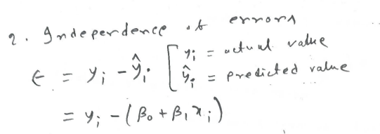


### 3. **Assumptions of Linear Regression : Homoscedasticity (Constant Variance)**: 
- The variance of the residuals (errors) should be constant across all levels of the independent variable $x$.
- This means that the spread of the residuals should be roughly the same for all values of $x$.
- If the variance of the residuals changes with $x$, it indicates **heteroscedasticity**
- which violates the assumption of homoscedasticity.
- To check for homoscedasticity, we can plot the residuals against the predicted values or the independent variable $x$. If the spread of the residuals is constant, the assumption holds.
- If the residuals fan out or contract as $x$ changes, it indicates heteroscedasticity.
- The residuals are the differences between the actual values and the predicted values from the regression model.
- When the residuals maintain constant variance, the model is said to be homoscedastic.


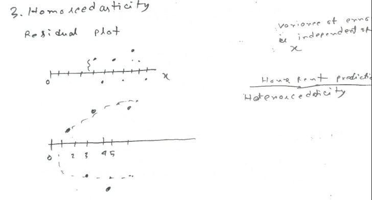

### 4. **Assumptions of Linear Regression : Normality of Residuals**:
- The errors (residuals) should be approximately normally distributed. 
- This means that the errors should follow a bell-shaped curve, with most errors clustered around the mean and fewer errors further away. 
- Histograms and Q-Q plots can be used to assess the normality of residuals. 
- If the residuals are not normally distributed, it can lead to biased estimates of the coefficients and incorrect predictions.
- To check for normality, we can plot a histogram of the residuals or use a Q-Q plot. 
- If the histogram shows a bell-shaped curve and the Q-Q plot shows points falling along a straight line, the residuals are approximately normally distributed.
- If the histogram is skewed or the Q-Q plot shows points deviating from the line, it indicates that the residuals are not normally distributed.
- The residuals are the differences between the actual values and the predicted values from the regression model.
- Multivariate normality is a key assumption for linear regression models when making statistical inferences. Specifically, it means that the residuals (the differences between observed and predicted values) should follow a normal distribution when considering multiple predictors together.
- 
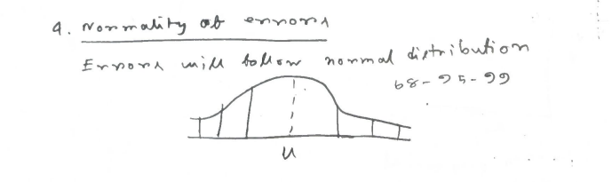


## 🔧 Least Squares Estimation

We estimate $\beta_0$ and $\beta_1$ by minimizing the **sum of squared errors** (SSE):

$$
RSS = SSE = \sum_{i=1}^{n} e_i^2 
$$
$$
= \sum_{i=1}^{n} (y_i - \hat{y}_i)^2
$$
$$
  = \sum_{i=1}^{n} (y_i - (\beta_0 + \beta_1 x_i))^2
$$
$$
  = \sum_{i=1}^{n} (y_i - \beta_0 - \beta_1 x_i)^2
$$

Where:

* Actual value : $y_i$
* Predicted value : $\hat{y}_i = \beta_0 + \beta_1 x_i$

### 🧮 Estimating the Coefficients


#### 1. **Intercept ($\beta_0$)**

$$
\beta_0 = \bar{y} - \beta_1 \bar{x}
$$

This is the value of $y$ when $x = 0$.


---
#### 2. **Slope ($\beta_1$)**

$$
\beta_1 = \frac{\sum (x_i - \bar{x})(y_i - \bar{y})}{\sum (x_i - \bar{x})^2}
$$

This measures how much $y$ changes for a unit change in $x$.

---

# [Derivation]: Derivation of Coefficients in Simple Linear Regression

## 1. Derivative with respect to β0
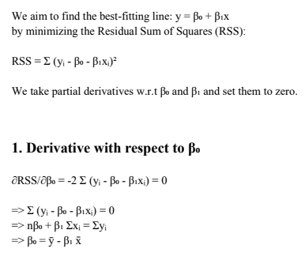
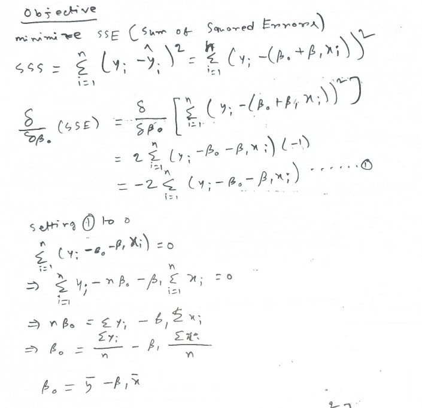


## 1. Derivative with respect to β1
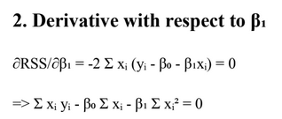
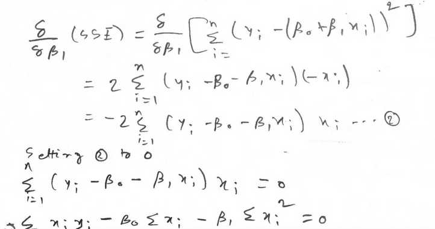
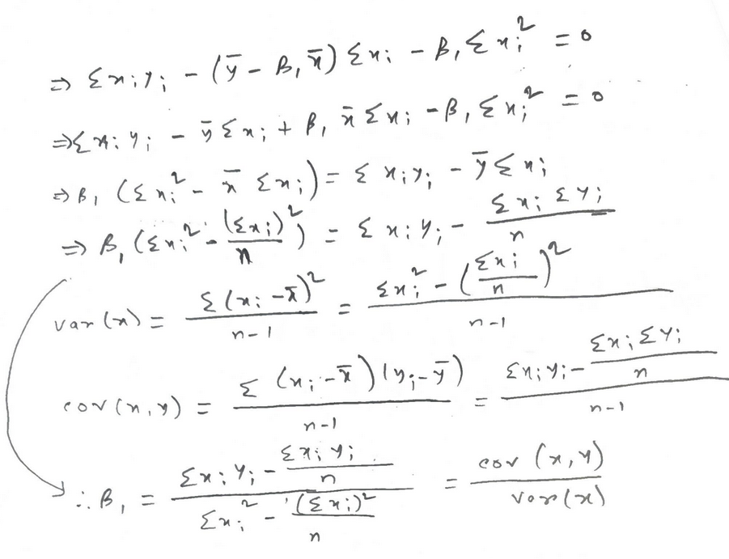

----
# [Problem]: Simple linear regression problem : 1
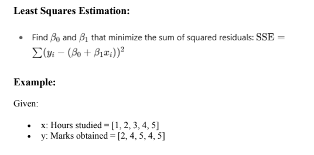

---

## 🔢 Step 1: Compute the Means

$$
\bar{x} = \frac{1 + 2 + 3 + 4 + 5}{5} = 3
$$

$$
\bar{y} = \frac{2 + 4 + 5 + 4 + 5}{5} = 4
$$

---

## 🧮 Step 2: Compute the Slope $\beta_1$

$$
\beta_1 = \frac{\sum (x_i - \bar{x})(y_i - \bar{y})}{\sum (x_i - \bar{x})^2}
$$

| $x_i$ | $y_i$ | $x_i - \bar{x}$ | $y_i - \bar{y}$ | $(x_i - \bar{x})(y_i - \bar{y})$ | $(x_i - \bar{x})^2$ |
| ----- | ----- | --------------- | --------------- | -------------------------------- | ------------------- |
| 1     | 2     | -2              | -2              | 4                                | 4                   |
| 2     | 4     | -1              | 0               | 0                                | 1                   |
| 3     | 5     | 0               | 1               | 0                                | 0                   |
| 4     | 4     | 1               | 0               | 0                                | 1                   |
| 5     | 5     | 2               | 1               | 2                                | 4                   |

$$
\sum (x_i - \bar{x})(y_i - \bar{y}) = 4 + 0 + 0 + 0 + 2 = 6
$$

$$
\sum (x_i - \bar{x})^2 = 4 + 1 + 0 + 1 + 4 = 10
$$

$$
\beta_1 = \frac{6}{10} = 0.6
$$

---

## 🧾 Step 3: Compute the Intercept $\beta_0$

$$
\beta_0 = \bar{y} - \beta_1 \bar{x} = 4 - (0.6)(3) = 2.2
$$

---

## ✅ Final Regression Equation

$$
\boxed{y = 2.2 + 0.6x}
$$

---

