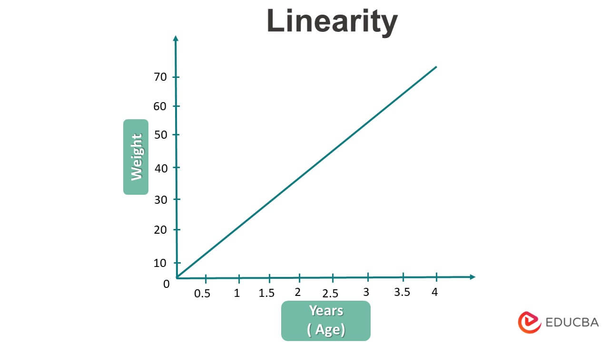
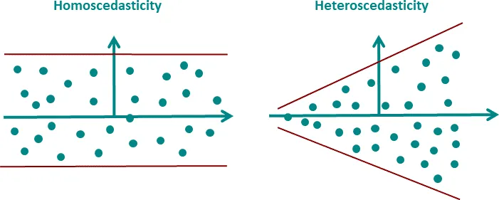
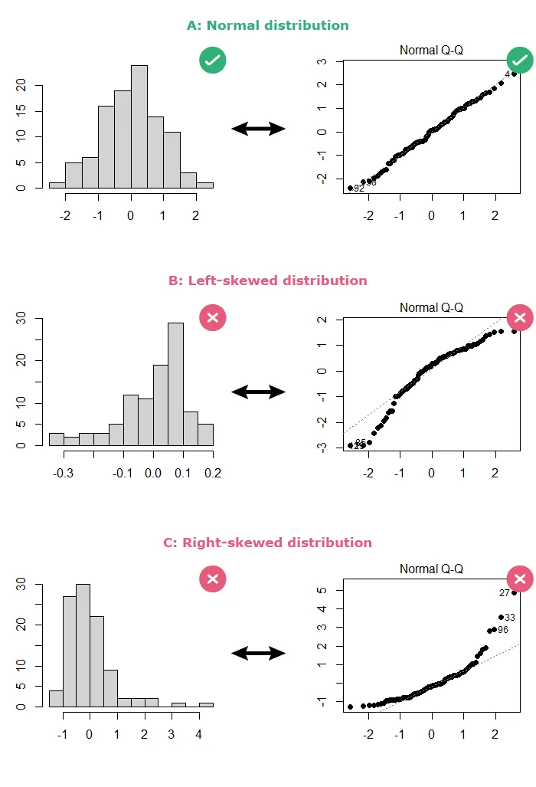

# 📘 Introduction to Regression

## 🔍 What is Regression?

Regression is a **statistical technique** used to:

* **Model and analyze** the relationship between a **dependent variable** (target) and one or more **independent variables** (features).
* **Predict a numeric outcome** based on given input variables.

---

## 💼 Use Cases

Regression is widely used in real-world scenarios such as:

* 🏠 **Predicting house prices**
* 📈 **Forecasting sales or stock returns**
* 🌡️ **Estimating temperature trends**
* 💰 **Estimating customer lifetime value**

---

## 🧠 Types of Regression

| Type                           | Description                                                                                                    |
| ------------------------------ | -------------------------------------------------------------------------------------------------------------- |
| **Simple Linear Regression**   | Models relationship between one independent variable and one dependent variable.                               |
| **Multiple Linear Regression** | Involves two or more independent variables to predict the dependent variable.                                  |
| **Polynomial Regression**      | Models a nonlinear relationship by using polynomial terms.                                                     |
| **Ridge Regression**           | A linear model with L2 regularization to prevent overfitting.                                                  |
| **Lasso Regression**           | Similar to Ridge but uses L1 regularization, which can shrink some coefficients to zero.                       |
| **ElasticNet**                 | Combines L1 and L2 regularization (Ridge + Lasso).                                                             |
| **Logistic Regression**        | Despite the name, used for **classification**, not regression; outputs probabilities for categorical outcomes. |

---

## **Simple Linear Regression:**
* **Description:** Models the relationship between **a single independent variable** and **a dependent variable** using a straight line.
* 1 input/feature 1 output
* 1 independent 1 dependent variable/feature
### 🧮 Equation of Simple Linear Regression

The general form:

$$
y = \beta_0 + \beta_1 x + \varepsilon
$$

* $x$ : Independent variable (input/feature)
* $y$ : Dependent variable (output/response)
* $\beta_0$ : Intercept (value of $y$ when $x = 0$)
* $\beta_1$ : Slope (change in $y$ for a unit change in $x$)
* $\varepsilon$ : Error term

---

## ✅ Assumptions of Simple Linear Regression [Head LIoN]
- Linear regression relies on several key assumptions to ensure the validity and accuracy of its results. Violating these assumptions can lead to biased or inefficient estimates

1. **Linearity**: The relationship between $x$ and $y$ is linear.
2. **Independence**: Observations are independent of each other.
3. **Homoscedasticity**: Constant variance of residuals across all levels of $x$.
4. **Normality of Residuals**: The residuals (errors) are normally distributed.

Absolutely! Here's a complete and visually intuitive explanation of the **Key Assumptions of Linear Regression**, focusing on **Linearity** — including **positive**, **negative**, and **non-linear (polynomial)** trends.

---

## ✅ Key Assumptions of Linear Regression

### 1. **Assumptions of Linear Regression : Linearity**
- The relationship between the independent variable(s) and the dependent variable is linear.
- **linear relationship** between the independent variable $x$ and the dependent variable $y$.
- The relationship between the independent and dependent variables is linear.


**Example**:
If you're predicting salary based on years of experience:

$$
\text{Salary} = \beta_0 + \beta_1 \cdot \text{Experience} + \epsilon
$$
---




#### 📈 Types of Trends

#### ✅ **Positive Linear Relationship**

* As $x$ increases, $y$ also increases.
* **Suitable** for linear regression.

```
y
↑
|        *
|      *
|    *
|  *
|*
+----------------→ x
```

> Example: Hours studied vs. marks — more study, more marks.

---

#### ✅ **Negative Linear Relationship**

* As $x$ increases, $y$ decreases.
* **Suitable** for linear regression.

```
y
↑
|*
|  *
|    *
|      *
|        *
+----------------→ x
```

> Example: Hours spent gaming vs. sleep quality — more gaming, less sleep.

---

#### ❌ **Curvilinear (Non-Linear / Polynomial) Relationship**

* The relationship curves — may be **quadratic, cubic**, etc.
* **Not suitable** for simple linear regression.

```
y
↑
|     *       *
|   *           *
| *               *
|                   *
+----------------→ x
```

> Example: Age vs. income — income may rise in early career and fall later, forming a curve.

---


Would you like Python/Excel code to visualize this with real data?


#### 📈 **Examples of Polynomial Equations:**

#### ✅ Quadratic (2nd degree):

$$
y = \beta_0 + \beta_1 x + \beta_2 x^2 + \varepsilon
$$

* Forms a **U-shape** or **inverted U-shape** (parabola)

#### ✅ Cubic (3rd degree):

$$
y = \beta_0 + \beta_1 x + \beta_2 x^2 + \beta_3 x^3 + \varepsilon
$$

* Can model **S-shaped curves** or **multiple bends**

---


### 2. **Assumptions of Linear Regression : Independence of errors**: 
- The errors (residuals) should be independent of each other.
- This means that the error for one observation should not influence the error for another observation.
- The observations are independent of each other.
- Independence of errors is another critical assumption for linear regression models. 
- It ensures that the residuals (the differences between the observed and predicted values) are not correlated with one another.
- In practice, this means that the residuals should not show any patterns when plotted against time or another variable.
- If the residuals are correlated, it indicates that there is some information left in the data that the model has not captured.
- This can lead to biased estimates of the coefficients and incorrect predictions.
- To check for independence of errors, we can plot the residuals against the predicted values or time. If there is no pattern, the errors are independent.
- The residuals are the differences between the actual values and the predicted values from the regression model.
- The residual for observation $i$ is defined as:

$$
e_i = y_i - \hat{y}_i
$$

Since:

$$
\hat{y}_i = \beta_0 + \beta_1 x_i
$$

We get:

$$
e_i = y_i - (\beta_0 + \beta_1 x_i)
$$

---

### 📌 Where:

* $y_i$ = actual value of the response variable for observation $i$
* $\hat{y}_i$ = predicted value from the regression model
* $\beta_0$ = intercept
* $\beta_1$ = slope (coefficient of the predictor $x$)
* $e_i$ = **residual**, the difference between actual and predicted


### 3. **Assumptions of Linear Regression : Homoscedasticity (Constant Variance)**: 
- The variance of the residuals (errors) should be constant across all levels of the independent variable $x$.
- The variance of the errors is constant across all levels of the independent variables.
- This means that the spread of the residuals should be roughly the same for all values of $x$.
- If the variance of the residuals changes with $x$, it indicates **heteroscedasticity**
- which violates the assumption of homoscedasticity.
- To check for homoscedasticity, we can plot the residuals against the predicted values or the independent variable $x$. If the spread of the residuals is constant, the assumption holds.
- If the residuals fan out or contract as $x$ changes, it indicates heteroscedasticity.
- The residuals are the differences between the actual values and the predicted values from the regression model.
- When the residuals maintain constant variance, the model is said to be homoscedastic.
- The variance of the errors should be constant across all levels of the independent variable(s). This means that the spread of the errors should not increase or decrease as the values of the independent variable change.




### 4. **Assumptions of Linear Regression : Normality of Residuals/errors**:
- The errors follow a normal distribution.
- The errors (residuals) should be approximately normally distributed. 
- This means that the errors should follow a bell-shaped curve, with most errors clustered around the mean and fewer errors further away. 
- Histograms and Q-Q plots can be used to assess the normality of residuals. 
- If the residuals are not normally distributed, it can lead to biased estimates of the coefficients and incorrect predictions.
- To check for normality, we can plot a histogram of the residuals or use a Q-Q plot. 
- If the histogram shows a bell-shaped curve and the Q-Q plot shows points falling along a straight line, the residuals are approximately normally distributed.
- If the histogram is skewed or the Q-Q plot shows points deviating from the line, it indicates that the residuals are not normally distributed.
- The residuals are the differences between the actual values and the predicted values from the regression model.
- Multivariate normality is a key assumption for linear regression models when making statistical inferences. Specifically, it means that the residuals (the differences between observed and predicted values) should follow a normal distribution when considering multiple predictors together.
- 




## 🔧 Least Squares Estimation

We estimate $\beta_0$ and $\beta_1$ by minimizing the **sum of squared errors** (SSE):

$$
RSS = SSE = \sum_{i=1}^{n} e_i^2 
$$
$$
= \sum_{i=1}^{n} (y_i - \hat{y}_i)^2
$$
$$
  = \sum_{i=1}^{n} (y_i - (\beta_0 + \beta_1 x_i))^2
$$
$$
  = \sum_{i=1}^{n} (y_i - \beta_0 - \beta_1 x_i)^2
$$

Where:

* Actual value : $y_i$
* Predicted value : $\hat{y}_i = \beta_0 + \beta_1 x_i$

### 🧮 Estimating the Coefficients


#### 1. **Intercept ($\beta_0$)**

$$
\beta_0 = \bar{y} - \beta_1 \bar{x}
$$

This is the value of $y$ when $x = 0$.


---
#### 2. **Slope ($\beta_1$)**

$$
\beta_1 = \frac{\sum (x_i - \bar{x})(y_i - \bar{y})}{\sum (x_i - \bar{x})^2}
$$

This measures how much $y$ changes for a unit change in $x$.

---

# [Derivation]: Derivation of Coefficients in Simple Linear Regression

## 1. Derivative with respect to β0


We start with the **Residual Sum of Squares (RSS)**:

$$
RSS = \sum_{i=1}^{n} e_i^2 
$$
$$
= \sum_{i=1}^{n} (y_i - \hat{y}_i)^2
$$

$$
 = \sum_{i=1}^n (y_i - \beta_0 - \beta_1 x_i)^2
$$

Our goal is to **minimize RSS**, so we take the **partial derivative** with respect to $\beta_0$:

---

### ✅ Step-by-step Derivation:

$$
\frac{\partial RSS}{\partial \beta_0} = \frac{\partial}{\partial \beta_0} \sum_{i=1}^n (y_i - \beta_0 - \beta_1 x_i)^2
$$

Apply the chain rule:

where:
- $\frac{d}{d\beta_0} [u^2] = 2u \cdot \frac{du}{d\beta_0}$
- Now compute $\frac{du}{d\beta_0}$:
- $\frac{d}{d\beta_0} (y_i - \beta_0 - \beta_1 x_i) = -1$


$$
= \sum_{i=1}^n 2(y_i - \beta_0 - \beta_1 x_i)(-1)
$$

$$
= -2 \sum_{i=1}^n (y_i - \beta_0 - \beta_1 x_i)
$$

Set the derivative to **zero** for minimization:

$$
-2 \sum_{i=1}^n (y_i - \beta_0 - \beta_1 x_i) = 0
$$

Divide both sides by -2:

$$
\sum_{i=1}^n (y_i - \beta_0 - \beta_1 x_i) = 0
$$

Distribute the summation:

$$
\sum_{i=1}^n y_i - n\beta_0 - \beta_1 \sum_{i=1}^n x_i = 0
$$


$$
\sum y_i - n\beta_0 - \beta_1 \sum x_i = 0
$$

Rearranged:

$$
n\beta_0  = \sum y_i - \beta_1 \sum x_i
$$


Now divide both sides by $n$:

$$
\beta_0 = \frac{\sum y_i}{n} - \beta_1 \cdot \frac{\sum x_i}{n}
$$


Where:
- $\bar{y} = \frac{\sum y_i}{n}$
- $\bar{x} = \frac{\sum x_i}{n}$

$$
\boxed{\beta_0 = \bar{y} - \beta_1 \bar{x}}
$$

This formula shows that the **intercept** is the point where the **regression line crosses the y-axis**, given the means of $x$ and $y$, and the slope $\beta_1$.

---


## 2. Derivative with respect to β1


### 🔢 Step 1: We start with the **Residual Sum of Squares (RSS)**:

$$
RSS = \sum_{i=1}^{n} e_i^2 
$$
$$
= \sum_{i=1}^{n} (y_i - \hat{y}_i)^2
$$

$$
 = \sum_{i=1}^n (y_i - \beta_0 - \beta_1 x_i)^2
$$

---

### ✅ Step 2: Take the Partial Derivative w\.r.t. $\beta_1$

We'll use the **chain rule** here again:

$$
\frac{\partial RSS}{\partial \beta_1} = \frac{\partial}{\partial \beta_1} \sum_{i=1}^{n} \left( y_i - \beta_0 - \beta_1 x_i \right)^2
$$

$$
 = \sum_{i=1}^{n} 2(y_i - \beta_0 - \beta_1 x_i)(-x_i)
$$


where:
- $\frac{df}{d\beta_1} = \frac{d(u^2)}{d\beta_1} = 2u \cdot \frac{du}{d\beta_1}$
- $\frac{du}{d\beta_1} = \frac{d}{d\beta_1}(y_i - \beta_0 - \beta_1 x_i) = -x_i$


$$
= -2 \sum_{i=1}^{n} x_i (y_i - \beta_0 - \beta_1 x_i)
$$

---

### ✅ Step 3: Set the Derivative to Zero (Minimize RSS)

$$
-2 \sum_{i=1}^{n} x_i (y_i - \beta_0 - \beta_1 x_i) = 0
$$

Divide both sides by -2:

$$
\sum_{i=1}^{n} x_i (y_i - \beta_0 - \beta_1 x_i) = 0
$$

Distribute the $x_i$:


$$
\sum x_i y_i - \beta_0 \sum x_i - \beta_1 \sum x_i^2 = 0
$$
$$
\sum x_i y_i - (\bar{y} - \beta_1 \bar{x}) \sum x_i - \beta_1 \sum x_i^2 = 0
$$
$$
\sum x_i y_i - \bar{y} \sum x_i + \beta_1 \bar{x} \sum x_i - \beta_1 \sum x_i^2 = 0
$$
$$
 \beta_1 (\bar{x} \sum x_i -  \sum x_i^2) = \bar{y} \sum x_i - \sum x_i y_i  
$$
$$
 \beta_1 ( \frac{\sum x_i }{n} \sum x_i -  \sum x_i^2) = \frac{\sum y_i }{n} \sum x_i - \sum x_i y_i  
$$
$$
 \beta_1  = \frac{\frac{\sum y_i }{n} \sum x_i - \sum x_i y_i}{ \frac{\sum x_i }{n} \sum x_i -  \sum x_i^2}  
$$
$$
 \beta_1  = \frac{\frac{\sum x_i y_i }{n} - \sum x_i y_i}{ \frac{\sum x_i^2 }{n}  -  \sum x_i^2}  
$$
$$
 \beta_1  = \frac{\sum x_i y_i - n \sum x_i y_i} { \sum x_i^2  -  n \sum x_i^2}  
$$
$$
 \beta_1  = \frac{cov(x,y)}{var(x)}
$$

Where:

* $\text{Cov}(x, y) = \frac{\sum (x_i - \bar{x})(y_i - \bar{y})}{n}$
* $\text{Var}(x) = \frac{\sum (x_i - \bar{x})^2}{n}$

### ✅ Final Slope Formula:

$$
\boxed{
\beta_1 = \frac{\sum (x_i - \bar{x})(y_i - \bar{y})}{\sum (x_i - \bar{x})^2}
}
$$

This gives the **best-fitting slope** of the regression line.


----
# [Problem]: Simple linear regression problem : 1


---

## 🔢 Step 1: Compute the Means

$$
\bar{x} = \frac{1 + 2 + 3 + 4 + 5}{5} = 3
$$

$$
\bar{y} = \frac{2 + 4 + 5 + 4 + 5}{5} = 4
$$

---

## 🧮 Step 2: Compute the Slope $\beta_1$

$$
\beta_1 = \frac{\sum (x_i - \bar{x})(y_i - \bar{y})}{\sum (x_i - \bar{x})^2}
$$

| $x_i$ | $y_i$ | $x_i - \bar{x}$ | $y_i - \bar{y}$ | $(x_i - \bar{x})(y_i - \bar{y})$ | $(x_i - \bar{x})^2$ |
| ----- | ----- | --------------- | --------------- | -------------------------------- | ------------------- |
| 1     | 2     | -2              | -2              | 4                                | 4                   |
| 2     | 4     | -1              | 0               | 0                                | 1                   |
| 3     | 5     | 0               | 1               | 0                                | 0                   |
| 4     | 4     | 1               | 0               | 0                                | 1                   |
| 5     | 5     | 2               | 1               | 2                                | 4                   |

$$
\sum (x_i - \bar{x})(y_i - \bar{y}) = 4 + 0 + 0 + 0 + 2 = 6
$$

$$
\sum (x_i - \bar{x})^2 = 4 + 1 + 0 + 1 + 4 = 10
$$

$$
\beta_1 = \frac{6}{10} = 0.6
$$


## 🧾 Step 3: Compute the Intercept $\beta_0$

$$
\beta_0 = \bar{y} - \beta_1 \bar{x} = 4 - (0.6)(3) = 2.2
$$


## ✅ Final Regression Equation

$$
\boxed{y = 2.2 + 0.6x}
$$

---

# $R^2$
- coefficient of determination
- R-squared (R²) evaluates how well a regression model fits the data


# $R^2$  Value

min=0, max=1

$$
    R^2 = 1 - \frac{SSR}{SST} 
$$
$$
    = \frac{SSE}{SST}
$$


where:
- $SSR$ = **Sum of Squares of Residuals** (or Errors)
  - $SSR = SS_{\text{res}} = RSS = \sum (y_i - \hat{y}_i)^2$
- $SST$ = **Total Sum of Squares**
  - $SST = SSR + SSE$ = $\sum (y_i - \bar{y})^2$ 
  - $\text{Total} =  \text{Unexplained} + \text{Explained}$
- $SSE$ = **Sum of Squares of Errors** (or Residuals)
  - $SSE = SS_{\text{regression}} = Explained Sum of Squares = \sum (\hat{y}_i - \bar{y})^2$
- $R^2$ = **Coefficient of Determination**
  - $R^2$ measures the proportion of variance in the dependent variable that can be explained by the independent variable(s). 


| $R^2$ Range          | Model Evaluation                                     |
| -------------------- | ---------------------------------------------------- |
| $R^2 = 1$            | Perfect fit — model explains all variance            |
| $R^2 \geq 0.9$       | Excellent fit (in domains like physics)              |
| $0.7 \leq R^2 < 0.9$ | Good fit (common in social science or business data) |
| $0.5 \leq R^2 < 0.7$ | Moderate fit — partially explains variance           |
| $0.3 \leq R^2 < 0.5$ | Weak fit — model doesn’t explain much                |
| $R^2 < 0.3$          | Very poor — little predictive power                  |
| $R^2 = 0$            | No fit — model explains nothing                      |


| **Evaluate $R^2$ Based On**  | **Why It Matters**                         |
| ---------------------------- | ------------------------------------------ |
| Domain knowledge             | Acceptable $R^2$ varies by field           |
| Context and use case         | Some problems tolerate lower $R^2$         |
| Model complexity             | High $R^2$ can signal overfitting          |
| Comparison with other models | Better for relative than absolute judgment |
| Use of adjusted $R^2$        | Penalizes unnecessary predictors           |


### 🧠 Key Considerations

* **High $R^2$** doesn’t always mean the model is good:

  * Could be overfitting
  * Could include irrelevant predictors
* **Low $R^2$** doesn't always mean the model is useless:

  * In complex or noisy fields (e.g., economics, psychology), even small $R^2$ values can be meaningful
* Use **Adjusted $R^2$** when comparing models with different numbers of predictors.


## 📊 $R^2  vs  Adjusted R^2$


| Feature          | $R^2$                                          | Adjusted $R^2$                                                     |
| ---------------- | ---------------------------------------------- | ------------------------------------------------------------------ |
| Best for...      | Simple models                                  | Multiple regression with many predictors                           |
| Value range      | 0 to 1                                         | Can be less than $R^2$, or even negative                           |
| Interpretability | Easy                                           | Slightly more complex                                              |
| Behavior         | Always increases when you add predictors       | Increases **only** if new predictor improves the model             |
| Penalizes noise  | ❌ No                                           | ✅ Yes                                                              |
| Summary          | Use when comparing models with same predictors | Use when comparing models with **different** numbers of predictors |


---

## 📏 MAE, MSE, RMSE – Regression Evaluation Metrics


### ✅ **1. MAE — Mean Absolute Error**

$$
\text{MAE} = \frac{1}{n} \sum_{i=1}^{n} |y_i - \hat{y}_i|
$$

* Measures the average **absolute difference** between actual and predicted values.
* **Interpretation**: Lower MAE = better model.
* **Pros**: Easy to interpret, not sensitive to outliers.

---

### ✅ **2. MSE — Mean Squared Error**

$$
\text{MSE} = \frac{1}{n} \sum_{i=1}^{n} (y_i - \hat{y}_i)^2
$$

* Measures the **average squared difference** between actual and predicted values.
* **Interpretation**: Penalizes large errors more than MAE.
* **Cons**: Sensitive to outliers due to squaring.

---

### ✅ **3. RMSE — Root Mean Squared Error**

$$
\text{RMSE} = \sqrt{\frac{1}{n} \sum_{i=1}^{n} (y_i - \hat{y}_i)^2}
$$

* **Square root of MSE**
* Puts error in the **same unit** as the target variable.
* **Interpretation**: Like MSE, but more interpretable in real-world units.

---
