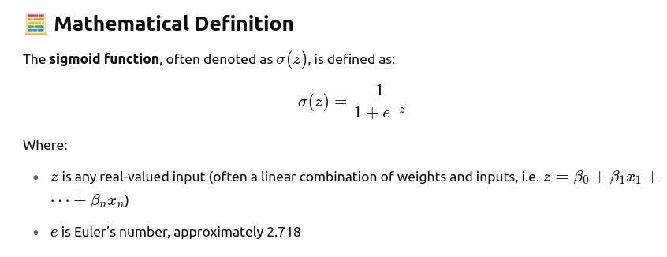
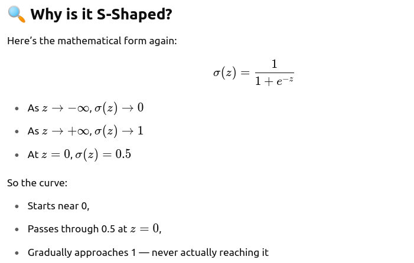
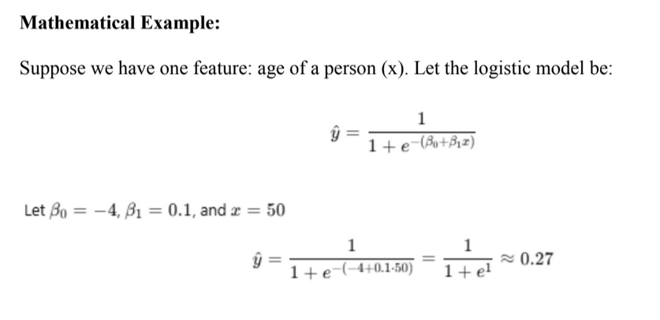
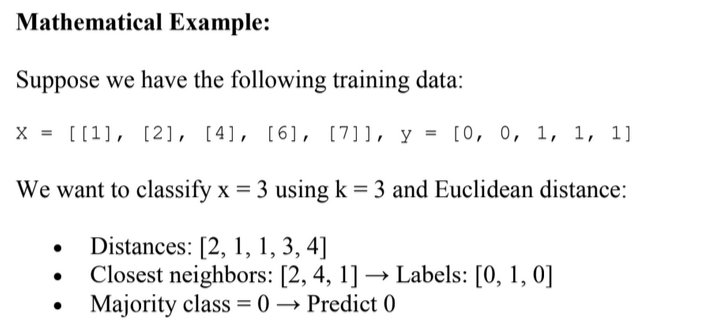

# Classification
- supervised learning technique
- predict categorical class labels/ categories / classes
- categories like discrete or nominal (e.g., "spam" or "not spam", "yes" or "no", "disease" or "no disease")
- used to classify new, unseen data by predicting the class label based on the input attributes
- Example
  - Email: spam vs. not spam
  - Medical diagnosis: has disease vs. no disease
  - Loan approval: approved vs. rejected
  - Pass or Fail
  - True or False (1 or 0)

## Types of Classification Problems

### 1. Binary Classification
- **Definition**: 
  - The model predicts one of **two possible classes**.
  - Classifies data into one of two distinct classes.
  - predict 1 from 2 classes
- **Examples**:
  - Spam or Not Spam  
  - Disease or No Disease  
  - Pass or Fail  
  - True or False (1 or 0)
### Algorithms: Logistic Regression, Support Vector Machines (SVM), Decision Trees, etc.

---

### 2. Multi-class Classification
- **Definition**: 
  - The model predicts one **out of more than two possible classes**.
  - Classifies data into one of three or more classes.
  - predict 1 from 3 or 3+ classes
- **Examples**:
  - Handwritten digit recognition (0–9)  
  - Animal classification (Cat, Dog, Horse, etc.)
  - Predicting student grades: A, B, C, D, F

### Algorithms: Softmax Regression, Random Forest, Naive Bayes, Neural Networks, etc.
---

### 3. Multi-label Classification
- **Definition**: 
  - Each instance can be **assigned to multiple classes simultaneously**.
  - each instance (data point) can be assigned multiple labels from a set of possible categories, rather than just one.
  - 
- **Examples**:
  - A news article labeled as both "Politics" and "Economy"  
  - A music genre classifier tagging a song as "Pop", "Rock", and "Electronic"  
  - A medical diagnosis identifying multiple conditions at once
  - Movie genre classification (Action, Comedy, Drama, etc.)
    - 1 movie 1 or multiple genre can be added
  - Multiple tags per input
  - 


------


# Logistic Regression
- **Logistic Regression** is a statistical method used for **binary classification**.  
- 0 – represents a negative class; 
- 1 – represents a positive class. 
- Logistic regression is commonly used in binary classification problems where the outcome variable reveals either of the two categories (0 and 1).
- Logistic Regression: converts linear output into a probability


## 🧠 Key Concepts

- **Dependent Variable**: Categorical (binary → 0 or 1)
- **Independent Variables**: Continuous or categorical
- **Output**: Probability of the positive class
- **Decision Boundary**: Typically 0.5 (can be adjusted)

## 📊 Example Use Cases

- Spam vs. Not Spam
- Fraud Detection
- Disease Diagnosis (Positive/Negative)
- Customer Churn (Stay/Leave)

## Decision boundary: 
- By default, if the predicted value is greater than 0.5, the class is
predicted as 1.


## Advantages:
- Simple and interpretable
- Fast to train
- Probabilistic output

## Limitations:
- Assumes linear decision boundary
- Sensitive to outliers and multicollinearity


## 📌 Logistic vs Linear Regression
| Feature              | Linear Regression | Logistic Regression  |
| -------------------- | ----------------- | -------------------- |
| Output Type          | Continuous        | Probability (0–1)    |
| Target Variable Type | Numeric           | Binary / Categorical |
| Function Used        | Linear Function   | Sigmoid Function     |
| Use Case             | Prediction        | Classification       |


## Sigmoid Function
- The sigmoid function is a key concept in logistic regression
- It maps any real-valued number to a value between 0 and 1, which is perfect for modeling probabilities.
- sigmoid function is often referred to as an S-shaped curve (or S-curve) because of how it looks when plotted — it smoothly increases from 0 to 1 in an “S” shape.
- 





| Property         | Description                             |
| ---------------- | --------------------------------------- |
| Output Range     | (0, 1)                                  |
| Symmetry         | Symmetric around $z = 0$                |
| Value at $z = 0$ | $\sigma(0) = 0.5$                       |
| Use Case         | Converts real number to probability     |
| Derivative       | $\sigma'(z) = \sigma(z)(1 - \sigma(z))$ |


----


# 🤖 K-Nearest Neighbors (KNN) 

## 📌 What is KNN?

- **K-Nearest Neighbors (KNN)** 
- **supervised machine learning algorithm**
- used for both **classification** and **regression** tasks
- It’s known as a **lazy learner**
- a lazy learning algorithm
- is a simple, non-parametric, instance-based learning algorithm used for **classification** and **regression**.
- **K-Nearest Neighbors (KNN)** is a simple, yet powerful **supervised machine learning algorithm** used for both **classification** and **regression** tasks. It’s known as a **lazy learner** because it doesn’t build an explicit model during training — instead, it stores the training data and makes decisions only when predicting.


## 📌 Key Concepts

| Term           | Meaning                                                  |
| -------------- | -------------------------------------------------------- |
| Instance-based | Uses the actual training instances for prediction        |
| Lazy learning  | No training phase; computation happens during prediction |
| Non-parametric | Makes no assumptions about the data distribution         |


### ✅ How It Works:
1. Choose a value of **k** (number of neighbors).
2. Compute the **distance** between a test point and all training points.
3. Find the **k nearest** training examples.
4. For classification: the majority class among the k-neighbors is chosen.


## 🧪 Strengths and Weaknesses

### ✅ Advantages
- Simple and easy to implement
- Works well with small datasets and low-dimensional data
- No training time

### ❌ Disadvantages
- Computationally expensive for large datasets
- **Slow** for large datasets (because it checks all points at prediction time)
- **Sensitive to irrelevant features** or **different feature scales**
- **Curse of dimensionality**: performance drops when there are too many features/columns/fields


---

## 🔧 When to Use KNN

- When data is small or moderately sized
- When you want an interpretable model
- When the decision boundary is **non-linear**
- When you have **well-labeled** and **balanced** data


## 📌 Summary Table

| Aspect              | KNN                            |
| ------------------- | ------------------------------ |
| Type                | Supervised learning            |
| Tasks               | Classification, Regression     |
| Model Type          | Non-parametric, Instance-based |
| Distance Metric     | Euclidean (commonly)           |
| Main Hyperparameter | Number of neighbors (k)        |
| Sensitive To        | Feature scaling, outliers      |
| Training Time       | ⏱️ Very fast                    |
| Prediction Time     | 🐌 Slow for large datasets      |


| Aspect             | Details                                           |
| ------------------ | ------------------------------------------------- |
| Type               | Supervised Learning                               |
| Learning Style     | Lazy Learning                                     |
| Data Type          | Labeled data                                      |
| Requires Scaling?  | ✅ Yes (distance-based)                            |
| Training Time      | 🟢 Fast                                            |
| Prediction Time    | 🔴 Slow (O(n) per prediction)                      |
| Key Hyperparameter | Number of neighbors (k)                           |
| Key Hyperparameter | Distance metric (Euclidean, Manhattan, Minkowski) |
| Model Storage      | Stores all training data                          |


Perfect! You're demonstrating a **step-by-step mathematical example of K-Nearest Neighbors (KNN)**. Here's the full explanation with **clear formatting and logic**:





---

### 🧮 KNN Mathematical Example (k = 3)

#### 📘 Given:

* **Training data (features):**

  $$
  X = [[1], [2], [4], [6], [7]]
  $$
* **Training labels:**

  $$
  y = [0, 0, 1, 1, 1]
  $$
* **New input to classify:**

  $$
  x = 3
  $$
* **Number of neighbors (k):**

  $$
  k = 3
  $$

---

### 📏 Step 1: Compute Euclidean Distances from x = 3

$$
\text{Distance to } 1 = |3 - 1| = 2 \\
\text{Distance to } 2 = |3 - 2| = 1 \\
\text{Distance to } 4 = |3 - 4| = 1 \\
\text{Distance to } 6 = |3 - 6| = 3 \\
\text{Distance to } 7 = |3 - 7| = 4
$$

So, distances are:

$$
[2, 1, 1, 3, 4]
$$

---

### 👥 Step 2: Find k = 3 Nearest Neighbors

Sort distances with corresponding labels:

| Index | X Value | Distance | Label |
| ----- | ------- | -------- | ----- |
| 1     | 2       | 1        | 0     |
| 2     | 4       | 1        | 1     |
| 0     | 1       | 2        | 0     |

**Closest neighbors (x = 3):** `2, 4, 1` → **Labels:** `[0, 1, 0]`

---

### ✅ Step 3: Predict by Majority Vote

Count class labels among the neighbors:

* Class `0`: 2 times
* Class `1`: 1 time

### 🔮 Final Prediction:

$$
\boxed{0}
$$

---

### 🧠 Conclusion:

* KNN classified **x = 3** as **class 0**
* Because the **majority** of the 3 nearest neighbors belonged to class 0

---

Would you like this as a Markdown file, a plotted visual version, or a scikit-learn code version for this same example?


# 🌳 Decision Trees – Overview

---

## 📘 What Are Decision Trees?
- A **Decision Tree** is a supervised machine learning model used for:
  - **Classification**: Predicting categories
  - **Regression**: Predicting continuous values
- A **tree-based machine learning model** that splits data into branches based on **feature thresholds**.
  - Each node represents a decision based on a feature.
  - Leaves represent the final prediction (class or value).
- It splits the data recursively into subsets based on **feature values**, forming a **tree-like structure** with:
  - **Nodes**: Decision points based on features
  - **Branches**: Outcomes of decisions
  - **Leaves**: Final predictions

---

## 🧮 Splitting Criteria (Impurity Measures)

| Criterion      | Description                                                            |
|----------------|------------------------------------------------------------------------|
| **Gini Impurity** | Measures the chance of misclassification if we randomly label a sample. Lower Gini = purer split. |
| **Entropy**        | Based on Information Gain. Measures the disorder or uncertainty in the dataset. Lower Entropy = purer node. |

---

## ✅ Advantages of Decision Trees

- 📊 **Easy to visualize and interpret**
- 🔄 **Captures non-linear relationships**
- ⚖️ **No need for feature scaling**
- 🧩 **Handles both numerical and categorical data**

---

## ❌ Limitations

- ⚠️ **Prone to overfitting** (especially deep trees)
- 🔁 **Unstable** – small data changes can cause big structural changes
- 🐢 Can be **less accurate** compared to ensemble methods

---


## ❌ Disadvantages

- **Overfitting** on small or noisy datasets
- **Unstable** (small data changes can alter the tree)
- Biased toward features with **more levels**
- Not as accurate as ensemble methods (Random Forest, XGBoost)


## ⚙️ Key Hyperparameters to Tune

| Parameter               | Description                                              |
|-------------------------|----------------------------------------------------------|
| `max_depth`             | Maximum depth of the tree                                |
| `min_samples_split`     | Minimum number of samples required to split a node       |
| `min_samples_leaf`      | Minimum number of samples required at a leaf node        |
| `criterion`             | Split quality: `'gini'` or `'entropy'`                   |
| `max_features`          | Number of features to consider when looking for best split |

---

## 📦 scikit-learn Example

```python
from sklearn.tree import DecisionTreeClassifier

model = DecisionTreeClassifier(
    criterion='gini', 
    max_depth=4, 
    min_samples_split=10,
    random_state=42
)
model.fit(X_train, y_train)
```

## ⚙️ How It Works (Classification)

1. Start at the **root node** with the entire dataset.
2. Choose the **best feature and threshold** to split the data.
3. Repeat the process recursively for each child node.
4. Stop when:
   - All data in the node belongs to one class
   - A stopping condition is reached (e.g., max depth)


Here’s a more detailed and clear explanation of the **impurity measures used in Decision Trees**:

---

### 🌳 Splitting in Decision Trees

At each node in a Decision Tree, the algorithm must decide **which feature and value to split on**. To do this, it uses **impurity measures** that evaluate how "pure" the resulting subsets will be.

The goal is to **maximize the difference** between the impurity of the parent node and the average impurity of the child nodes — this means we’re making the best possible split.

---

## 🔹 Gini Impurity

**Definition:**
Gini Impurity measures the **chance that a randomly chosen sample** would be **incorrectly classified** if it were labeled according to the class distribution in the node.

**Formula:**

$$
\text{Gini} = 1 - \sum_{i=1}^{C} p_i^2
$$

Where:

* $C$ = number of classes
* $p_i$ = proportion of class $i$ in the node

**Key idea:**

* **Lower Gini = purer node**
* Used by default in `DecisionTreeClassifier` in `scikit-learn`

---

## 🔸 Entropy (Information Gain)

**Definition:**
- Entropy is a measure from **information theory** that quantifies the **uncertainty** or **impurity** in a node.
-  Entropy is a measure of uncertainty, disorder, or impurity in a dataset. 
-  In the context of decision trees, it tells us how mixed the classes are at a particular node.
-  If a node is **pure** (all data points belong to one class), entropy is **0**.
-  If classes are **evenly mixed**, entropy is **maximum**.

**Formula:**

$$
\text{Entropy} = - \sum_{i=1}^{C} p_i \log_2(p_i)
$$

**Information Gain**:

$$
\text{Information Gain} = \text{Entropy(parent)} - \text{Weighted Average Entropy(children)}
$$

**Key idea:**

* **Higher Information Gain = better split**
* Entropy becomes 0 when the node is pure (only one class present)


---

## 📊 Examples

### 🟢 Pure Node (All samples belong to one class)

| Class | Count | Probability |
| ----- | ----- | ----------- |
| 1     | 10    | 1.0         |
| 0     | 0     | 0.0         |

$$
Entropy = - (1 \cdot \log_2(1)) = 0
$$

> A pure node has **zero entropy**.

---

### 🔴 Mixed Node (50% of each class)

| Class | Count | Probability |
| ----- | ----- | ----------- |
| 1     | 5     | 0.5         |
| 0     | 5     | 0.5         |

$$
Entropy = - (0.5 \cdot \log_2(0.5) + 0.5 \cdot \log_2(0.5)) = 1
$$

> A perfectly mixed node has **maximum entropy = 1** (for binary classification).

---
### 🟡 Uneven Mix (e.g., 70% class 1, 30% class 0)

$$
Entropy = - (0.7 \cdot \log_2(0.7) + 0.3 \cdot \log_2(0.3)) \approx 0.881
$$

---

## 📌 Quick Summary

| Feature          | Description                                                   |
| ---------------- | ------------------------------------------------------------- |
| Entropy          | Measures uncertainty in a node                                |
| Range            | 0 (pure) to 1 (max impurity for 2 classes)                    |
| Used In          | ID3 algorithm, DecisionTreeClassifier (`criterion='entropy'`) |
| Compared to Gini | More mathematically intense, similar performance              |

---

### 📊 Gini vs. Entropy

| Criterion     | Focus                         | Interpretation              | Performance                          |
| ------------- | ----------------------------- | --------------------------- | ------------------------------------ |
| Gini Impurity | Misclassification probability | Faster to compute           | Slightly faster                      |
| Entropy       | Information gain              | Based on information theory | Slightly more accurate in some cases |

---

Would you like to see a worked-out example comparing Gini and Entropy on a small dataset?
