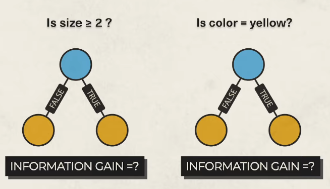

# Classification
- supervised learning technique
- predict categorical class labels/ categories / classes
- categories like discrete or nominal (e.g., "spam" or "not spam", "yes" or "no", "disease" or "no disease")
- used to classify new, unseen data by predicting the class label based on the input attributes
- Example
  - Email: spam vs. not spam
  - Medical diagnosis: has disease vs. no disease
  - Loan approval: approved vs. rejected
  - Pass or Fail
  - True or False (1 or 0)

## Types of Classification Problems

### 1. Binary Classification
- **Definition**: 
  - The model predicts one of **two possible classes**.
  - Classifies data into one of two distinct classes.
  - predict 1 from 2 classes
- **Examples**:
  - Spam or Not Spam  
  - Disease or No Disease  
  - Pass or Fail  
  - True or False (1 or 0)
### Algorithms: Logistic Regression, Support Vector Machines (SVM), Decision Trees, etc.

---

### 2. Multi-class Classification
- **Definition**: 
  - The model predicts one **out of more than two possible classes**.
  - Classifies data into one of three or more classes.
  - predict 1 from 3 or 3+ classes
- **Examples**:
  - Handwritten digit recognition (0–9)  
  - Animal classification (Cat, Dog, Horse, etc.)
  - Predicting student grades: A, B, C, D, F

### Algorithms: Softmax Regression, Random Forest, Naive Bayes, Neural Networks, etc.
---

### 3. Multi-label Classification
- **Definition**: 
  - Each instance can be **assigned to multiple classes simultaneously**.
  - each instance (data point) can be assigned multiple labels from a set of possible categories, rather than just one.
  - 
- **Examples**:
  - A news article labeled as both "Politics" and "Economy"  
  - A music genre classifier tagging a song as "Pop", "Rock", and "Electronic"  
  - A medical diagnosis identifying multiple conditions at once
  - Movie genre classification (Action, Comedy, Drama, etc.)
    - 1 movie 1 or multiple genre can be added
  - Multiple tags per input
  - 

------

# Logistic Regression
- **Logistic Regression** is a statistical method used for **binary classification**.  
- 0 – represents a negative class; 
- 1 – represents a positive class. 
- Logistic regression is commonly used in binary classification problems where the outcome variable reveals either of the two categories (0 and 1).
- Logistic Regression: converts linear output into a probability

## 🧠 Key Concepts

- **Dependent Variable**: Categorical (binary → 0 or 1)
- **Independent Variables**: Continuous or categorical
- **Output**: Probability of the positive class
- **Decision Boundary**: Typically 0.5 (can be adjusted)

## 📊 Example Use Cases

- Spam vs. Not Spam
- Fraud Detection
- Disease Diagnosis (Positive/Negative)
- Customer Churn (Stay/Leave)

## Decision boundary: 
- By default, if the predicted value is greater than 0.5, the class is
predicted as 1.

## Advantages:
- Simple and interpretable
- Fast to train
- Probabilistic output

## Limitations:
- Assumes linear decision boundary
- Sensitive to outliers and multicollinearity

## 📌 Logistic vs Linear Regression
| Feature              | Linear Regression | Logistic Regression  |
| -------------------- | ----------------- | -------------------- |
| Output Type          | Continuous        | Probability (0–1)    |
| Target Variable Type | Numeric           | Binary / Categorical |
| Function Used        | Linear Function   | Sigmoid Function     |
| Use Case             | Prediction        | Classification       |

## Sigmoid Function
- The sigmoid function is a key concept in logistic regression
- It maps any real-valued number to a value between 0 and 1, which is perfect for modeling probabilities.
- sigmoid function is often referred to as an S-shaped curve (or S-curve) because of how it looks when plotted — it smoothly increases from 0 to 1 in an “S” shape.
- 

| Property         | Description                             |
| ---------------- | --------------------------------------- |
| Output Range     | (0, 1)                                  |
| Symmetry         | Symmetric around $z = 0$                |
| Value at $z = 0$ | $\sigma(0) = 0.5$                       |
| Use Case         | Converts real number to probability     |
| Derivative       | $\sigma'(z) = \sigma(z)(1 - \sigma(z))$ |

----

# 🤖 K-Nearest Neighbors (KNN) 

## 📌 What is KNN?

- **K-Nearest Neighbors (KNN)** 
- **supervised machine learning algorithm**
- used for both **classification** and **regression** tasks
- It’s known as a **lazy learner**
- a lazy learning algorithm
- is a simple, non-parametric, instance-based learning algorithm used for **classification** and **regression**.
- **K-Nearest Neighbors (KNN)** is a simple, yet powerful **supervised machine learning algorithm** used for both **classification** and **regression** tasks. It’s known as a **lazy learner** because it doesn’t build an explicit model during training — instead, it stores the training data and makes decisions only when predicting.

## 📌 Key Concepts

| Term           | Meaning                                                  |
| -------------- | -------------------------------------------------------- |
| Instance-based | Uses the actual training instances for prediction        |
| Lazy learning  | No training phase; computation happens during prediction |
| Non-parametric | Makes no assumptions about the data distribution         |

### ✅ How It Works:
1. Choose a value of **k** (number of neighbors).
2. Compute the **distance** between a test point and all training points.
3. Find the **k nearest** training examples.
4. For classification: the majority class among the k-neighbors is chosen.

## 🧪 Strengths and Weaknesses

### ✅ Advantages
- Simple and easy to implement
- Works well with small datasets and low-dimensional data
- No training time

### ❌ Disadvantages
- Computationally expensive for large datasets
- **Slow** for large datasets (because it checks all points at prediction time)
- **Sensitive to irrelevant features** or **different feature scales**
- **Curse of dimensionality**: performance drops when there are too many features/columns/fields

---

## 🔧 When to Use KNN

- When data is small or moderately sized
- When you want an interpretable model
- When the decision boundary is **non-linear**
- When you have **well-labeled** and **balanced** data

## 📌 Summary Table

| Aspect              | KNN                            |
| ------------------- | ------------------------------ |
| Type                | Supervised learning            |
| Tasks               | Classification, Regression     |
| Model Type          | Non-parametric, Instance-based |
| Distance Metric     | Euclidean (commonly)           |
| Main Hyperparameter | Number of neighbors (k)        |
| Sensitive To        | Feature scaling, outliers      |
| Training Time       | ⏱️ Very fast                    |
| Prediction Time     | 🐌 Slow for large datasets      |

| Aspect             | Details                                           |
| ------------------ | ------------------------------------------------- |
| Type               | Supervised Learning                               |
| Learning Style     | Lazy Learning                                     |
| Data Type          | Labeled data                                      |
| Requires Scaling?  | ✅ Yes (distance-based)                            |
| Training Time      | 🟢 Fast                                            |
| Prediction Time    | 🔴 Slow (O(n) per prediction)                      |
| Key Hyperparameter | Number of neighbors (k)                           |
| Key Hyperparameter | Distance metric (Euclidean, Manhattan, Minkowski) |
| Model Storage      | Stores all training data                          |

Perfect! You're demonstrating a **step-by-step mathematical example of K-Nearest Neighbors (KNN)**. Here's the full explanation with **clear formatting and logic**:

---

### 🧮 KNN Mathematical Example (k = 3)

#### 📘 Given:

* **Training data (features):**

  $$
  X = [[1], [2], [4], [6], [7]]
  $$
* **Training labels:**

  $$
  y = [0, 0, 1, 1, 1]
  $$
* **New input to classify:**

  $$
  x = 3
  $$
* **Number of neighbors (k):**

  $$
  k = 3
  $$

---

### 📏 Step 1: Compute Euclidean Distances from x = 3

$$
\text{Distance to } 1 = |3 - 1| = 2 \\
\text{Distance to } 2 = |3 - 2| = 1 \\
\text{Distance to } 4 = |3 - 4| = 1 \\
\text{Distance to } 6 = |3 - 6| = 3 \\
\text{Distance to } 7 = |3 - 7| = 4
$$

So, distances are:

$$
[2, 1, 1, 3, 4]
$$

---

### 👥 Step 2: Find k = 3 Nearest Neighbors

Sort distances with corresponding labels:

| Index | X Value | Distance | Label |
| ----- | ------- | -------- | ----- |
| 1     | 2       | 1        | 0     |
| 2     | 4       | 1        | 1     |
| 0     | 1       | 2        | 0     |

**Closest neighbors (x = 3):** `2, 4, 1` → **Labels:** `[0, 1, 0]`

---

### ✅ Step 3: Predict by Majority Vote

Count class labels among the neighbors:

* Class `0`: 2 times
* Class `1`: 1 time

### 🔮 Final Prediction:

$$
\boxed{0}
$$

---

### 🧠 Conclusion:

* KNN classified **x = 3** as **class 0**
* Because the **majority** of the 3 nearest neighbors belonged to class 0

---

Would you like this as a Markdown file, a plotted visual version, or a scikit-learn code version for this same example?

# 🌳 Decision Trees – Overview

---

## 📘 What Are Decision Trees?
- A **Decision Tree** is a supervised machine learning model used for:
  - **Classification**: Predicting categories
  - **Regression**: Predicting continuous values
- A **tree-based machine learning model** that splits data into branches based on **feature thresholds**.
  - Each node represents a decision based on a feature.
  - Leaves represent the final prediction (class or value).
- It splits the data recursively into subsets based on **feature values**, forming a **tree-like structure** with:
  - **Nodes**: Decision points based on features
  - **Branches**: Outcomes of decisions
  - **Leaves**: Final predictions
- Data is continuously split according to a cretain parameter
- 

---

## 🧮 Splitting Criteria (Impurity Measures)

| Criterion         | Description                                                                                                 |
| ----------------- | ----------------------------------------------------------------------------------------------------------- |
| **Gini Impurity** | Measures the chance of misclassification if we randomly label a sample. Lower Gini = purer split.           |
| **Entropy**       | Based on Information Gain. Measures the disorder or uncertainty in the dataset. Lower Entropy = purer node. |

---

## ✅ Advantages of Decision Trees

- 📊 **Easy to visualize and interpret**
- 🔄 **Captures non-linear relationships**
- ⚖️ **No need for feature scaling**
- 🧩 **Handles both numerical and categorical data**

---

## ❌ Limitations

- ⚠️ **Prone to overfitting** (especially deep trees)
- 🔁 **Unstable** – small data changes can cause big structural changes
- 🐢 Can be **less accurate** compared to ensemble methods

---

## ❌ Disadvantages

- **Overfitting** on small or noisy datasets
- **Unstable** (small data changes can alter the tree)
- Biased toward features with **more levels**
- Not as accurate as ensemble methods (Random Forest, XGBoost)

## ⚙️ Key Hyperparameters to Tune

| Parameter           | Description                                                |
| ------------------- | ---------------------------------------------------------- |
| `max_depth`         | Maximum depth of the tree                                  |
| `min_samples_split` | Minimum number of samples required to split a node         |
| `min_samples_leaf`  | Minimum number of samples required at a leaf node          |
| `criterion`         | Split quality: `'gini'` or `'entropy'`                     |
| `max_features`      | Number of features to consider when looking for best split |

---

## ⚙️ How It Works (Classification)

1. Start at the **root node** with the entire dataset.
2. Choose the **best feature and threshold** to split the data.
3. Repeat the process recursively for each child node.
4. Stop when:
   - All data in the node belongs to one class
   - A stopping condition is reached (e.g., max depth)

Here’s a more detailed and clear explanation of the **impurity measures used in Decision Trees**:

---

### 🌳 Splitting in Decision Trees

At each node in a Decision Tree, the algorithm must decide **which feature and value to split on**. To do this, it uses **impurity measures** that evaluate how "pure" the resulting subsets will be.

The goal is to **maximize the difference** between the impurity of the parent node and the average impurity of the child nodes — this means we’re making the best possible split.

---

## 🔹 Gini Impurity

**Definition:**
Gini Impurity measures the **chance that a randomly chosen sample** would be **incorrectly classified** if it were labeled according to the class distribution in the node.

**Formula:**

$$
\text{Gini} = 1 - \sum_{i=1}^{C} p_i^2
$$

Where:

* $C$ = number of classes
* $p_i$ = proportion of class $i$ in the node

**Key idea:**

* **Lower Gini = purer node**

---

## 🔸 Entropy (Information Gain)

**Definition:**
- Entropy is a measure from **information theory** that quantifies the **uncertainty** or **impurity** in a node.
-  Entropy is a measure of uncertainty, disorder, or impurity in a dataset. 
-  In the context of decision trees, it tells us how mixed the classes are at a particular node.
-  If a node is **pure** (all data points belong to one class), entropy is **0**.
-  If classes are **evenly mixed**, entropy is **maximum**.

**Formula:**

$$
\text{Entropy} = - \sum_{i=1}^{C} p_i \log_2(p_i)
$$

**Information Gain**:

$$
\text{Information Gain} = \text{Entropy(parent)} - \text{Weighted Average Entropy(children)}
$$

**Key idea:**

* **Higher Information Gain = better split**
* Entropy becomes 0 when the node is pure (only one class present)

---

## 📊 Examples

### 🟢 Pure Node (All samples belong to one class)

| Class | Count | Probability |
| ----- | ----- | ----------- |
| 1     | 10    | 1.0         |
| 0     | 0     | 0.0         |

$$
Entropy = - (1 \cdot \log_2(1)) = 0
$$

> A pure node has **zero entropy**.

---

### 🔴 Mixed Node (50% of each class)

| Class | Count | Probability |
| ----- | ----- | ----------- |
| 1     | 5     | 0.5         |
| 0     | 5     | 0.5         |

$$
Entropy = - (0.5 \cdot \log_2(0.5) + 0.5 \cdot \log_2(0.5)) = 1
$$

> A perfectly mixed node has **maximum entropy = 1** (for binary classification).

---
### 🟡 Uneven Mix (e.g., 70% class 1, 30% class 0)

$$
Entropy = - (0.7 \cdot \log_2(0.7) + 0.3 \cdot \log_2(0.3)) \approx 0.881
$$

---

## 📌 Quick Summary

| Feature          | Description                                                   |
| ---------------- | ------------------------------------------------------------- |
| Entropy          | Measures uncertainty in a node                                |
| Range            | 0 (pure) to 1 (max impurity for 2 classes)                    |
| Used In          | ID3 algorithm, DecisionTreeClassifier (`criterion='entropy'`) |
| Compared to Gini | More mathematically intense, similar performance              |

---

### 📊 Gini vs. Entropy

| Criterion     | Focus                         | Interpretation              | Performance                          |
| ------------- | ----------------------------- | --------------------------- | ------------------------------------ |
| Gini Impurity | Misclassification probability | Faster to compute           | Slightly faster                      |
| Entropy       | Information gain              | Based on information theory | Slightly more accurate in some cases |

---

Would you like to see a worked-out example comparing Gini and Entropy on a small dataset?

## 📌 Types of Decision Trees Summary

| Type           | Target Variable | Use Case Example                |
| -------------- | --------------- | ------------------------------- |
| Classification | Categorical     | Spam detection, fraud detection |
| Regression     | Numerical       | House price prediction          |

## 🔹 1. Classification Trees

- **Used when** the target variable is **categorical**.
- The tree splits the dataset based on features to classify data into categories.
- Example: Predicting whether an email is "Spam" or "Not Spam".

**Common Criteria**:
- Gini Index
- Entropy (Information Gain)

---

## 🔹 2. Regression Trees

- **Used when** the target variable is **continuous/numerical**.
- Splits are made to minimize the variance or mean squared error (MSE) in the output.
- Example: Predicting the price of a house.

**Common Criteria**:
- Mean Squared Error (MSE)
- Mean Absolute Error (MAE)

## 🧠 Bonus: Tree Variants by Algorithm

| Tree Type        | Description                                      |
|------------------|--------------------------------------------------|
| **ID3**          | Uses Information Gain for splitting              |
| **C4.5 / C5.0**  | Improvement of ID3; handles both continuous and missing values |
| **CART**         | Classification and Regression Trees (binary splits only) |
| **CHAID**        | Uses chi-square test; works well with categorical data |
| **Random Forest**| An ensemble of multiple decision trees           |
| **XGBoost**      | Boosted decision trees for high-performance tasks|

#  Decision Tree: Important things to know 

---

# Example Of Decision Tree
Got it! Let's go through a **complete decision tree example using mathematical calculations only**, step by step — **no programming, just pure logic, table, and math**.

## 🌳 Decision Tree Example (By Hand)

### 🎯 Problem:

You want to decide whether a person **will play tennis** based on the **Outlook** of the day.

### 🧾 Dataset (Simplified)

| Example | Outlook  | Play Tennis |
| ------- | -------- | ----------- |
| 1       | Sunny    | No          |
| 2       | Sunny    | No          |
| 3       | Overcast | Yes         |
| 4       | Rain     | Yes         |
| 5       | Rain     | Yes         |
| 6       | Rain     | No          |
| 7       | Overcast | Yes         |
| 8       | Sunny    | Yes         |
| 9       | Sunny    | Yes         |
| 10      | Rain     | Yes         |
| 11      | Sunny    | No          |
| 12      | Overcast | Yes         |
| 13      | Overcast | Yes         |
| 14      | Rain     | No          |

### Step 1: Calculate Total Entropy of the Dataset

* Suppose in dataset **S**, Total = 14 , **Yes** =9 , **No** =5 

### Step 2: Calculate Entropy of the Total Dataset
**Formula:**

$$
\text{Entropy} = - \sum_{i=1}^{C} p_i \log_2(p_i)
$$

$$
\text{Entropy}(S) = -p_+ \log_2(p_+) - p_- \log_2(p_-)
$$

Where:

* $p_+$ = proportion of positive examples (e.g., "Yes")
* $p_-$ = proportion of negative examples (e.g., "No")

$$
\text{Entropy}(S) = -\frac{9}{14} \log_2(\frac{9}{14}) - \frac{5}{14} \log_2(\frac{5}{14})
$$

$$
\text{Entropy}(S) = -\frac{9}{14} \log_2\left(\frac{9}{14}\right) - \frac{5}{14} \log_2\left(\frac{5}{14}\right)
\approx -0.643 \cdot \log_2(0.643) - 0.357 \cdot \log_2(0.357)
\approx 0.940
$$

- Entropy(S) measures the impurity or uncertainty of a dataset S
- If all examples belong to the same class (all Yes or all No), entropy is 0 (perfectly pure).
- If examples are evenly split between classes, entropy is maximum (completely impure).

### 📉 Interpretation:

| Class Split (Yes/No) | Entropy               |
| -------------------- | --------------------- |
| 14 Yes / 0 No        | 0.0     (pure)        |
| 9 Yes / 5 No         | 0.940   (mixed)       |
| 7 Yes / 7 No         | 1.0     (most impure) |

### Step 3: Split by "Outlook"

#### Values of Outlook: Sunny, Overcast, Rain

Let’s divide the data and compute entropy for each group.

#### 🌤 Sunny (5 examples)

| Example | Play Tennis |
| ------- | ----------- |
| 1       | No          |
| 2       | No          |
| 8       | Yes         |
| 9       | Yes         |
| 11      | No          |

* Yes = 2, No = 3, Total = 5

$$
\text{Entropy(Sunny)} = -\frac{2}{5} \log_2\left(\frac{2}{5}\right) - \frac{3}{5} \log_2\left(\frac{3}{5}\right)
\approx 0.971
$$

#### ⛅ Overcast (4 examples)

| Example | Play Tennis |
| ------- | ----------- |
| 3       | Yes         |
| 7       | Yes         |
| 12      | Yes         |
| 13      | Yes         |

* Yes = 4, No = 0, Total = 4

All are Yes → Entropy = 0 (pure node)

$$
\text{Entropy}(S_{\text{Overcast}}) = -\frac{4}{4} \cdot \log_2(\frac{4}{4}) - \frac{0}{4} \cdot \log_2(\frac{0}{4})
$$
$$
\text{Entropy}(S_{\text{Overcast}}) = -1 \cdot \log_2(1) - 0 \cdot \log_2(0)
$$

* $\log_2(1) = 0$
* $0 \cdot \log_2(0)$ is defined as **0** (in information theory)

$$
\text{Entropy}(S_{\text{Overcast}}) = -1 \cdot 0 - 0 = 0
$$

Since all the outcomes are the same (**pure node**), there's **no uncertainty**, so **entropy = 0**.

#### 🌧 Rain (5 examples)

| Example | Play Tennis |
| ------- | ----------- |
| 4       | Yes         |
| 5       | Yes         |
| 6       | No          |
| 10      | Yes         |
| 14      | No          |

* Yes = 3, No = 2, Total = 5

$$
\text{Entropy}(S_{\text{Rain}}) = -p_+ \log_2(p_+) - p_- \log_2(p_-)
$$

$$
\text{Entropy}(S_{\text{Rain}}) = -\frac{3}{5} \log_2\left(\frac{3}{5}\right) - \frac{2}{5} \log_2\left(\frac{2}{5}\right)
\approx 0.971
$$

### Step 4: Compute Information Gain for "Outlook"

$$
\text{Gain}(S, \text{Outlook}) = \text{Entropy}(S) - \sum_{v \in \text{values}} \frac{|S_v|}{|S|} \cdot \text{Entropy}(S_v)
$$

$$
= 0.940 - \left( \frac{5}{14} \cdot 0.971 + \frac{4}{14} \cdot 0 + \frac{5}{14} \cdot 0.971 \right)
$$

$$
= 0.940 - \left( 0.347 + 0 + 0.347 \right) = 0.940 - 0.694 = 0.246
$$

#### Explaination of step 4

$$
\text{Gain}(S, \text{Outlook}) = \text{Entropy}(S) - \sum_{v \in \text{values}} \frac{|S_v|}{|S|} \cdot \text{Entropy}(S_v)
$$

##### 📌 What Does It Mean?

This formula calculates how much **"uncertainty"** (entropy) is **reduced** when the dataset $S$ is split by a feature — in this case, `Outlook`.

We want to know:

> How much does splitting the data on the "Outlook" attribute help us better predict the target variable?

# Term-by-Term Explanation:

### **Entropy(S)**

This is the **entropy of the full dataset**, before any splitting.
It represents the current level of disorder or impurity.

### 
$$\sum_{v \in \text{values}}$$

This means we are looping over **each value** of the "Outlook" feature:

* Sunny
* Overcast
* Rain

### 3. **$\frac{|S_v|}{|S|}$**

This is the **weight** of each group.
It’s the proportion of data points where `Outlook = v`.

For example:

* If 5 of the 14 examples have `Outlook = Sunny`, then:

$$
|S_{\text{Sunny}}| = 5 \quad \Rightarrow \quad \frac{|S_{\text{Sunny}}|}{|S|} = \frac{5}{14}
$$
$$
|S_{\text{Overcast}}| = 4 \quad \Rightarrow \quad \frac{|S_{\text{Overcast}}|}{|S|} = \frac{4}{14}
$$
$$
|S_{\text{Rain}}| = 5 \quad \Rightarrow \quad \frac{|S_{\text{Rain}}|}{|S|} = \frac{5}{14}
$$
---

### 4. **$\text{Entropy}(S_v)$**

This is the **entropy of the subgroup** where `Outlook = v`.

You calculate this separately for:

* $\text{Entropy}(S_{\text{Sunny}})$
* $\text{Entropy}(S_{\text{Overcast}})$
* $\text{Entropy}(S_{\text{Rain}})$

### 5. **Putting it all together**

The entire term:

$$
\sum_{v \in \text{values}} \frac{|S_v|}{|S|} \cdot \text{Entropy}(S_v)
$$

is the **expected entropy after splitting** by "Outlook".

So,

$$
\text{Information Gain} = \text{Entropy before split} - \text{Weighted entropy after split}
$$

## ✅ Example (From Earlier)

We had:

* $\text{Entropy}(S) \approx 0.940$
* Weighted entropies:

  * Sunny: $\frac{5}{14} \cdot 0.971$
  * Overcast: $\frac{4}{14} \cdot 0$
  * Rain: $\frac{5}{14} \cdot 0.971$

$$
\text{Gain}(S, \text{Outlook}) = 0.940 - \left( \frac{5}{14} \cdot 0.971 + \frac{4}{14} \cdot 0 + \frac{5}{14} \cdot 0.971 \right)
= 0.940 - 0.694 = 0.246
$$

So splitting on "Outlook" **reduces entropy by 0.246**, which is the **information gain**.

Let me know if you want to do this step-by-step with another feature (e.g., `Humidity`) to compare!

### 🏆 Conclusion

* The **Information Gain** for splitting on **Outlook** is **0.246**.
* You would do the same calculation for other attributes (e.g., Humidity, Wind).
* The attribute with the **highest information gain** becomes the **root node** of the decision tree.

---

### 🎯 Problem:

Predict if someone will **Play Tennis** based on **Outlook**.

### 📊 Dataset:

| Outlook  | Play Tennis                           |
| -------- | ------------------------------------- |
| Sunny    | No, No, Yes, Yes, No → (2 Yes, 3 No)  |
| Overcast | Yes, Yes, Yes, Yes → (4 Yes)          |
| Rain     | Yes, Yes, No, Yes, No → (3 Yes, 2 No) |

### Step 1: Entropy of Entire Dataset

* Total = 14
* Yes = 9, No = 5

$$
\text{Entropy}(S) = -\frac{9}{14} \log_2(\frac{9}{14}) - \frac{5}{14} \log_2(\frac{5}{14}) \approx 0.940
$$

### Step 2: Entropy by Outlook

* **Sunny (5)** → 2 Yes, 3 No

  $$
  \text{Entropy} \approx 0.971
  $$

* **Overcast (4)** → 4 Yes

  $$
  \text{Entropy} = 0
  $$

* **Rain (5)** → 3 Yes, 2 No

  $$
  \text{Entropy} \approx 0.971
  $$

### Step 3: Information Gain

$$
\text{Gain}(S, \text{Outlook}) = 0.940 - \left( \frac{5}{14} \cdot 0.971 + \frac{4}{14} \cdot 0 + \frac{5}{14} \cdot 0.971 \right)
= 0.940 - 0.694 = 0.246
$$

### ✅ Conclusion:

* Splitting by **Outlook** gives an **information gain of 0.246**.
* You’d repeat this for other attributes (e.g., Humidity) and pick the one with the **highest gain** as the root.

---

# Decision Treee Prblem 2 [3 features]

Great! You've already calculated the **information gain for the feature `Outlook`**, and now you'd like to do the same for **two more features**. Let's continue with a full **by-hand example** (no code) for the features:

* `Humidity`
* `Wind`

We'll follow the same steps:

1. Divide data by feature values
2. Compute entropy of each group
3. Compute weighted average entropy
4. Subtract from total entropy to get **Information Gain**

## 📊 Data (continued with extra columns)

We'll now assume a simplified version of the full dataset includes two more features for each record:

| Ex | Outlook  | Humidity | Wind   | Play Tennis |
| -- | -------- | -------- | ------ | ----------- |
| 1  | Sunny    | High     | Weak   | No          |
| 2  | Sunny    | High     | Strong | No          |
| 3  | Overcast | High     | Weak   | Yes         |
| 4  | Rain     | High     | Weak   | Yes         |
| 5  | Rain     | Normal   | Weak   | Yes         |
| 6  | Rain     | Normal   | Strong | No          |
| 7  | Overcast | Normal   | Strong | Yes         |
| 8  | Sunny    | High     | Weak   | Yes         |
| 9  | Sunny    | Normal   | Weak   | Yes         |
| 10 | Rain     | Normal   | Weak   | Yes         |
| 11 | Sunny    | Normal   | Strong | No          |
| 12 | Overcast | High     | Strong | Yes         |
| 13 | Overcast | Normal   | Weak   | Yes         |
| 14 | Rain     | High     | Strong | No          |

## ✅ Step 1: Entropy(S) (from earlier)

We already calculated:

$$
\text{Entropy} = - \sum_{i=1}^{C} p_i \log_2(p_i)
$$

$$
\text{Entropy}(S) = -p_+ \log_2(p_+) - p_- \log_2(p_-)
$$

Where:

* $p_+$ = proportion of positive examples (e.g., "Yes")
* $p_-$ = proportion of negative examples (e.g., "No")

$$
\text{Entropy}(S) = -\frac{9}{14} \log_2(\frac{9}{14}) - \frac{5}{14} \log_2(\frac{5}{14})
$$

$$
\text{Entropy}(S) = -\frac{9}{14} \log_2\left(\frac{9}{14}\right) - \frac{5}{14} \log_2\left(\frac{5}{14}\right)
\approx -0.643 \cdot \log_2(0.643) - 0.357 \cdot \log_2(0.357)
\approx 0.940
$$

## 🔸 Feature 1: **Humidity** (values: High, Normal)

### ➤ Group by Humidity

#### a. **Humidity = High**

| Ex | Play |
| -- | ---- |
| 1  | No   |
| 2  | No   |
| 3  | Yes  |
| 4  | Yes  |
| 12 | Yes  |
| 14 | No   |

* Total = 6
* Yes = 3, No = 3

$$
\text{Entropy(High)} = -\frac{3}{6} \log_2\left(\frac{3}{6}\right) - \frac{3}{6} \log_2\left(\frac{3}{6}\right) = 1.0
$$

#### b. **Humidity = Normal**

| Ex | Play |
| -- | ---- |
| 5  | Yes  |
| 6  | No   |
| 7  | Yes  |
| 8  | Yes  |
| 9  | Yes  |
| 10 | Yes  |
| 11 | No   |
| 13 | Yes  |

* Total = 8
* Yes = 6, No = 2

$$
\text{Entropy(Normal)} = -\frac{6}{8} \log_2\left(\frac{6}{8}\right) - \frac{2}{8} \log_2\left(\frac{2}{8}\right)
$$

$$
= -0.75 \log_2(0.75) - 0.25 \log_2(0.25) \approx 0.811
$$

### ➤ Information Gain for Humidity

$$
\text{Gain}(S, \text{Humidity}) = \text{Entropy}(S) - \sum_{v \in \text{values}} \frac{|S_v|}{|S|} \cdot \text{Entropy}(S_v)
$$

$$
= 0.940 - \left( \frac{6}{14} \cdot 1.0 + \frac{8}{14} \cdot 0.811 \right)
$$

$$
= 0.940 - \left( 0.4286 + 0.4634 \right)
$$

$$
= 0.940 - 0.892 = \boxed{0.048}
$$

## 🔸 Feature 2: **Wind** (values: Weak, Strong)

### ➤ Group by Wind

#### a. **Wind = Weak**

| Ex | Play |
| -- | ---- |
| 1  | No   |
| 3  | Yes  |
| 4  | Yes  |
| 5  | Yes  |
| 8  | Yes  |
| 9  | Yes  |
| 10 | Yes  |
| 13 | Yes  |

* Total = 8
* Yes = 7, No = 1

$$
\text{Entropy(Weak)} = -\frac{7}{8} \log_2\left(\frac{7}{8}\right) - \frac{1}{8} \log_2\left(\frac{1}{8}\right)
= -0.875 \log_2(0.875) - 0.125 \log_2(0.125) \approx 0.543
$$

#### b. **Wind = Strong**

| Ex | Play |
| -- | ---- |
| 2  | No   |
| 6  | No   |
| 7  | Yes  |
| 11 | No   |
| 12 | Yes  |
| 14 | No   |

* Total = 6
* Yes = 2, No = 4

$$
\text{Entropy(Strong)} = -\frac{2}{6} \log_2\left(\frac{2}{6}\right) - \frac{4}{6} \log_2\left(\frac{4}{6}\right)
= -0.333 \log_2(0.333) - 0.667 \log_2(0.667) \approx 0.918
$$

### ➤ **Information Gain for Wind**

$$
\text{Gain}(S, \text{Wind}) = \text{Entropy}(S) - \sum_{v \in \text{values}} \frac{|S_v|}{|S|} \cdot \text{Entropy}(S_v)
$$

$$
= 0.940 - \left( \frac{8}{14} \cdot 0.543 + \frac{6}{14} \cdot 0.918 \right)
$$

$$
= 0.940 - \left( 0.310 + 0.393 \right)
$$

$$
= 0.940 - 0.703 = \boxed{0.237}
$$

## ✅ Final Summary

| Feature  | Information Gain |
| -------- | ---------------- |
| Outlook  | **0.246**        |
| Humidity | 0.048            |
| Wind     | **0.237**        |

🔚 **Conclusion:**

Since **Outlook** has the **highest information gain**, it is selected as the **root node** of the decision tree.

> 📌 So, the **best attribute to split on first** is **Outlook**.

---

## Summarized Version

## ✅ Entropy of Dataset $S$

**Formula:**

$$
\text{Entropy}(S) = -p_+ \log_2(p_+) - p_- \log_2(p_-)
$$

**Values:**

$$
p_+ = \frac{9}{14}, \quad p_- = \frac{5}{14}
$$

$$
\text{Entropy}(S) = -\frac{9}{14} \log_2\left(\frac{9}{14}\right) - \frac{5}{14} \log_2\left(\frac{5}{14}\right) \approx \boxed{0.940}
$$

## 🔸 Feature: **Humidity** (High / Normal)

**Entropies:**

* $\text{Entropy(High)} = 1.0$
* $\text{Entropy(Normal)} = -\frac{6}{8} \log_2\left(\frac{6}{8}\right) - \frac{2}{8} \log_2\left(\frac{2}{8}\right) \approx 0.811$

**Information Gain Formula:**

$$
\text{Gain}(S, \text{Humidity}) = \text{Entropy}(S) - \sum_{v \in \text{values}} \frac{|S_v|}{|S|} \cdot \text{Entropy}(S_v)
$$
$$
\text{Gain}(S, \text{Humidity}) = \text{Entropy}(S) - \left( \frac{6}{14} \cdot \text{Entropy(High)} + \frac{8}{14} \cdot \text{Entropy(Normal)} \right)
$$

**Calculation:**

$$
= 0.940 - \left( \frac{6}{14} \cdot 1.0 + \frac{8}{14} \cdot 0.811 \right)
= 0.940 - (0.4286 + 0.4634) = \boxed{0.048}
$$

## 🔸 Feature: **Wind** (Weak / Strong)

**Entropies:**

* $\text{Entropy(Weak)} = -\frac{7}{8} \log_2\left(\frac{7}{8}\right) - \frac{1}{8} \log_2\left(\frac{1}{8}\right) \approx 0.543$
* $\text{Entropy(Strong)} = -\frac{2}{6} \log_2\left(\frac{2}{6}\right) - \frac{4}{6} \log_2\left(\frac{4}{6}\right) \approx 0.918$

**Information Gain Formula:**
$$
\text{Gain}(S, \text{Wind}) = \text{Entropy}(S) - \sum_{v \in \text{values}} \frac{|S_v|}{|S|} \cdot \text{Entropy}(S_v)
$$
$$
\text{Gain}(S, \text{Wind}) = \text{Entropy}(S) - \left( \frac{8}{14} \cdot \text{Entropy(Weak)} + \frac{6}{14} \cdot \text{Entropy(Strong)} \right)
$$

**Calculation:**

$$
= 0.940 - \left( \frac{8}{14} \cdot 0.543 + \frac{6}{14} \cdot 0.918 \right)
= 0.940 - (0.310 + 0.393) = \boxed{0.237}
$$

## 📊 Final Summary

| Feature  | Information Gain |
| -------- | ---------------- |
| Outlook  | **0.246**        |
| Wind     | **0.237**        |
| Humidity | 0.048            |

📌 **Best Split**: `Outlook` (highest gain)

---

# C4.5 Decision Tree Example

Great! Here's the **same Play Tennis decision tree example** using the **C4.5 algorithm**, which improves on ID3 by using **Gain Ratio** instead of just Information Gain.

## 🌳 Decision Tree Example Using **C4.5 (Gain Ratio)**

### 🎯 Problem:

Predict if someone will **Play Tennis** based on **Outlook**.

### 📊 Dataset Recap:

| Outlook  | Play Tennis                           |
| -------- | ------------------------------------- |
| Sunny    | No, No, Yes, Yes, No → (2 Yes, 3 No)  |
| Overcast | Yes, Yes, Yes, Yes → (4 Yes)          |
| Rain     | Yes, Yes, No, Yes, No → (3 Yes, 2 No) |

Total = 14, Yes = 9, No = 5
Entropy of dataset $S \approx 0.940$

### Step 1: Compute **Information Gain** for "Outlook"

Compute Information Gain for "Outlook"

$$
\textbf{\text{Gain}(S, \text{Outlook})} = \text{Entropy}(S) - \sum_{i \in \text{values}} \frac{|S_i|}{|S|} \cdot \text{Entropy}(S_i)
$$

$$
= 0.940 - \left( \frac{5}{14} \cdot 0.971 + \frac{4}{14} \cdot 0 + \frac{5}{14} \cdot 0.971 \right)
$$

$$
= 0.940 - \left( 0.347 + 0 + 0.347 \right) = 0.940 - 0.694 = \textbf{0.246}
$$

### Step 2: Compute **Split Information**

**Formula:**

$$
\text{SplitInfo}(S, \text{Outlook}) = -\sum_{i=1}^{n} \frac{|S_i|}{|S|} \log_2\left(\frac{|S_i|}{|S|}\right)
$$

Where:

* Sunny = 5, Overcast = 4, Rain = 5

$$
\text{SplitInfo}(S, \text{Outlook}) = -\left( \frac{5}{14} \log_2\left(\frac{5}{14}\right) + \frac{4}{14} \log_2\left(\frac{4}{14}\right) + \frac{5}{14} \log_2\left(\frac{5}{14}\right) \right)
$$

$$
= -\left( 2 \cdot \frac{5}{14} \log_2\left(\frac{5}{14}\right) + \frac{4}{14} \log_2\left(\frac{4}{14}\right) \right)
$$

Now calculate:

* $\frac{5}{14} \approx 0.357$, $\log_2(0.357) \approx -1.485$
* $\frac{4}{14} \approx 0.286$, $\log_2(0.286) \approx -1.807$

$$
\text{SplitInfo} \approx -\left(2 \cdot 0.357 \cdot -1.485 + 0.286 \cdot -1.807\right)
= -( -1.059 - 0.517 ) = 1.576
$$

### Step 3: Compute **Gain Ratio**

$$
\text{GainRatio}(S, \text{Outlook}) = \frac{\text{Gain}}{\text{SplitInfo}} = \frac{0.246}{1.576} \approx 0.156
$$

### ✅ C4.5 Conclusion:

* **Gain Ratio for Outlook ≈ 0.156**
* C4.5 prefers attributes with **high information gain** but **low intrinsic information** (split info).
* Repeat Gain Ratio calculations for other attributes (e.g., Humidity, Wind).
* Choose the attribute with the **highest Gain Ratio** as the root node.

Let me know if you want to calculate Gain Ratio for another feature to compare!

---

## 🌲 Decision Tree Example Using **CART (Gini Index)**

### 🎯 Goal:

Predict if someone will **Play Tennis** based on **Outlook**, using **Gini Index** (used in CART) instead of Entropy or Gain Ratio.

### 🧮 Step 1: Gini Index Formula

For a set $S$, with two classes (e.g., Yes, No):

$$
\text{Gini}(S) = 1 - \sum_{i=1}^{c} p_i^2
$$

Where $p_i$ is the proportion of class $i$ in set $S$.

### 📊 Dataset Summary (Play Tennis):

| Outlook  | Play Tennis                           |
| -------- | ------------------------------------- |
| Sunny    | No, No, Yes, Yes, No → (2 Yes, 3 No)  |
| Overcast | Yes, Yes, Yes, Yes → (4 Yes)          |
| Rain     | Yes, Yes, No, Yes, No → (3 Yes, 2 No) |

Total: 14,
Yes: 9, No: 5

### Step 2: Gini of Full Dataset $S$

$$
\text{Gini}(S) = 1 - (9/14)^2 - (5/14)^2 = 1 - 0.413 - 0.128 = \textbf{0.459}
$$

### Step 3: Gini for **Outlook**

#### 🌤 Sunny (5 samples: 2 Yes, 3 No)

$$
\text{Gini}(Sunny) = 1 - (2/5)^2 - (3/5)^2 = 1 - 0.16 - 0.36 = \textbf{0.48}
$$

#### ☁ Overcast (4 samples: 4 Yes, 0 No)

$$
\text{Gini}(Overcast) = 1 - (1)^2 - (0)^2 = \textbf{0}
$$

#### 🌧 Rain (5 samples: 3 Yes, 2 No)

$$
\text{Gini}(Rain) = 1 - (3/5)^2 - (2/5)^2 = 1 - 0.36 - 0.16 = \textbf{0.48}
$$

### Step 4: Weighted Gini after split on **Outlook**

$$
\text{Gini}_{\text{split}} = \frac{5}{14} \cdot 0.48 + \frac{4}{14} \cdot 0 + \frac{5}{14} \cdot 0.48
$$

$$
= 0.171 + 0 + 0.171 = \textbf{0.342}
$$

### Step 5: Gini Gain

$$
\text{Gini Gain} = \text{Gini}(S) - \text{Gini}_{\text{split}} = 0.459 - 0.342 = \textbf{0.117}
$$

## ✅ CART Conclusion:

* **Gini Gain for Outlook ≈ 0.117**
* CART chooses the attribute with the **lowest Gini after split** (or highest Gini Gain).
* Next step: Repeat this Gini Gain computation for other features (like Humidity, Wind).
* Choose the attribute with **maximum Gini Gain** to split at root.

---
