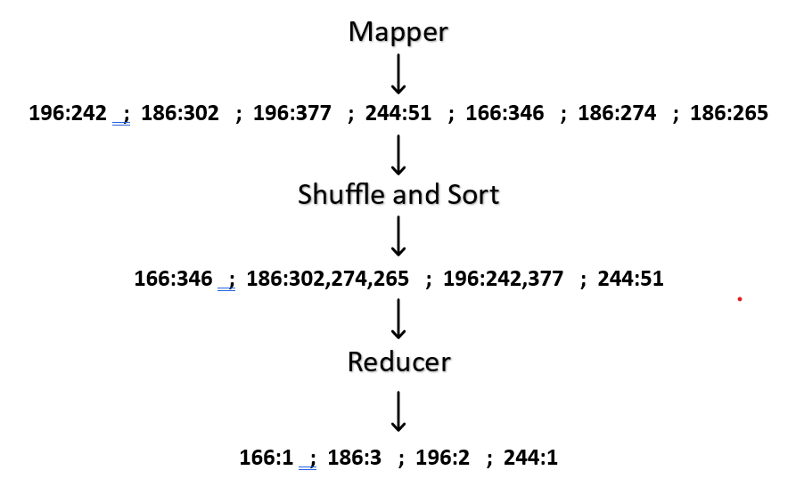

# Characteristics of Big Data

---
## **6 V’s of Big Data**


| **V**           | **Meaning**                                                             | **Explanation / Example**                                                                  |
| --------------- | ----------------------------------------------------------------------- | ------------------------------------------------------------------------------------------ |
| **Volume**      | **Amount/size/quantity/(how much) of data**                             | Massive amounts of data — e.g., Facebook generates terabytes of user data daily.           |
| **Variety**     | **Different types/formats/(What kind) of data**                         | Structured (tables), semi-structured (JSON, XML), and unstructured (videos, images, text). |
| **Velocity**    | **Speed/(how fast data moving) of data generation and processing**      | Real-time streaming from IoT devices, financial trades, social media feeds, etc.           |
| **Value**       | **Usefulness/worth/(is data useful) of data for decision-making**       | Data must provide insights, trends, or patterns that help businesses or organizations.     |
| **Variability** | **Inconsistency or unpredictability in data flows (How data changes?)** | Data meaning changes over time — e.g., trending topics on Twitter vary hour by hour.       |
| **Veracity**    | **Accuracy/quality/reliability/(How trustworthy) of data**              | Data can be noisy, incomplete, or misleading — requires cleaning and validation.           |

---


### Hadoop MapReduce Function? [MeSSiR]


### 1. **Map Phase**

* Takes input data and processes it into intermediate **(key, value)** pairs.
* Each mapper works **independently and in parallel** on a chunk of data.

### 2. **Shuffle and Sort Phase**

* Groups and sorts the intermediate data by key.
* Ensures all values of the same key are sent to the same reducer.

### 3. **Reduce Phase**

* Takes grouped **(key, list of values)** and produces final output.
* Often used to **aggregate**, **summarize**, or **transform** data.

---

### 🛠️ Basic Flow Diagram

```text
Input Data → Map → Shuffle & Sort → Reduce → Output
```

---
# Hadoop MapReduce pseudo-code:

## Example-1 : Word Count

Word Count Detailed Example:
- Goal: Count occurrences of each word in a document corpus.
- Map: For each word in a line, emit (word, 1).
- Shuffle & Sort: Group all (word, 1) pairs by word.
- Reduce: Sum counts for each word.

```
map(document):
    for word in document.split():
        emit(word, 1)
reduce(word, counts):
    emit(word, sum(counts))
```


## Example-2 : Average Calculation

Average Calculation Example:
- Goal: Compute average value of numbers in a dataset.
- Map: Emit ("key", (number, 1))
- Reduce: Sum numbers and counts, then calculate average.


```
map(record):
    emit("key", (record.value, 1))
reduce("key", list_of_values):
    total,count = 0, 0
    for value, c in list_of_values:
        total += value
        count += c
    emit("key", total / count)
```

## Example-3 : Compute average word length in a corpus. [No need for exam]

---

# MapReduce math
## understanding using numeric solution




## MapReduce MATH 1


## MapReduce MATH 2


---


# Hadoop MapReduce vs Apache Spark

| **Feature**         | **Hadoop MapReduce**                            | **Apache Spark**                                                                 |
| ------------------- | ----------------------------------------------- | -------------------------------------------------------------------------------- |
| **Processing**      | Disk-based after each phase                     | In-memory (RAM) with optional disk spill                                         |
| **Iterative Tasks** | Slow due to repeated disk I/O                   | Fast using RDD/DataFrame caching                                                 |
| **Programming**     | Low-level Java API                              | High-level APIs in Python, Scala, Java, R                                        |
| **Speed**           | Good for simple, one-pass batch jobs            | Up to 100x faster for complex or iterative workloads                             |
| **Use Case Fit**    | Ideal for large-scale ETL and linear batch jobs | Ideal for interactive, iterative jobs (e.g., machine learning, graph processing) |


### 🧠 Summary:

* **Hadoop MapReduce** is disk-heavy, reliable, and best for **sequential batch jobs**.
* **Apache Spark** is memory-centric, faster, and better suited for **real-time, iterative, and ML tasks**.


## 🔍 **1. Processing**

### ✅ Hadoop MapReduce:

* Processes data in **stages**, writing intermediate results to **disk** after every **Map** or **Reduce** phase.
* This ensures fault tolerance, but causes **slower performance** due to heavy **disk I/O**.

### ✅ Apache Spark:

* Processes data **in memory**, meaning intermediate data is stored in **RAM**, not disk (unless necessary).
* This significantly **improves speed** for multi-stage or iterative computations.


## 🔄 **2. Iterative Tasks**

### ✅ Hadoop MapReduce:

* Each job must read from and write to disk every time, even if the same data is reused.
* This makes it **inefficient** for iterative algorithms like machine learning or graph processing.

### ✅ Apache Spark:

* Supports **in-memory caching** of datasets using **RDDs (Resilient Distributed Datasets)** or **DataFrames**.
* This makes it ideal for **reusing data across multiple operations**, resulting in **faster performance**.


## 💻 **3. Programming**

### ✅ Hadoop MapReduce:

* Mostly uses **low-level Java APIs**.
* More **boilerplate code** is needed for writing and reading data, managing mappers/reducers, etc.

### ✅ Apache Spark:

* Offers **high-level APIs** in **Scala, Python (PySpark), Java, and R**.
* Provides **simple functions** for map, filter, join, groupBy, etc., making development **faster and easier**.


## ⚡ **4. Speed**

### ✅ Hadoop MapReduce:

* Decent for **simple batch jobs** that need to scan large datasets once (e.g., logs processing).
* Slower for complex logic due to reliance on disk.

### ✅ Apache Spark:

* **Up to 100x faster** than MapReduce for **complex, multi-step jobs**.
* Especially efficient for ML, streaming, and graph algorithms.


## 🎯 **5. Use Case Fit**

### ✅ Hadoop MapReduce:

* Best for **large, one-pass data processing** tasks like ETL (Extract, Transform, Load), indexing, and archiving.
* Good when memory is limited, and reliability is key.

### ✅ Apache Spark:

* Ideal for **interactive data analysis**, **real-time processing**, and **machine learning workflows**.
* Frequently used in modern data platforms due to its flexibility and speed.


## 🧠 In Short:

| **If your job is...**                       | **Choose...**    |
| ------------------------------------------- | ---------------- |
| Heavy, one-time processing on huge datasets | Hadoop MapReduce |
| Fast, repeated access to the same dataset   | Apache Spark     |
| Real-time or interactive                    | Apache Spark     |
| Memory-constrained, disk-safe batch jobs    | Hadoop MapReduce |

---


## Apache Spark – Key Characteristics

| **Characteristic**         | **Explanation**                                                                                     |
| -------------------------- | --------------------------------------------------------------------------------------------------- |
| **In-Memory Computation**  | Stores intermediate results in RAM for faster performance than disk-based systems (like MapReduce). |
| **Speed**                  | Up to **100x faster** than Hadoop MapReduce for complex or iterative tasks.                         |
| **Distributed Processing** | Automatically distributes data and tasks across multiple nodes in a cluster.                        |
| **Ease of Use**            | Supports high-level **APIs in Scala, Python (PySpark), Java, R**, and SQL.                          |
| **Lazy Evaluation**        | Builds a **Directed Acyclic Graph (DAG)** of execution for better optimization.                     |
| **Fault Tolerance**        | Uses **RDD lineage** to recover lost data without needing full data replication.                    |
| **Unified Engine**         | Handles **batch processing, streaming, machine learning, and graph processing**.                    |
| **Rich Libraries**         | Includes **Spark SQL**, **Spark MLlib**, **Spark Streaming**, **GraphX**, etc.                      |
| **Scalability**            | Scales from a laptop to thousands of nodes — suitable for both small and big data.                  |
| **Integration Support**    | Integrates with **Hadoop (HDFS), Hive, HBase, Cassandra, Kafka, S3**, etc.                          |


## 🧠 Summary

Apache Spark is:

* **Fast** (in-memory & parallel)
* **Flexible** (multiple languages & workloads)
* **Unified** (one engine for many tasks)
* **Scalable** (from GBs to petabytes)
* **Extensible** (via libraries and external data sources)

---
# DAG
