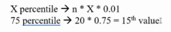

# Data Preprocessing Steps





## Outlier Detection


```
z = (X — μ) / σ​

Here’s what each component means:

    Z is the Z-score we’re calculating.
    X is the specific data point we want to evaluate.
    μ (mu) is the mean (average) of the dataset.
    σ (sigma) is the standard deviation, which measures how spread out the data is.
```

# Documents
- https://www.savemyexams.com/international-a-level/maths/edexcel/20/statistics-1/revision-notes/data-presentation-and-interpretation/working-with-data/outliers/
- 