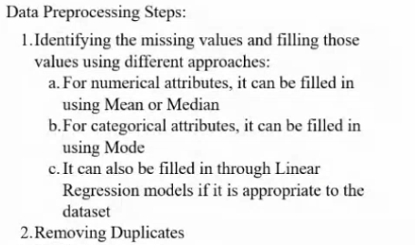
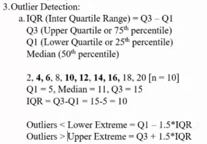
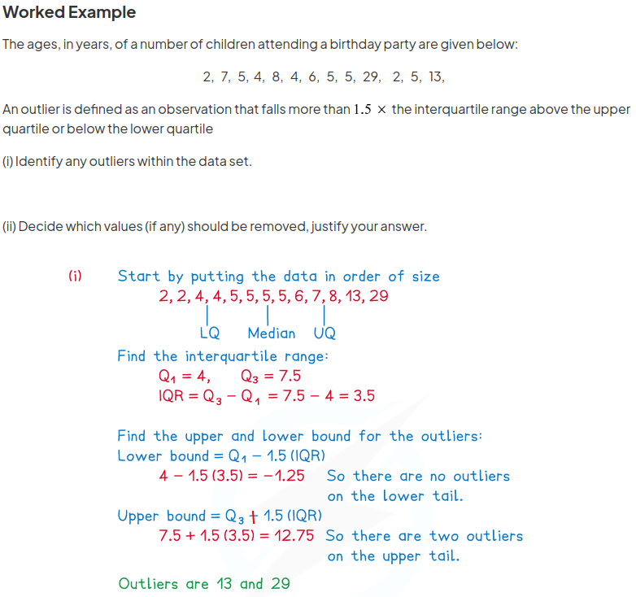
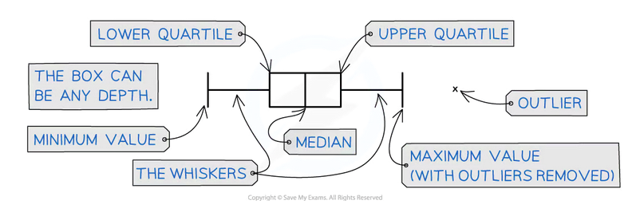
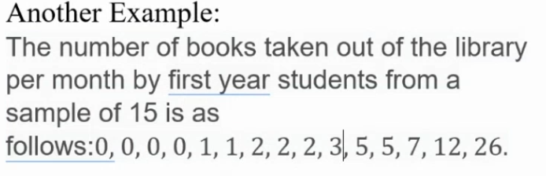
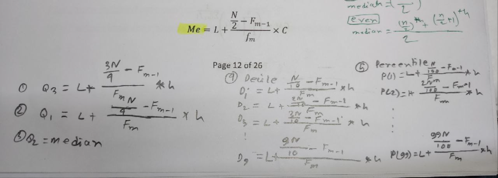
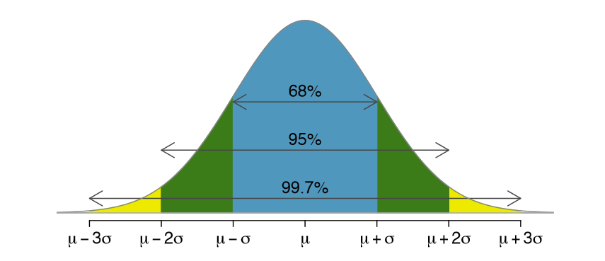

# Data Preprocessing Steps

## Outlier Detection

# Documents
- https://www.savemyexams.com/international-a-level/maths/edexcel/20/statistics-1/revision-notes/data-presentation-and-interpretation/working-with-data/outliers/
- 