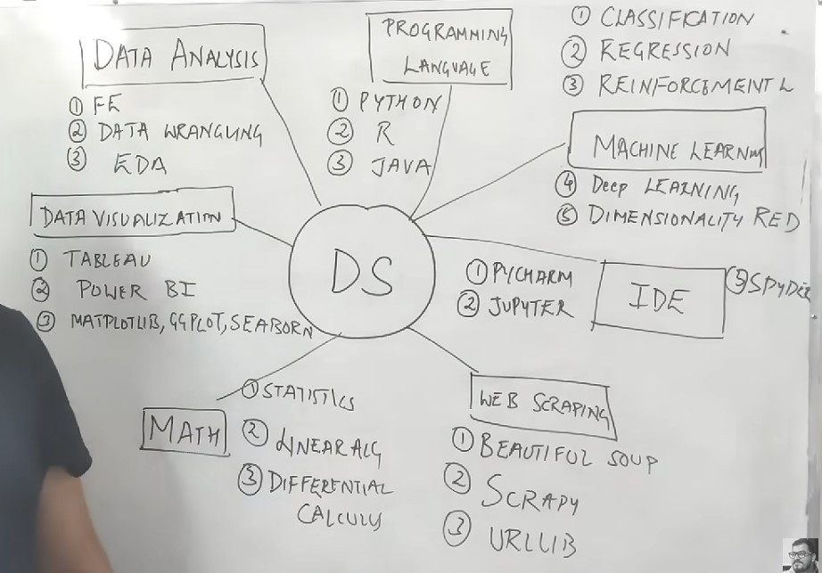

# How to Learn Data Science

# CI/CD
- Github Actions
  

# API HUB
- https://rapidapi.com/hub

# Database
- https://cloud.mongodb.com/

# Maths
- learn math with Data science topics related to math not all things

# Learning Process
- MVP (Minimum Viable Product)
- Spiral Learning
- Learn Faster reach ends then repeat multiple times

# Projects
- Always create minimal implementation/project on a topic 