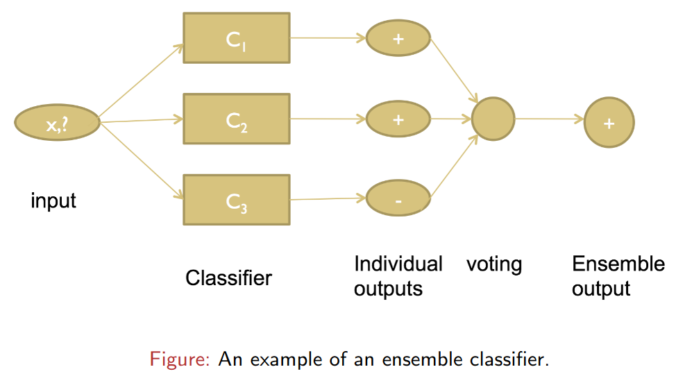
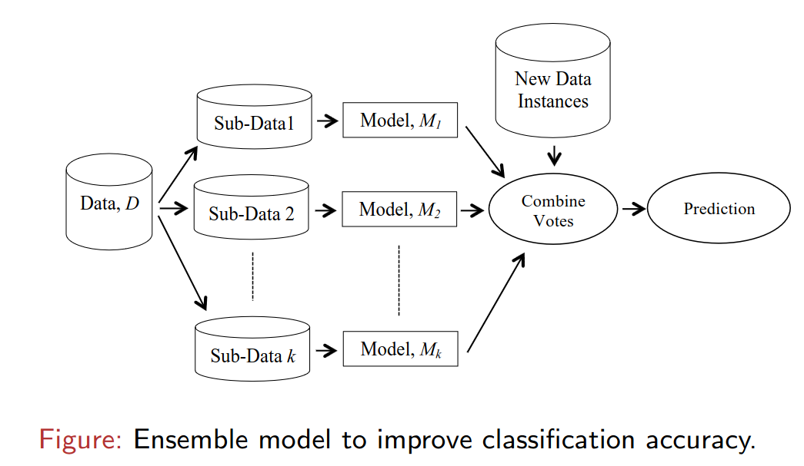

# Ensemble Learning
- a powerful machine learning technique that combines the predictions of multiple models to improve overall performance. 
- where multiple models (often called "weak learners" or "base models") are trained and combined to solve a particular problem
- combining multiple models improves the overall performance, reduces the risk of overfitting, and provides more robust predictions compared to any single model.
- It is the process of combining different classification techniques to
build a powerful composite model from the data.
- It improves the classification accuracy of class-imbalanced data.
- It returns a class label prediction for new instances based on the
individual classifiers vote.

## Common Ensemble Methods:
1. Bagging (Bootstrap Aggregating)
2. Boosting
3. Stacking
4. Voting and Averaging

### Key Differences Between Bagging and Boosting

| **Aspect**            | **Bagging**                  | **Boosting**                                                  |
| --------------------- | ---------------------------- | ------------------------------------------------------------- |
| **Goal**              | Reduce variance              | Reduce bias                                                   |
| **Model Training**    | parallel                     | sequentially                                                  |
| **Focus**             | All models have equal focus  | Each model focuses on correcting errors from the previous one |
| **Error Handling**    | Reduces overfitting          | Reduces bias but may overfit                                  |
| **Combination**       | Majority voting or averaging | Weighted voting or weighted averaging                         |
| **Example Algorithm** | Random Forest                | AdaBoost, Gradient Boosting (XGBoost, LightGBM, CatBoost)     |

### Bagging (Bootstrap Aggregating)

- **Goal**: Reduce variance and prevent overfitting by training multiple models independently on different subsets of data.

- **How it works**:
  - Randomly sample the dataset **with replacement** to create multiple subsets (bootstrap samples).
  - Train a separate model (e.g., Decision Tree) on each subset independently.
  - Combine predictions using:
    - **Majority voting** for classification.
    - **Averaging** for regression.

- **Key Characteristics**:
  - Models are trained **in parallel** (independent of each other).
  - Reduces variance and improves robustness.
  - Suitable for high-variance models like Decision Trees.

- **Example Algorithm**: Random Forest (ensemble of decision trees using bagging).

---

### Boosting

- **Goal**: Reduce bias and improve predictive accuracy by training models sequentially, where each model focuses on correcting the errors of the previous one.

- **How it works**:
  - Train the first model on the dataset.
  - Identify and assign higher weights to misclassified samples or focus on errors from the previous model.
  - Train the next model to address those errors.
  - Combine all models to make the final prediction, typically using:
    - **Weighted voting** for classification.
    - **Weighted averaging** for regression.

- **Key Characteristics**:
  - Models are trained **sequentially** (not independent).
  - Focuses on hard-to-predict samples, improving bias.
  - Can lead to overfitting if not carefully regularized.

- **Example Algorithms**:
  - **AdaBoost**
  - **Gradient Boosting Machines** (e.g., XGBoost, LightGBM, CatBoost)
