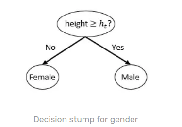
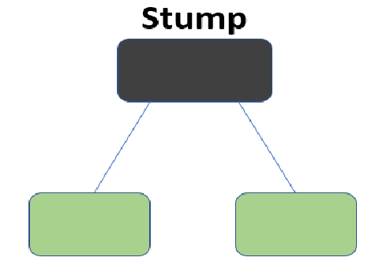

# https://sefiks.com/2018/11/02/a-step-by-step-adaboost-example/

#  Adaboost
Adaptive boosting or shortly adaboost is awarded boosting algorithm. The principle is basic. A weak worker cannot move a heavy rock but weak workers come together and move heavy rocks and build a pyramid. The algorithm expects to run weak learners. This could be a single layer perceptron, too. A weak learner cannot solve non-linear problems but its sequential usage enables to solve non-linear problems. The trick is to increase the weight of incorrect decisions and to decrease the weight of correct decisions between sequences. Adaboost is not related to decision trees. You might consume an 1-level basic decision tree (decision stumps) but this is not a must.

AdaBoost also called Adaptive Boosting is a technique in Machine Learning used as an Ensemble Method. The most common algorithm used with AdaBoost is decision trees with one level that means with Decision trees with only 1 split. These trees are also called Decision Stumps.

## Decision stumps

Decision trees approaches problems with divide and conquer method. They might have lots of nested decision rules. This makes them non-linear classifiers. In contrast, decision stumps are 1-level decision trees. They are linear classifiers just like (single layer) perceptrons. You might think that if height of someone is greater than 1.70 meters (5.57 feet), then it would be male. Otherwise, it would be female. This decision stump would classify gender correctly at least 50% accuracy. That’s why, these classifiers are weak learners.

- decision trees with one level that means with Decision trees with only 1 split. These trees are also called Decision Stumps.
