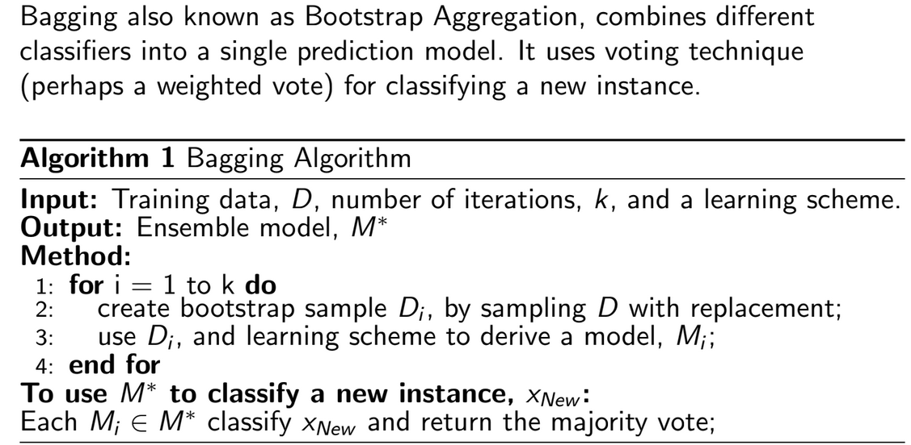
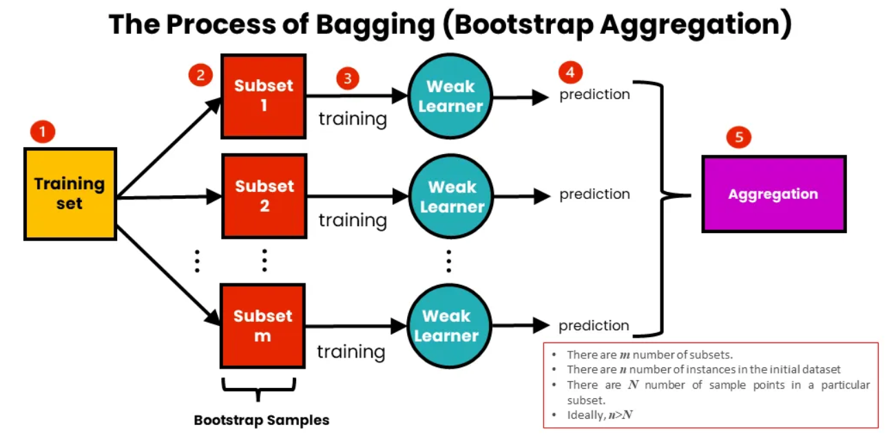
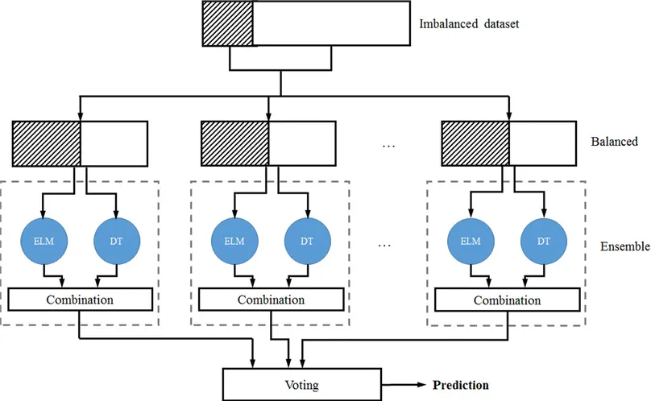
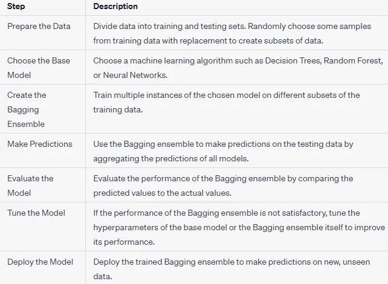

# Bagging

- Bagging (Bootstrap Aggregating) is an ensemble learning technique that improves the accuracy and stability of machine learning models.
- Combining the decision of different mining models means the various outputs into a single prediction.
-  It aims to improve the accuracy and stability of a model by combining the results of multiple models
-  Essentially, bagging reduces variance and helps prevent overfitting. 

# How Bagging Works

## 1. Bootstrap Sampling:
- Multiple subsets of the training data are created by randomly sampling **with replacement**.
- Each subset is used to train a separate model.
- Bootstrapping: Multiple subsets of the training data are created by random sampling with replacement.

## 2. Model Training:
- Independent models (often called **"weak learners"**) are trained on each subset.
- Common algorithms used include **decision trees**, but bagging can be applied to any model.
- Training: A model (e.g., decision tree) is trained on each subset.

## 3. Aggregation:
- Predictions from all models are combined:
  - **Averaging** for regression tasks.
  - **Majority voting** for classification tasks.
- This helps improve accuracy and reduce overfitting.
- Aggregating: The predictions from each model are combined to form a final prediction, often by averaging for regression tasks or by taking a majority vote for classification tasks.
-  Predictions from all models are combined (e.g., by averaging for regression or majority voting for classification) to produce the final output.

