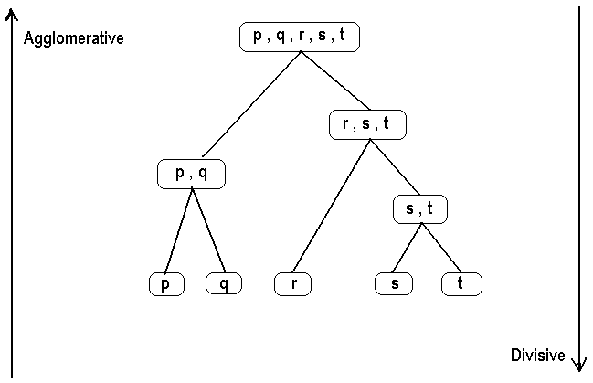
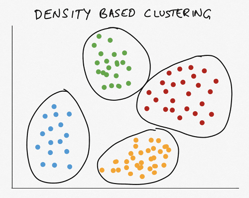
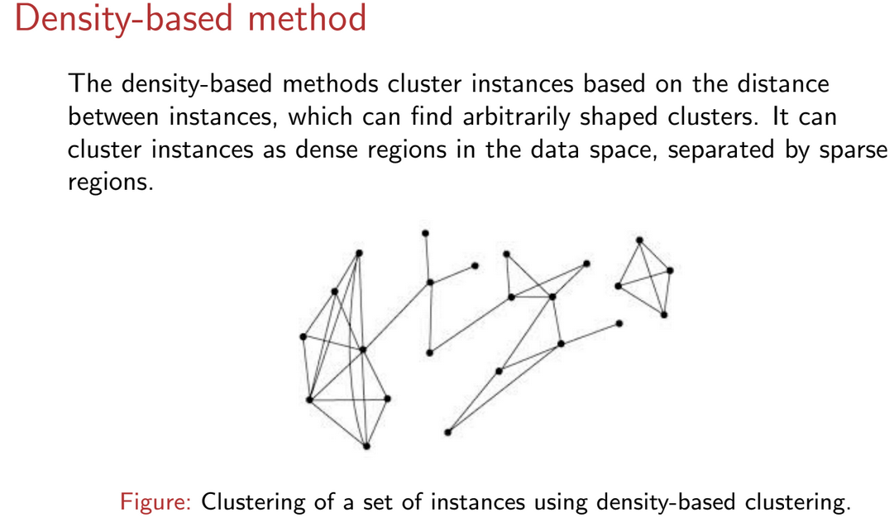
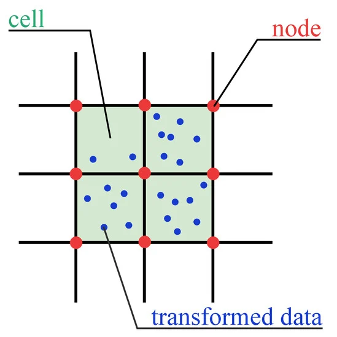
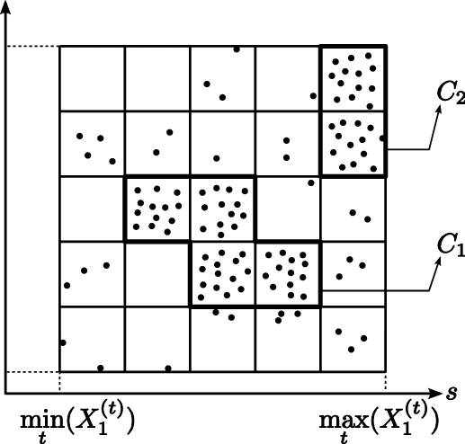

# Clustering
- a technique used to group data points or objects based on certain characteristics or features. 
- The goal is to ensure that objects in the same group (or cluster) are more similar to each other than to those in other clusters.
-  groups similar data points together
-  unsupervised machine learning technique
-  A measure of how closely related two data points are.
-  technique used to group similar data points into clusters
-  

## Area of applications
- Human genetic clustering
- Medical imaging clustering
- Market research
- Field robotics
- Crime analysis
- Pattern recognition

### Types of Clustering Methods
1. Partitioning methods
2. Hierarchical methods
3. Density-based methods
4. Grid-based methods

#### Partitioning methods
- Divide the dataset into a predefined number of clusters
-  K-means

#### Hierarchical methods
- Create a hierarchy of clusters, either by agglomerative (bottom-up) or divisive (top-down) approaches.
- Agglomerative Clustering, Divisive Clustering.
- to build a hierarchy of clusters i.e. tree-type structure based on the hierarchy
- technique that groups the data based on similarity between the set of data
- Hierarchical clustering is a connectivity-based clustering model that groups the data points together that are close to each other based on the measure of similarity or distance. 

#### Density-based methods
-  group data points based on their density distribution
-  grouping data points based on their density in the data space.
-  groups data points based on their density in the feature space
-  Identify clusters based on regions of high data density.
-  These methods define clusters as dense regions of points, separated by regions of lower density.
- DBSCAN (Density-Based Spatial Clustering of Applications with Noise), OPTICS (Ordering Points To Identify the Clustering Structure).
In density-based clustering, groups or clusters are created where you have a high density of data points. This can also be done based on low-density spaces as separators. Ideally, both high-density areas and low-density spaces are considered in selecting clusters. 

 When using the density-based clustering approach, the number of clusters is arrived at automatically based on the data, unlike other clustering methods where you have to specify the number of clusters initially. 

#### How Density-Based Clustering Works
----------
##### 1. Core Points Identification
- A point is a **core point** if it has at least a **minimum number of neighbors (MinPts)** within a given **radius (ε)**.

##### 2. Cluster Formation
- Clusters are formed by **connecting core points** that are close to each other.
- Points that are not part of any cluster are classified as **noise**.

##### 3. Outlier Detection
- Points that do not belong to any **dense region** remain **unclustered** and are considered **outliers**.

#### Grid-based methods
- Quantize the data space into a grid and perform clustering operations on the grid cells.
-  STING (Statistical Information Grid), CLIQUE (Clustering In QUEst).
-  These methods divide the data space into a grid and perform clustering on these grids.
-  The grid-based methods use a multi-resolution grid data structure. It’s fast processing time that typically independent of the number of instances, yet dependent on the grid size.

# Subspace Clustering
