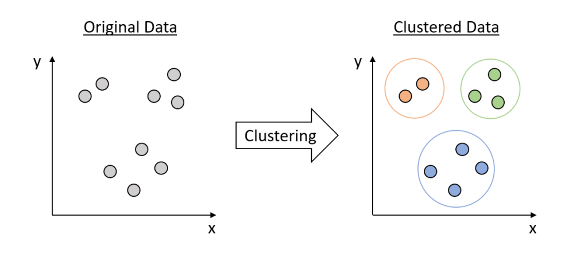

# Clustering
- a technique used to group data points or objects based on certain characteristics or features. 
- The goal is to ensure that objects in the same group (or cluster) are more similar to each other than to those in other clusters.
-  groups similar data points together
-  unsupervised machine learning technique
-  A measure of how closely related two data points are.
-  technique used to group similar data points into clusters
-  

### Types of Clustering Methods
1. Partitioning methods
2. Hierarchical methods
3. Density-based methods
4. Grid-based methods

#### Partitioning methods
- Divide the dataset into a predefined number of clusters
-  K-means

#### Hierarchical methods
- Create a hierarchy of clusters, either by agglomerative (bottom-up) or divisive (top-down) approaches.
- Agglomerative Clustering, Divisive Clustering.
#### Density-based methods
-  Identify clusters based on regions of high data density.
-  These methods define clusters as dense regions of points, separated by regions of lower density.
- DBSCAN (Density-Based Spatial Clustering of Applications with Noise), OPTICS (Ordering Points To Identify the Clustering Structure).

#### Grid-based methods
- Quantize the data space into a grid and perform clustering operations on the grid cells.
-  STING (Statistical Information Grid), CLIQUE (Clustering In QUEst).
-  These methods divide the data space into a grid and perform clustering on these grids.

# Subspace Clustering
