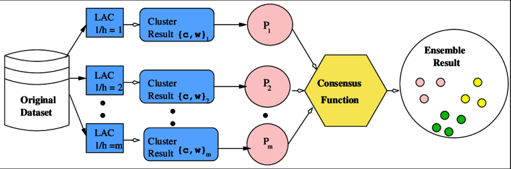
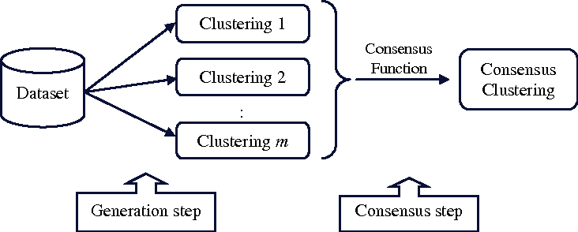

# Ensemble Clustering
- uses multiple clustering algorithms (are combined same or different algorithm) to produce a more robust and stable clustering result.
- Ensemble Clustering is a technique in unsupervised learning where multiple clustering algorithms (or the same algorithm with different parameters) are combined to produce a more robust and stable clustering result.
- combines the results of multiple clustering algorithms or runs of the same algorithm with different parameters to produce a more robust and accurate clustering solution.
- It involves combining multiple clustering algorithms or clustering results to improve the robustness, stability, and accuracy of the clustering outcomes.

