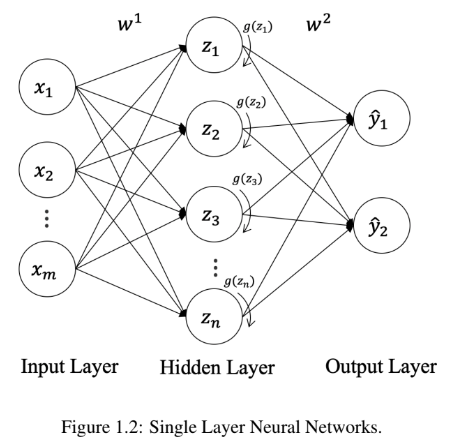
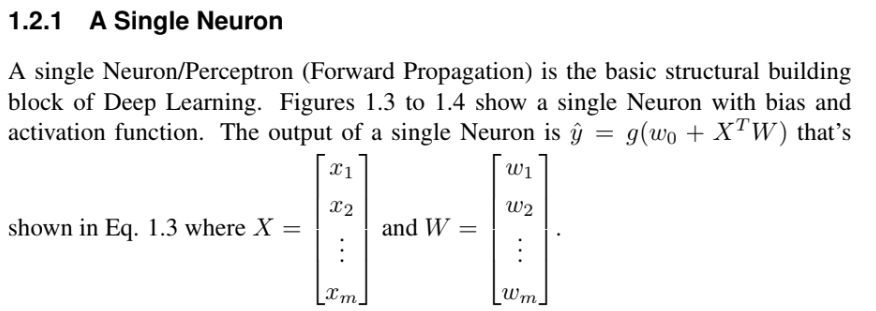
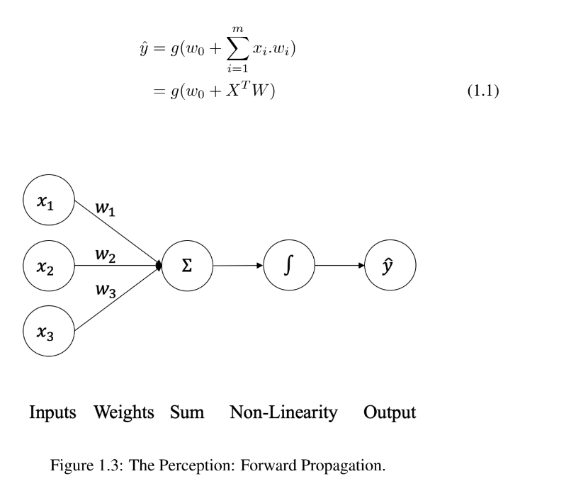
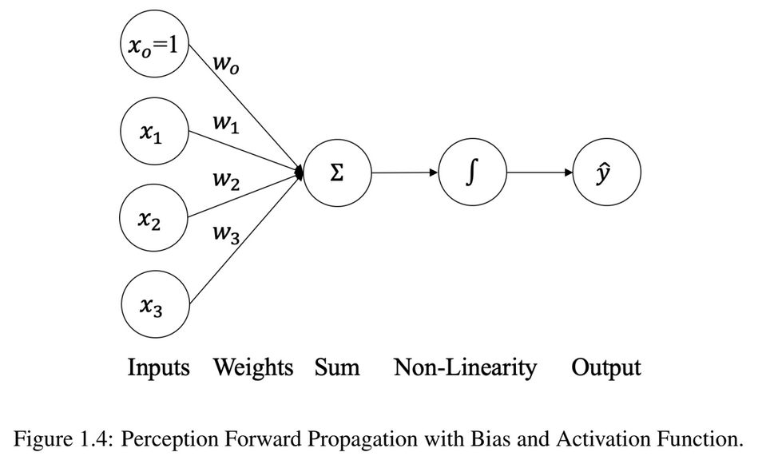

# Neural Network
- Deep learning models use artificial neural networks (ANNs), inspired by the human brain.
- A neural network consists of layers of neurons, including:
    - Input Layer: Receives the raw data (e.g., images, text, numbers).
    - Hidden Layers: Perform computations and extract patterns using neurons.
    - Output Layer: Produces the final result (e.g., classification label, prediction).

**Input Layer**
- Function: Takes input features directly from the dataset.
  - The starting point of the network.
  - Receives raw data (features) from the outside world
  - Each neuron in this layer represents a specific input feature.
  - No computation is performed here; neurons simply pass the input data to the next layer.
- Role: Simply passes these features onto the subsequent layer.
- Example: For an image recognition task, input features might be pixel values.

**Hidden Layer(s)**
- Function: Performs computations and transformations on the input features.
  - The core of the neural network's learning process.
  - Hidden layers perform complex computations on the input data.
  - Each neuron in a hidden layer receives weighted inputs from the previous layer, applies an activation function, and passes the result to the next layer. 
  - The number of hidden layers and the number of neurons in each layer determine the network's capacity to learn complex patterns.
- Role: Extracts and abstracts patterns or features from the input data.
- Example: In a network for image recognition, hidden layers could detect edges, textures, and shapes.

**Output Layer**
- Function: Converts the abstracted data from the hidden layers into a format that can be interpreted.
  - The final layer of the network.
  - Produces the network's output or prediction.
- Role: Provides the final prediction or classification.
- Example: For an image recognition task, it might output labels like "cat" or "dog".

# A Single Neuron
- A single neuron is the fundamental building block of a neural network
- It's a simplified model of a biological neuron, designed to receive, process, and transmit information.

## Key points
- A single neuron performs a simple computation but becomes powerful when combined with many others in a network.
- The weights and bias are learned during training to minimize the error in predictions.
- Activation functions enable the network to model complex, non-linear relationships.

