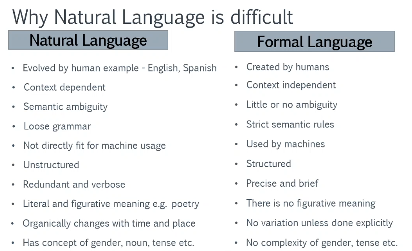
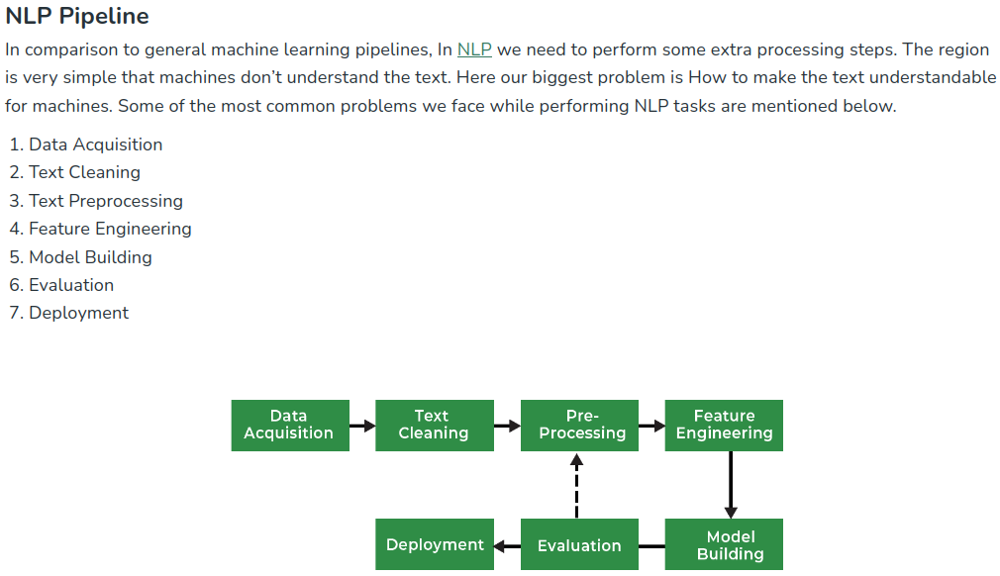

# Difference Between Natural Language and Formal Language in NLP

| **Aspect**               | **Natural Language**                               | **Formal Language**                               |
|--------------------------|---------------------------------------------------|-------------------------------------------------|
| **Definition**            | The language spoken and written by humans, like English, Spanish, or Chinese. | A set of rules or syntax used to create strings in a computational or mathematical context. |
| **Purpose**               | Communication between humans.                    | Communication between machines or for mathematical formalism. |
| **Structure**             | Ambiguous, flexible, context-dependent, and often informal. | Precise, strict, and follows well-defined rules (e.g., grammar, syntax). |
| **Examples**              | English, Hindi, French, Chinese.                 | Programming languages (Python, Java), Regular Expressions, Mathematical expressions. |
| **Complexity in NLP**     | Difficult to process due to ambiguity, context, and variability. | Easier to process because of strict rules and structure. |
| **Ambiguity**             | Highly ambiguous (e.g., "I saw the man with a telescope"). | No ambiguity (rules clearly define valid strings). |
| **Syntax Rules**          | Flexible and context-sensitive.                  | Fixed and strictly defined by grammar or logic. |
| **Error Tolerance**       | Can tolerate errors (e.g., typos, informal grammar). | Errors typically result in failure (e.g., compilation error). |
| **Applications in NLP**   | Machine Translation, Sentiment Analysis, Chatbots, Speech Recognition. | Compiler Design, Parsing Algorithms, Automata Theory. |
| **Examples in Use**       | - "The quick brown fox jumps over the lazy dog." | - `if (x > 5) { return x; }` (Programming) |

