## TOC
- [NLP Tokenization: Breaking Text into Smaller Units](#nlp-tokenization-breaking-text-into-smaller-units)
  - [Types of Tokenization](#types-of-tokenization)
  - [Methods of Tokenization](#methods-of-tokenization)
  - [Purpose of Tokenization](#purpose-of-tokenization)
- [Character Tokenization](#character-tokenization)
- [Word Tokenization](#word-tokenization)
  - [Notes](#notes)
- [Subword Tokenization](#subword-tokenization)
- [Sentence Tokenization](#sentence-tokenization)
- [Key Differences](#key-differences)

# NLP Tokenization: Breaking Text into Smaller Units

## Types of Tokenization
1. **Word Tokenization**: Splits text into words. Splits text into individual words based on whitespace and punctuation. 
   - Example: `"I love NLP"` → `["I", "love", "NLP"]`
   - Example: "Hello, world!" -> ["Hello", ",", "world", "!"]
2. **Subword Tokenization**: Breaks words into meaningful subunits. Breaks words into smaller units, such as subwords or characters.  
   - Example: `"unhappiness"` → `["un", "happiness"]`
   - Example: "running" -> ["run", "##ing"]
3. **Character Tokenization**: Splits text into individual characters  
   - Example: `"cat"` → `["c", "a", "t"]`
   - Example: "Hello" -> ["H", "e", "l", "l", "o"]
4. **Sentence Tokenization**: Splits text into sentences  
   - Example: `"Hello. How are you?"` → `["Hello.", "How are you?"]`

## Methods of Tokenization
- **Rule-Based**: Use spaces, punctuation, or regex.
- **Pre-trained Models**: Tokenizers like BERT's WordPiece or GPT's Byte-Pair Encoding (BPE).

## Purpose of Tokenization
Prepares text for NLP tasks like:
- Analysis
- Word embeddings
- Training models

# Character Tokenization
- Splits text into individual characters 

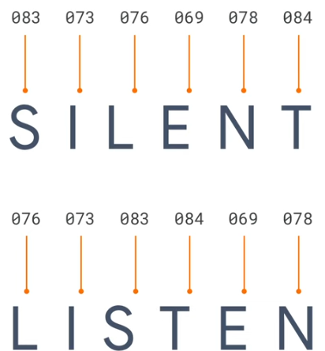

- Consider the word "listen," as you can see here.
- It's made up of a sequence of letters.
- These letters can be represented by numbers
- using an encoding scheme.
- A popular one called ASCII has these letters represented
- by these numbers.
- This bunch of numbers can then represent the word listen.
- But the word silent has the same letters, and thus
- the same numbers, just in a different order.
- So it makes it hard for us to understand sentiment of a word
- just by the letters in it.
- So it might be easier, instead of encoding letters,
- to encode words.

# Word Tokenization
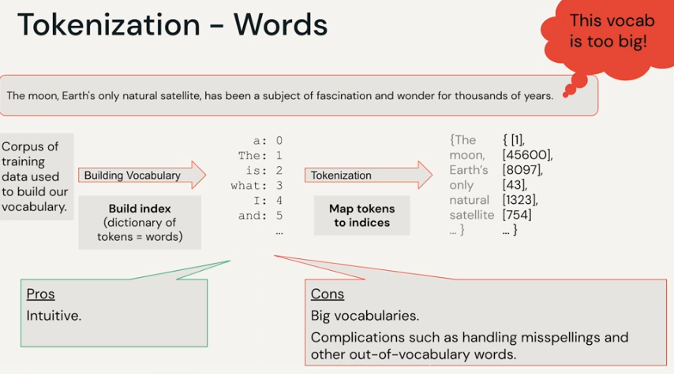

## Notes
- ASCII Encoding: Represents letters as numbers, but can't capture meaning.
- Word Embeddings: Map words to dense vectors based on meaning (e.g., Word2Vec).
- Contextual Embeddings: Consider word context (e.g., BERT, GPT).
- Hashing: Use unique hashes for quick word representation.
- Goal: Encode meaning, not just characters.

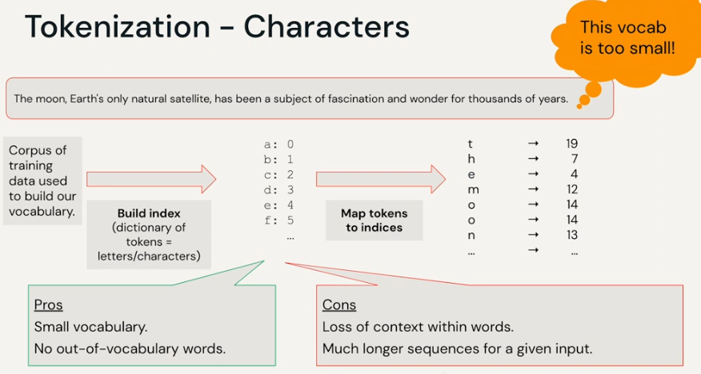

# Subword Tokenization
- Breaks words into meaningful subunits. Breaks words into smaller units, such as subwords or characters.  
- Example: `"unhappiness"` → `["un", "happiness"]`
- Example: "running" -> ["run", "##ing"]
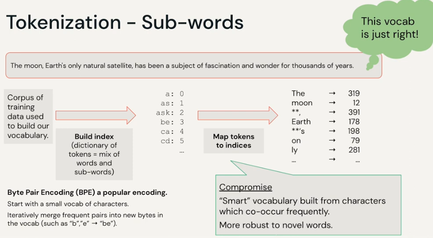

# Sentence Tokenization
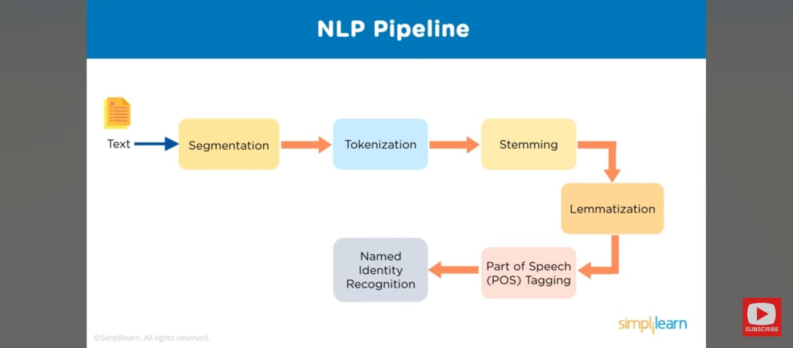
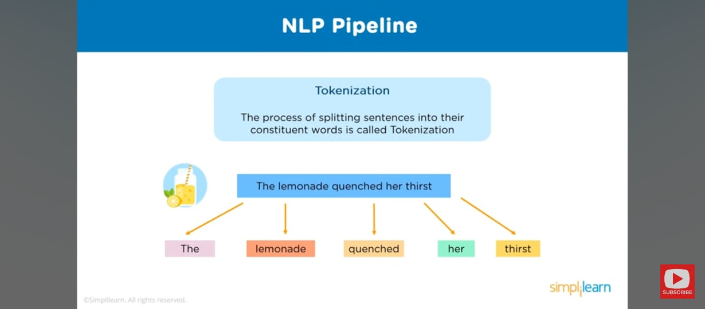

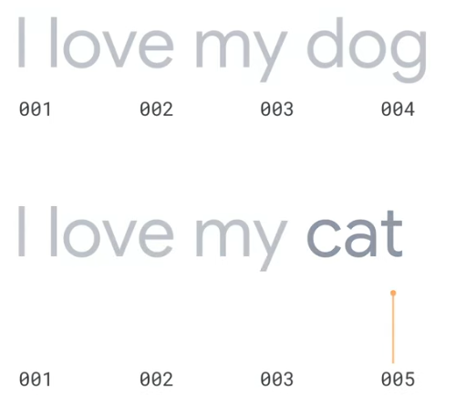
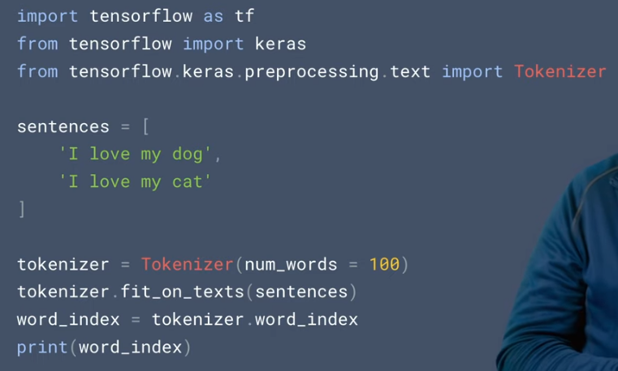
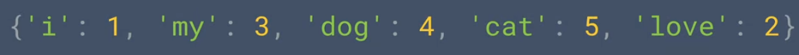
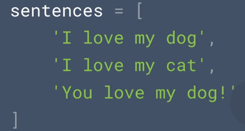
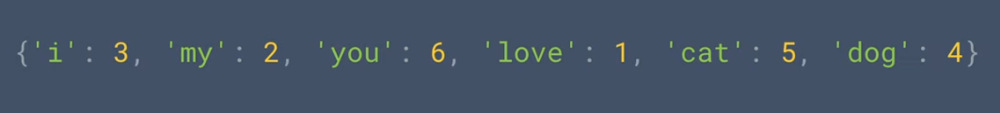

# Key Differences

| **Aspect**       | **Tokenization**                           | **Sequence**                          |
|-------------------|-------------------------------------------|---------------------------------------|
| **Focus**        | Breaking down text into smaller parts.    | Maintaining the order of elements.    |
| **Scope**        | A preprocessing step.                     | A representation used in modeling.    |
| **Granularity**  | Words, subwords, or characters.           | Ordered list of tokens, words, or sentences. |
| **Examples**     | `"Tokenize this text!"` → `["Tokenize", "this", "text!"]` | `"I love NLP"` → Sequence of tokens: `["I", "love", "NLP"]` |
