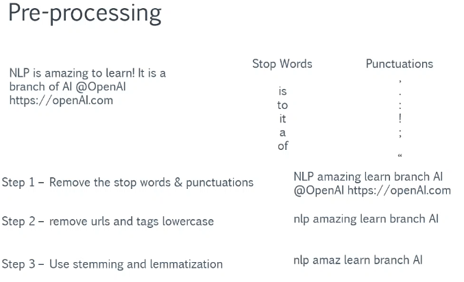

# Preprocessing

## Common Stop Words in English

| a         | about      | above  | after    | again      | against  | all     | am     | an      | and       |
| --------- | ---------- | ------ | -------- | ---------- | -------- | ------- | ------ | ------- | --------- |
| any       | are        | aren't | as       | at         | be       | because | been   | before  | being     |
| below     | between    | both   | but      | by         | can      | can't   | cannot | could   | couldn't  |
| did       | didn't     | do     | does     | doesn't    | doing    | don't   | down   | during  | each      |
| few       | for        | from   | further  | had        | hadn't   | has     | hasn't | have    | haven't   |
| having    | he         | he'd   | he'll    | he's       | her      | here    | here's | hers    | herself   |
| him       | himself    | his    | how      | how's      | i        | i'd     | i'll   | i'm     | i've      |
| if        | in         | into   | is       | isn't      | it       | it's    | its    | itself  | let's     |
| me        | more       | most   | mustn't  | my         | myself   | no      | nor    | not     | of        |
| off       | on         | once   | only     | or         | other    | ought   | our    | ours    | ourselves |
| out       | over       | own    | same     | shan't     | she      | she'd   | she'll | she's   | should    |
| shouldn't | so         | some   | such     | than       | that     | that's  | the    | their   | theirs    |
| them      | themselves | then   | there    | there's    | these    | they    | they'd | they'll | they're   |
| they've   | this       | those  | through  | to         | too      | under   | until  | up      | very      |
| was       | wasn't     | we     | we'd     | we'll      | we're    | we've   | were   | weren't | what      |
| what's    | when       | when's | where    | where's    | which    | while   | who    | who's   | whom      |
| why       | why's      | with   | won't    | would      | wouldn't | you     | you'd  | you'll  | you're    |
| you've    | your       | yours  | yourself | yourselves |

## Common Punctuation Marks

| Symbol | Name                   | Description                                   | Example                                     |
| ------ | ---------------------- | --------------------------------------------- | ------------------------------------------- |
| .      | Period/Full Stop       | Ends a sentence.                              | This is a sentence.                         |
| ,      | Comma                  | Separates elements in a list or clauses.      | Apples, oranges, and bananas.               |
| ;      | Semicolon              | Connects closely related independent clauses. | I went to the park; it was fun.             |
| :      | Colon                  | Introduces a list, explanation, or quote.     | Here's what I need: eggs, milk.             |
| ?      | Question Mark          | Ends a question.                              | How are you?                                |
| !      | Exclamation Mark       | Expresses strong emotion.                     | Wow! That’s amazing!                        |
| -      | Hyphen                 | Joins words or parts of words.                | Well-known author.                          |
| –      | En Dash                | Represents a range or connection.             | Pages 10–20.                                |
| —      | Em Dash                | Indicates a pause or break.                   | Wait—what happened?                         |
| '      | Apostrophe             | Indicates possession or contraction.          | It's John's book.                           |
| " "    | Quotation Marks        | Encloses direct speech or quotations.         | She said, "Hello."                          |
| ' '    | Single Quotation Marks | Encloses a quote within a quote.              | "He said, 'It's fine.'"                     |
| ( )    | Parentheses            | Adds extra information.                       | I love apples (especially red ones).        |
| [ ]    | Square Brackets        | Adds editorial or explanatory information.    | He [the editor] made changes.               |
| { }    | Curly Braces           | Groups items, often in programming.           | {a, b, c}                                   |
| ...    | Ellipsis               | Indicates omission or trailing thoughts.      | I’m not sure...                             |
| /      | Slash                  | Indicates alternatives or fractions.          | Yes/no, 1/2                                 |
| \      | Backslash              | Escapes characters in programming.            | C:\Users\Name                               |
|        |                        | Vertical Bar                                  | Used in logic or programming (OR operator). | true | false |
| _      | Underscore             | Joins words in file names or identifiers.     | file_name.txt                               |
| ~      | Tilde                  | Indicates approximation or range.             | ~100 people                                 |
