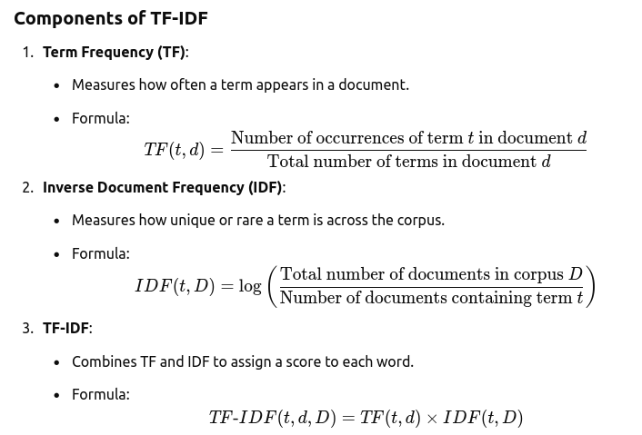

### TF-IDF (Term Frequency-Inverse Document Frequency)

TF-IDF is a statistical measure used in text mining and NLP to evaluate the importance of a word in a document relative to a collection of documents (corpus).

