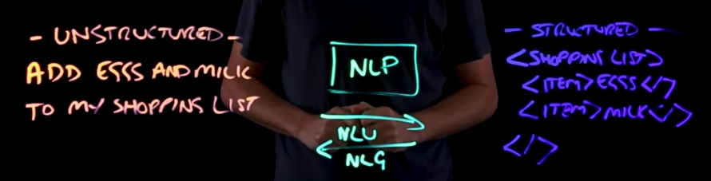
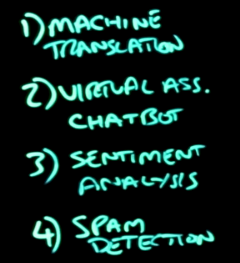
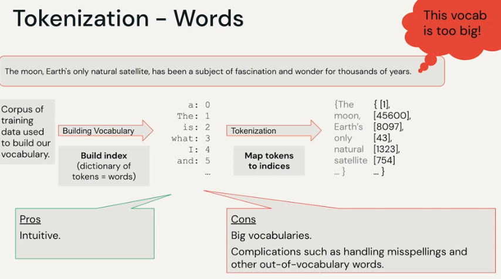
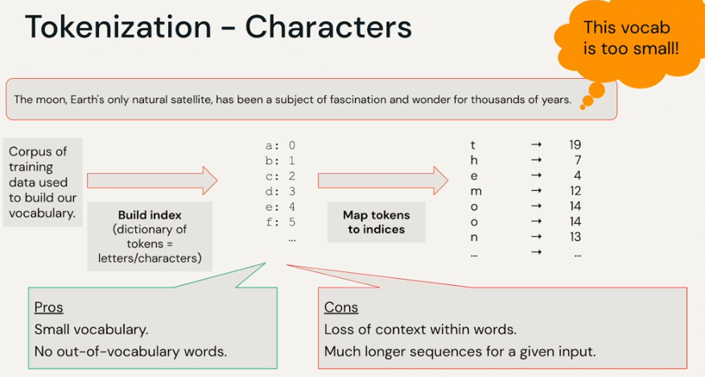
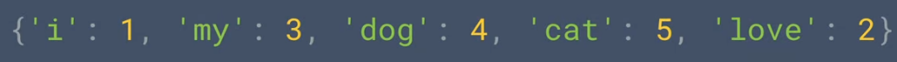
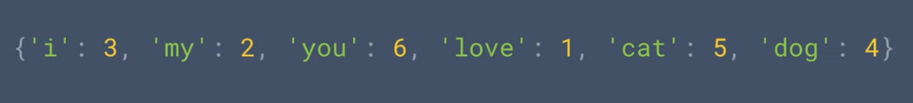
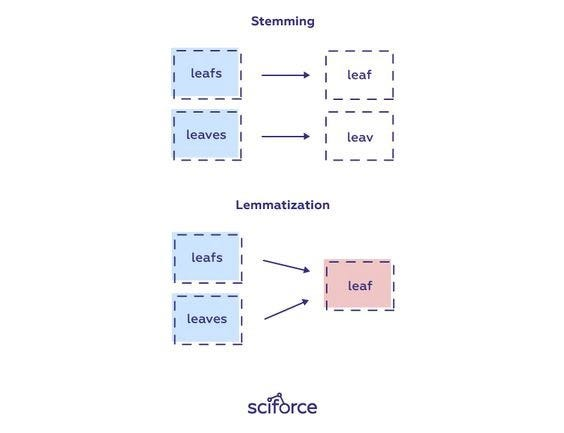

# Difference Between Natural Language and Formal Language in NLP

| **Aspect**               | **Natural Language**                               | **Formal Language**                               |
|--------------------------|---------------------------------------------------|-------------------------------------------------|
| **Definition**            | The language spoken and written by humans, like English, Spanish, or Chinese. | A set of rules or syntax used to create strings in a computational or mathematical context. |
| **Purpose**               | Communication between humans.                    | Communication between machines or for mathematical formalism. |
| **Structure**             | Ambiguous, flexible, context-dependent, and often informal. | Precise, strict, and follows well-defined rules (e.g., grammar, syntax). |
| **Examples**              | English, Hindi, French, Chinese.                 | Programming languages (Python, Java), Regular Expressions, Mathematical expressions. |
| **Complexity in NLP**     | Difficult to process due to ambiguity, context, and variability. | Easier to process because of strict rules and structure. |
| **Ambiguity**             | Highly ambiguous (e.g., "I saw the man with a telescope"). | No ambiguity (rules clearly define valid strings). |
| **Syntax Rules**          | Flexible and context-sensitive.                  | Fixed and strictly defined by grammar or logic. |
| **Error Tolerance**       | Can tolerate errors (e.g., typos, informal grammar). | Errors typically result in failure (e.g., compilation error). |
| **Applications in NLP**   | Machine Translation, Sentiment Analysis, Chatbots, Speech Recognition. | Compiler Design, Parsing Algorithms, Automata Theory. |
| **Examples in Use**       | - "The quick brown fox jumps over the lazy dog." | - `if (x > 5) { return x; }` (Programming) |





## TOC
- [Pipelines](#pipelines)

# Pipelines


## TOC
- [NLP Tokenization:](#nlp-tokenization)
  - [Types of Tokenization](#types-of-tokenization)
  - [Methods of Tokenization](#methods-of-tokenization)
  - [Purpose of Tokenization](#purpose-of-tokenization)
- [Character Tokenization](#character-tokenization)
- [Word Tokenization](#word-tokenization)
  - [Notes](#notes)
- [Subword Tokenization](#subword-tokenization)
- [Sentence Tokenization](#sentence-tokenization)
- [Key Differences](#key-differences)


# NLP Tokenization: 
- Breaking Text into Smaller Units
- a preprocessing step
- process of splitting the texts/sentence/corpus into meaningful chunks 

## Types of Tokenization
1. **Word Tokenization**: Splits text into words. Splits text into individual words based on whitespace and punctuation. 
   - Example: `"I love NLP"` → `["I", "love", "NLP"]`
   - Example: "Hello, world!" -> ["Hello", ",", "world", "!"]
2. **Subword Tokenization**: Breaks words into meaningful subunits. Breaks words into smaller units, such as subwords or characters.  
   - Example: `"unhappiness"` → `["un", "happiness"]`
   - Example: "running" -> ["run", "##ing"]
3. **Character Tokenization**: Splits text into individual characters  
   - Example: `"cat"` → `["c", "a", "t"]`
   - Example: "Hello" -> ["H", "e", "l", "l", "o"]
4. **Sentence Tokenization**: Splits text into sentences  
   - Example: `"Hello. How are you?"` → `["Hello.", "How are you?"]`


## Methods of Tokenization
- **Rule-Based**: Use white spaces, punctuation, or regex.
- **Pre-trained Models**: Tokenizers like BERT's WordPiece or GPT's Byte-Pair Encoding (BPE).

## Purpose of Tokenization
Prepares text for NLP tasks like:
- Analysis
- Word embeddings
- Training models


# Character Tokenization
- Splits text into individual characters 


- Consider the word "listen," as you can see here.
- It's made up of a sequence of letters.
- These letters can be represented by numbers
- using an encoding scheme.
- A popular one called ASCII has these letters represented
- by these numbers.
- This bunch of numbers can then represent the word listen.
- But the word silent has the same letters, and thus
- the same numbers, just in a different order.
- So it makes it hard for us to understand sentiment of a word
- just by the letters in it.
- So it might be easier, instead of encoding letters,
- to encode words.


# Word Tokenization


## Notes
- ASCII Encoding: Represents letters as numbers, but can't capture meaning.
- Word Embeddings: Map words to dense vectors based on meaning (e.g., Word2Vec).
- Contextual Embeddings: Consider word context (e.g., BERT, GPT).
- Hashing: Use unique hashes for quick word representation.
- Goal: Encode meaning, not just characters.




# Subword Tokenization
- Breaks words into meaningful subunits. Breaks words into smaller units, such as subwords or characters.  
- Example: `"unhappiness"` → `["un", "happiness"]`
- Example: "running" -> ["run", "##ing"]


# Sentence Tokenization







# Key Differences

| **Aspect**       | **Tokenization**                           | **Sequence**                          |
|-------------------|-------------------------------------------|---------------------------------------|
| **Focus**        | Breaking down text into smaller parts.    | Maintaining the order of elements.    |
| **Scope**        | A preprocessing step.                     | A representation used in modeling.    |
| **Granularity**  | Words, subwords, or characters.           | Ordered list of tokens, words, or sentences. |
| **Examples**     | `"Tokenize this text!"` → `["Tokenize", "this", "text!"]` | `"I love NLP"` → Sequence of tokens: `["I", "love", "NLP"]` |
## TOC
- [Sequence](#sequence)
- [Key Differences](#key-differences)


# Sequence

- **Definition**: An ordered list of elements, often representing text data as tokens, words, characters, or sentences.  
- **Purpose**: Captures the structure and order of text for analysis or modeling.  
- **Output Example**:  
  - **Text**: `"I love NLP"`  
  - **Sequence**: `["I", "love", "NLP"]` (a sequence of tokens)  
- **Key Use Cases**:  
  - Language modeling  
  - Translation  
  - Sequence-to-sequence tasks  


# Key Differences

| **Aspect**       | **Tokenization**                           | **Sequence**                          |
|-------------------|-------------------------------------------|---------------------------------------|
| **Focus**        | Breaking down text into smaller parts.    | Maintaining the order of elements.    |
| **Scope**        | A preprocessing step.                     | A representation used in modeling.    |
| **Granularity**  | Words, subwords, or characters.           | Ordered list of tokens, words, or sentences. |
| **Examples**     | `"Tokenize this text!"` → `["Tokenize", "this", "text!"]` | `"I love NLP"` → Sequence of tokens: `["I", "love", "NLP"]` |
# Preprocessing


## Common Stop Words in English

| a         | about      | above  | after    | again      | against  | all     | am     | an      | and       |
| --------- | ---------- | ------ | -------- | ---------- | -------- | ------- | ------ | ------- | --------- |
| any       | are        | aren't | as       | at         | be       | because | been   | before  | being     |
| below     | between    | both   | but      | by         | can      | can't   | cannot | could   | couldn't  |
| did       | didn't     | do     | does     | doesn't    | doing    | don't   | down   | during  | each      |
| few       | for        | from   | further  | had        | hadn't   | has     | hasn't | have    | haven't   |
| having    | he         | he'd   | he'll    | he's       | her      | here    | here's | hers    | herself   |
| him       | himself    | his    | how      | how's      | i        | i'd     | i'll   | i'm     | i've      |
| if        | in         | into   | is       | isn't      | it       | it's    | its    | itself  | let's     |
| me        | more       | most   | mustn't  | my         | myself   | no      | nor    | not     | of        |
| off       | on         | once   | only     | or         | other    | ought   | our    | ours    | ourselves |
| out       | over       | own    | same     | shan't     | she      | she'd   | she'll | she's   | should    |
| shouldn't | so         | some   | such     | than       | that     | that's  | the    | their   | theirs    |
| them      | themselves | then   | there    | there's    | these    | they    | they'd | they'll | they're   |
| they've   | this       | those  | through  | to         | too      | under   | until  | up      | very      |
| was       | wasn't     | we     | we'd     | we'll      | we're    | we've   | were   | weren't | what      |
| what's    | when       | when's | where    | where's    | which    | while   | who    | who's   | whom      |
| why       | why's      | with   | won't    | would      | wouldn't | you     | you'd  | you'll  | you're    |
| you've    | your       | yours  | yourself | yourselves |


## Common Punctuation Marks

| Symbol | Name                   | Description                                   | Example                                     |
| ------ | ---------------------- | --------------------------------------------- | ------------------------------------------- |
| .      | Period/Full Stop       | Ends a sentence.                              | This is a sentence.                         |
| ,      | Comma                  | Separates elements in a list or clauses.      | Apples, oranges, and bananas.               |
| ;      | Semicolon              | Connects closely related independent clauses. | I went to the park; it was fun.             |
| :      | Colon                  | Introduces a list, explanation, or quote.     | Here's what I need: eggs, milk.             |
| ?      | Question Mark          | Ends a question.                              | How are you?                                |
| !      | Exclamation Mark       | Expresses strong emotion.                     | Wow! That’s amazing!                        |
| -      | Hyphen                 | Joins words or parts of words.                | Well-known author.                          |
| –      | En Dash                | Represents a range or connection.             | Pages 10–20.                                |
| —      | Em Dash                | Indicates a pause or break.                   | Wait—what happened?                         |
| '      | Apostrophe             | Indicates possession or contraction.          | It's John's book.                           |
| " "    | Quotation Marks        | Encloses direct speech or quotations.         | She said, "Hello."                          |
| ' '    | Single Quotation Marks | Encloses a quote within a quote.              | "He said, 'It's fine.'"                     |
| ( )    | Parentheses            | Adds extra information.                       | I love apples (especially red ones).        |
| [ ]    | Square Brackets        | Adds editorial or explanatory information.    | He [the editor] made changes.               |
| { }    | Curly Braces           | Groups items, often in programming.           | {a, b, c}                                   |
| ...    | Ellipsis               | Indicates omission or trailing thoughts.      | I’m not sure...                             |
| /      | Slash                  | Indicates alternatives or fractions.          | Yes/no, 1/2                                 |
| \      | Backslash              | Escapes characters in programming.            | C:\Users\Name                               |
|        |                        | Vertical Bar                                  | Used in logic or programming (OR operator). | true | false |
| _      | Underscore             | Joins words in file names or identifiers.     | file_name.txt                               |
| ~      | Tilde                  | Indicates approximation or range.             | ~100 people                                 |
# Stemming
-  removing suffixes and prefixes
-  it is a token normalization process
-  





# English Grammar to Know for NLP


## Noun
- **Definition**: A word that identifies a person, place, thing, or idea.
- **Example**: `dog`, `city`, `happiness`, `book`, `teacher`, `river`, `friendship`, `car`, `apple`, `freedom`, `university`, `mountain`, `music`, `family`, `love`.
- **Usage**: Nouns are often the subject or object in a sentence.
  - *The **dog** barked loudly.*  
  - *The **city** is bustling with activity.*  
  - *Her **happiness** was contagious.*  
  - *I borrowed a **book** from the library.*  
  - *The **teacher** explained the lesson clearly.*  
  - *The **river** flows through the valley.*  
  - *Their **friendship** lasted a lifetime.*  
  - *The **car** stopped at the red light.*  
  - *She ate an **apple** for breakfast.*  
  - *They value their **freedom** above all else.*  


---

## Pronoun
- **Definition**: A word used in place of a noun.
- **Examples**: `he`, `she`, `it`, `they`, `I`, `we`, `you`, `this`, `those`, `someone`, `anyone`.
- **Usage**: Pronouns replace nouns to avoid repetition.
  - 


- **Examples**:

#### **Personal Pronouns**:
- `I`, `you`, `he`, `she`, `it`, `we`, `they`

#### **Possessive Pronouns**:
- `my`, `your`, `his`, `her`, `its`, `our`, `their`

#### **Reflexive Pronouns**:
- `myself`, `yourself`, `himself`, `herself`, `itself`, `ourselves`, `themselves`

#### **Demonstrative Pronouns**:
- `this`, `that`, `these`, `those`

#### **Interrogative Pronouns**:
- `who`, `whom`, `what`, `which`

#### **Indefinite Pronouns**:
- `anyone`, `everyone`, `someone`, `nobody`, `none`, `all`, `somebody`, `both`, `few`, `several`, `each`, `another`

#### **Relative Pronouns**:
- `who`, `whom`, `whose`, `which`, `that`


### Example Sentence: 
  - **She** is reading a book.
  - **He** is cooking dinner.
  - **They** are playing soccer.
  - **I** am going to the store.
  - **We** visited the museum yesterday.
  - **It** is raining outside.
  - **You** are my best friend.
  - **This** is my favorite movie.
  - **Those** books are on the shelf.
  - **Someone** knocked on the door.
  - **Everybody** loves a good story.
  - **Who** is at the door?
  - **Which** one do you prefer?
  - **None** of them are available.
---

## Verb
- **Definition**: A word that expresses an action, occurrence, or state of being.
- **Examples**: `run`, `is`, `think`, `eat`, `go`, `sleep`, `talk`, `jump`, `make`, `play`.
- **Usage**: Verbs are essential for sentence structure.

### Example Sentences:
- *She **runs** every morning.*
- *They **are** learning new skills.*
- *I **think** you are right.*
- *He **eats** dinner at 7 PM.*
- *We **go** to the gym on weekends.*
- *The children **sleep** early.*
- *She **talks** to her friends after school.*
- *He **jumps** over the hurdle.*
- *They **make** delicious food.*
- *We **play** tennis every Sunday.*


---

## Verb Modifier
- **Definition**: Words or phrases that modify verbs, typically adverbs or prepositional phrases.
- **Examples**: `quickly`, `in the morning`, `loudly`, `carefully`, `well`, `eagerly`, `slowly`, `loudly`, `easily`, `honestly`, `always`, `often`, `never`, `very`, `too`, `here`, `there`, `everywhere`, `sometimes`, `soon`, `tomorrow`, `at home`, `on time`, `without hesitation`, `with enthusiasm`

- **Usage**: Provides additional detail about the action.

### Example Sentences:
- *She sings **beautifully**.*
- *He runs **fast** in the race.*
- *They completed the task **carefully**.*
- *I wake up **early** every day.*
- *The children played **outside** in the yard.*
- *She spoke **softly** during the meeting.*
- *He finished the project **in the morning**.*
- *The cat jumped **high** over the fence.*
- *We worked **hard** on the assignment.*
- *She studied **late** last night.*


---

## Adverb
- **Definition**: A word that modifies a verb, adjective, or another adverb.
- **Examples**: `slowly`, `very`, `yesterday`, `quickly`, `often`, `carefully`, `never`, `always`, `too`, `well`.
- **Usage**: Indicates how, when, where, or to what extent something happens.
  
### Example Sentences:
- *He speaks **slowly**.*
- *She runs **very** fast.*
- *They left **yesterday**.*
- *The teacher explained the concept **carefully**.*
- *We visit our grandparents **often**.*
- *She sings **well** in the competition.*
- *I have **never** seen that movie.*
- *He is **too** tired to continue.*
- *I will call you **soon**.*
- *They finished their work **quickly**.*

---

## Object
- **Definition**: A noun or pronoun that receives the action of a verb.
- **Example**: `ball`, `cake`, `book`, `letter`, `movie`, `idea`.
- **Usage**: Comes after the verb in a sentence.

### Example Sentences:
- *She baked a **cake**.*  
- *He kicked the **ball**.*  
- *They watched a **movie**.*  
- *I read the **book**.*  
- *She sent the **letter** yesterday.*  
- *We found the **key** under the table.*  
- *He built a **house** last year.*  
- *They bought a **car**.*  
- *She wrote a **letter** to her friend.*  
- *The dog chased the **ball**.*

---

## Object with Modifier
- **Definition**: An object that includes descriptive words.
- **Examples**: `a delicious cake`, `an old book`, `the red car`, `a tall building`, `a warm blanket`.
- **Usage**: Adds detail to the object.

### Example Sentences:
- *She baked **a delicious cake**.*  
- *He bought **a new car**.*  
- *They stayed in **a cozy cabin**.*  
- *She wore **a beautiful dress**.*  
- *I saw **a large tree** in the park.*  
- *They built **a sturdy bridge** over the river.*  
- *He read **an interesting book** about history.*  
- *We had **a wonderful dinner** at the restaurant.*  
- *She painted **a colorful picture**.*  
- *He built **a small house** near the beach.*

---

## Adjective
- **Definition**: A word that describes a noun or pronoun.
- **Examples**: `red`, `tall`, `interesting`, `happy`, `young`, `fast`, `beautiful`, `large`, `smart`, `delicious`.
- **Usage**: Adds detail about size, color, shape, quality, or other characteristics.

### Example Sentences:
- *The **red** car is fast.*
- *She wore a **beautiful** dress.*
- *The **tall** building stood out in the city.*
- *They live in a **large** house.*
- *He is a **smart** student.*
- *The pizza was **delicious**.*
- *The **young** child is playing in the park.*
- *She gave a **good** speech.*
- *We saw an **interesting** movie last night.*
- *He is the **fastest** runner in the race.*
---

## Adjective with Modifier
- **Definition**: An adjective with additional descriptive words.
- **Examples**: `extremely tall`, `very beautiful`, `incredibly fast`, `quite expensive`, `absolutely stunning`.
- **Usage**: Provides more precise description.

### Example Sentences:
- *The **extremely tall** building is impressive.*  
- *She wore a **very beautiful** dress to the party.*  
- *The car is **incredibly fast** on the highway.*  
- *This restaurant is **quite expensive** but worth it.*  
- *He gave an **absolutely stunning** performance on stage.*  
- *The room was **surprisingly clean** after the party.*  
- *They visited a **highly recommended** tourist spot.*  
- *We were **completely satisfied** with the service.*  
- *She made a **perfectly delicious** meal for dinner.*  
- *The story was **wonderfully written** and engaging.*
---

## Suffix
- **Definition**: A letter or group of letters added to the end of a word to change its meaning.
- **Examples**: `-ness` (happiness), `-ful` (beautiful), `-ly` (quickly), `-er` (teacher), `-able` (readable), `-ment` (enjoyment), `-tion` (celebration), `-less` (hopeless), `-ive` (active), `-ist` (artist).
- **Usage**: Changes the word’s grammatical role.

### Example Sentences:
- *Happy → Happiness.*  
- *Beauty → Beautiful.*  
- *Quick → Quickly.*  
- *Teach → Teacher.*  
- *Read → Readable.*  
- *Enjoy → Enjoyment.*  
- *Celebrate → Celebration.*  
- *Hope → Hopeless.*  
- *Act → Active.*  
- *Art → Artist.*  
- *Kind → Kindness.*  
- *Fear → Fearless.*  
- *Create → Creation.*  
- *Invent → Inventor.*  
- *Move → Movement.*  

---

## Prefix
- **Definition**: A letter or group of letters added to the beginning of a word to change its meaning.
- **Example**: `un-` (undo), `re-` (rewrite).
- **Usage**: Alters the word’s meaning.
  - Example: *Do → Undo.*

---

## Punctuation
- **Definition**: Symbols used to organize and clarify writing.
- **Example**: `.`, `,`, `!`, `?`.
- **Usage**: Indicates sentence boundaries or enhances clarity.
  - Example Sentence: *Hello, how are you?*

---

## Sentence
- **Definition**: A group of words containing a subject and predicate that expresses a complete thought.
- **Example**: `The cat sleeps.`
- **Usage**: Must include at least one noun and one verb.
  - Example Sentence: *The **dog** **barked** loudly.*

## Preposition
- **Definition**: A word used to link nouns, pronouns, or phrases to other words within a sentence, often indicating direction, location, time, or method.
- **Examples**: `in`, `on`, `at`, `by`, `with`, `about`, `under`, `over`, `through`.

### Usage
Prepositions are followed by a noun or pronoun to form a prepositional phrase.

### Example Sentences
- The book is **on** the table.  
- She went **to** the park.  
- We arrived **at** the station early.  
- The cat is hiding **under** the bed.  
- He walked **through** the forest.  
- The meeting is **about** the new project.  
- She painted the picture **with** a brush.  
- The airplane flew **over** the mountains.  
- He sat **beside** his friend.  
- The gift is **for** you.  


## Conjunction
- **Definition**: A word used to connect words, phrases, clauses, or sentences.
- **Types of Conjunctions**:
  - **Coordinating Conjunctions**: Join words or groups of words that are equal in importance.
    - **Examples**: `and`, `but`, `or`, `so`, `yet`, `for`, `nor`.
  - **Subordinating Conjunctions**: Connect a dependent clause to an independent clause.
    - **Examples**: `because`, `although`, `if`, `when`, `while`, `since`.
  - **Correlative Conjunctions**: Work in pairs to join words or groups of words.
    - **Examples**: `either...or`, `neither...nor`, `not only...but also`.

### Example Sentences
- **Coordinating Conjunction**: 
  - *I like tea, **and** she prefers coffee.*  
  - *He was tired, **but** he kept working.*  

- **Subordinating Conjunction**: 
  - *We canceled the trip **because** it was raining.*  
  - *She will succeed **if** she works hard.*  

- **Correlative Conjunction**: 
  - *You can choose **either** tea **or** coffee.*  
  - *She is **not only** smart **but also** kind.*  


## Interjection
- **Definition**: A word or phrase that expresses strong emotion or sudden reaction. Interjections are often followed by an exclamation mark but can also be followed by a comma in less intense situations.
- **Examples**: `Oh!`, `Wow!`, `Hey!`, `Oops!`, `Hurray!`, `Alas!`, `Ah!`, `Ouch!`, `Yay!`, `No!`.

### Usage
Interjections are typically used at the beginning of a sentence to convey emotion or grab attention.

### Example Sentences
- **Oh!** I forgot my keys.  
- **Wow!** That’s an amazing view.  
- **Hey!** Stop running in the hallway.  
- **Oops!** I spilled the coffee.  
- **Hurray!** We won the match.  
- **Alas!** The hero met a tragic end.  
- **Ah!** Now I understand the problem.  
- **Ouch!** That really hurt.  
- **Yay!** The weekend is finally here.  
- **No!** Don’t touch that.  


# Grammar Concepts to Know for Context-Free Grammar (CFG)

## 1. Sentence Structure
- **Definition**: CFG defines the structure of sentences by breaking them into components like subject and predicate.
- **Key Terms**:
  - **Subject**: Who or what the sentence is about.
  - **Predicate**: Describes what the subject does or is.
- **Example**:
  - Sentence: *The cat sleeps.*
  - CFG: `S → NP VP`

---

## 2. Parts of Speech
CFG rules often use parts of speech as non-terminal symbols.

### **Noun (N)**
- Represents people, places, things, or ideas.
- **Example**: `N → dog | city | happiness`

### **Verb (V)**
- Represents actions or states.
- **Example**: `V → runs | is | thinks`

### **Adjective (Adj)**
- Describes nouns.
- **Example**: `Adj → red | tall | happy`

### **Adverb (Adv)**
- Describes verbs, adjectives, or other adverbs.
- **Example**: `Adv → quickly | very | silently`

### **Pronoun (Pron)**
- Replaces nouns.
- **Example**: `Pron → he | she | they`

### **Preposition (Prep)**
- Indicates relationships between words (e.g., direction, location).
- **Example**: `Prep → on | in | under`

### **Conjunction (Conj)**
- Connects words, phrases, or clauses.
- **Example**: `Conj → and | but | or`

---

## 3. Phrases
CFG defines phrases as hierarchical structures composed of parts of speech.

### **Noun Phrase (NP)**
- **Structure**: `(Det) + Adj* + N + (PP)`
- **Example**: *The tall building in the city*
- **CFG**: `NP → Det Adj* N (PP)`

### **Verb Phrase (VP)**
- **Structure**: `V + (NP) + (PP)`
- **Example**: *ate the cake with a fork*
- **CFG**: `VP → V NP (PP)`

### **Prepositional Phrase (PP)**
- **Structure**: `Prep + NP`
- **Example**: *on the table*
- **CFG**: `PP → Prep NP`

---

## 4. Clauses
- **Independent Clause**: A complete thought with a subject and predicate.
- **Dependent Clause**: Cannot stand alone; often introduced by subordinating conjunctions (e.g., `because`, `if`).
- **CFG Example**: `S → NP VP`

---

## 5. Terminal vs. Non-Terminal Symbols
- **Terminals**: Actual words in a language (e.g., `dog`, `runs`).
- **Non-Terminals**: Abstract categories representing grammatical structures (e.g., `Noun`, `Verb Phrase`).
- **Example CFG**:
  - `S → NP VP`
  - `NP → Det N`
  - `VP → V NP`

---

## 6. Recursion
- **Definition**: CFGs use recursion to handle nested phrases or repeated patterns.
- **Example**:
  - `S → S Conj S`
  - Sentence: *The boy ran and the girl walked.*

---

## 7. Punctuation
- **Definition**: Punctuation is treated as terminals in CFG.
- **Example**:
  - `S → NP VP "."`
  - Sentence: *The cat sleeps.*
```
cat *.md > merged_file.md
sudo apt install pandoc texlive-xetex texlive-fonts-recommended
pandoc NLP.md -o NLP.pdf
```