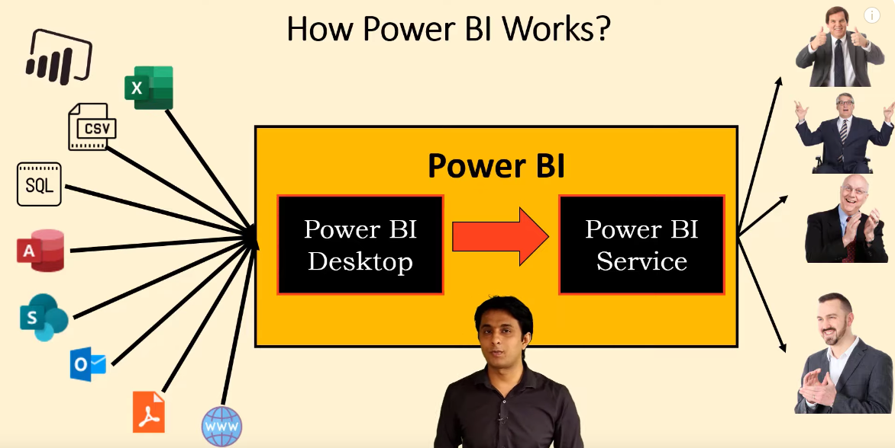

table  of contents:
- [collection of 4 components](#collection-of-4-components)
- [What is Power BI?](#what-is-power-bi)
- [How Power BI works](#how-power-bi-works)
- [Tutorials](#tutorials)

# collection of 4 components
  1. Power Query
  2. Power Pivot
  3. Power View
  4. Power BI Service

# What is Power BI?
 1. Google Trends
 2. Maximum number of features
 3. Cost
 4. Data Connectivity
 5. Recognized by Gartner

# How Power BI works
 1. Data Sources
 2. Data Transformation
 3. Data Modeling
 4. Data Visualization
 5. Sharing and Collaboration

# Tutorials
- Power BI Full Course Tutorial (8+ Hours) : https://www.youtube.com/watch?v=e6QD8lP-m6E 
-  Power Bi tutorial for Beginners | Power BI Dashboard Project in Hindi | Power Bi Course 2023  : https://www.youtube.com/watch?v=6cV3OwFrOkk&list=TLPQMDYwODIwMjUTq7iP_fYY0g&index=2
-  Power BI Tutorial For Beginners | Master Power BI From Beginner to Expert, By Microsoft  : https://www.youtube.com/watch?v=s3RD-zX9NkM