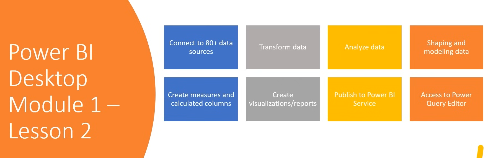

# Tutorials
- Power BI Full Course Tutorial (8+ Hours) : https://www.youtube.com/watch?v=e6QD8lP-m6E 
-  Power Bi tutorial for Beginners | Power BI Dashboard Project in Hindi | Power Bi Course 2023  : https://www.youtube.com/watch?v=6cV3OwFrOkk&list=TLPQMDYwODIwMjUTq7iP_fYY0g&index=2
-  Power BI Tutorial For Beginners | Master Power BI From Beginner to Expert, By Microsoft  : https://www.youtube.com/watch?v=s3RD-zX9NkM
-  

# Modules

- Introduction to Data Analytics and Power BI
- Data Shaping
- Enhancing Data Structure
- Designing Data Model
- DAX
- Optimizing Model Performance
- Reports and Accessibility

# Other Modules

- Dashboards
- Paginated Reports
- Performing Advanced Analytics
- Managing Workspaces
- Managing Datasets
- Row Level Security

