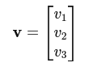
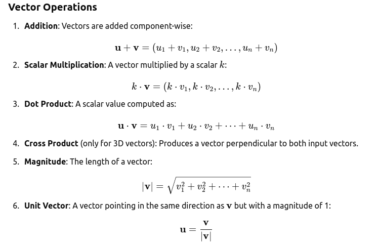
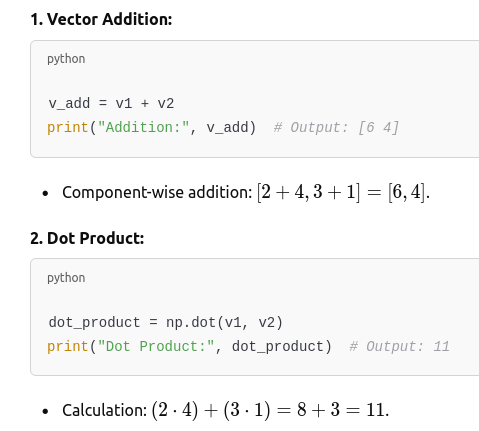
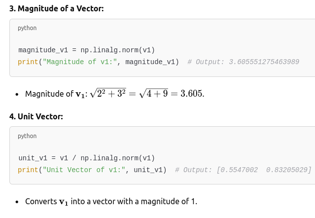

### What Are Vectors?

- A vector is a mathematical object that has both a magnitude (size) and a direction. 

### Representation of Vectors

#### Mathematical Notation:
- A vector is represented as v=(v1,v2,…,vn)v=(v1​,v2​,…,vn​), where v1,v2,…,vnv1​,v2​,…,vn​ are components of the vector.
- Example: A 2D vector is v=(3,4)v=(3,4).

#### Graphical Representation:
- Vectors are represented as arrows in a coordinate system.
- The length of the arrow indicates the magnitude, and the arrowhead indicates the direction.

#### In Python:
- Represented using arrays, lists, or objects in libraries like NumPy or PyTorch.

### Types of Vectors

- Zero Vector: A vector with all components equal to zero, e.g., v=(0,0,0)v=(0,0,0). It has no direction.
- Unit Vector: A vector with a magnitude of 1. It is used to represent direction.
- Row Vector / Column Vector:
    - Row vector: v=[v1,v2,v3]v=[v1​,v2​,v3​]
    - Column vector:
        - 
​

## Example Operations You Can Perform:

