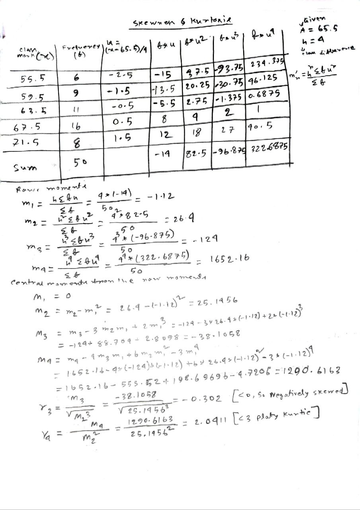

## Skewness

### Left-skewed:
- Negatively skewed (Left-skewed)
- Longer left whisker → Left-skewed.
- Negative Skewed or Left-Skewed (Negative Skewness)
- mean < median < mode

### Right-skewed
- Positively skewed
- Longer right whisker → Right-skewed.
- Positive Skewed or Right-Skewed  (Positive Skewness)
- mean > median > mode

### Symmetrical
- No skew
- mean = median = mode

### Box whisker
- which box is little or IQR more less what one will be more consistent
- less IQR means More consistent/accrately predictable
- 
- 

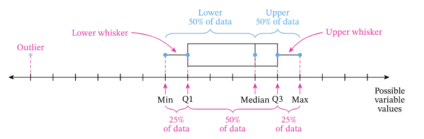
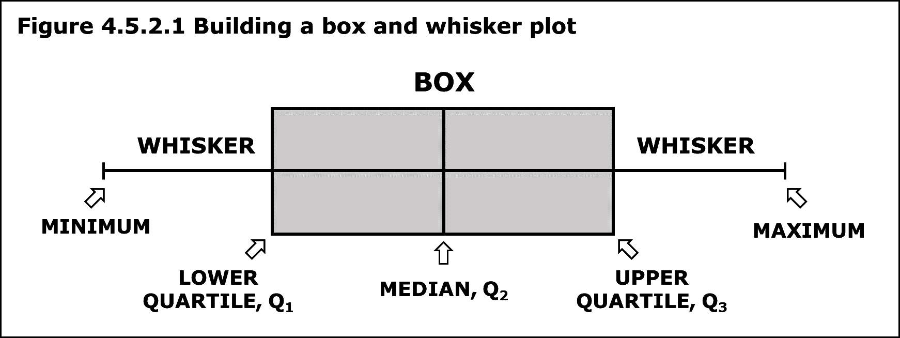
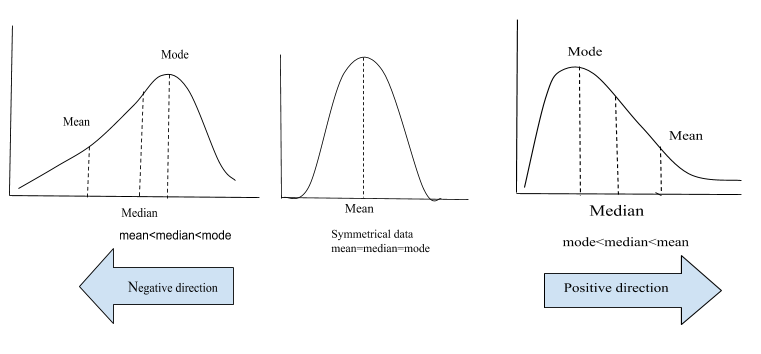
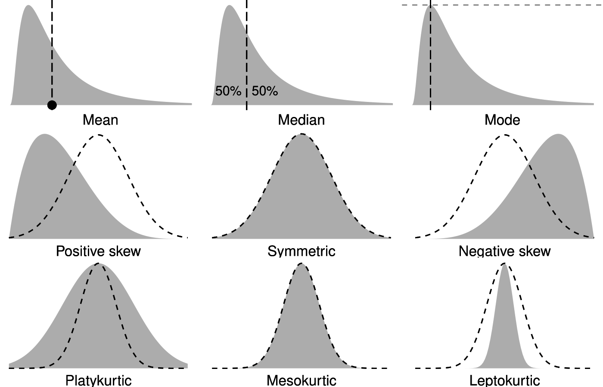
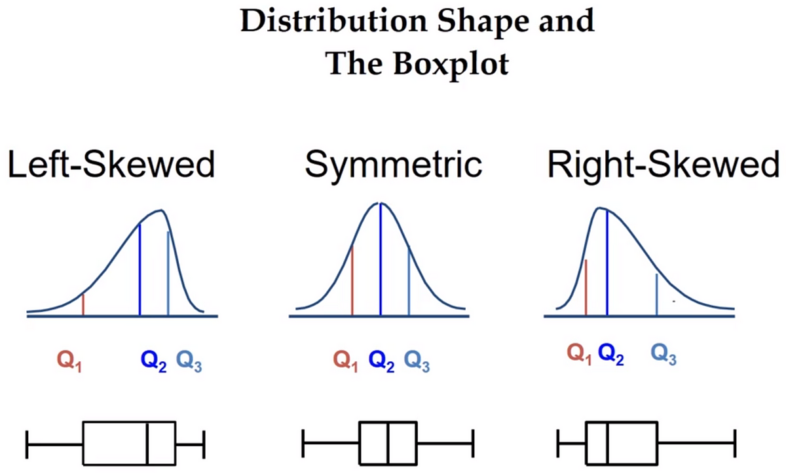
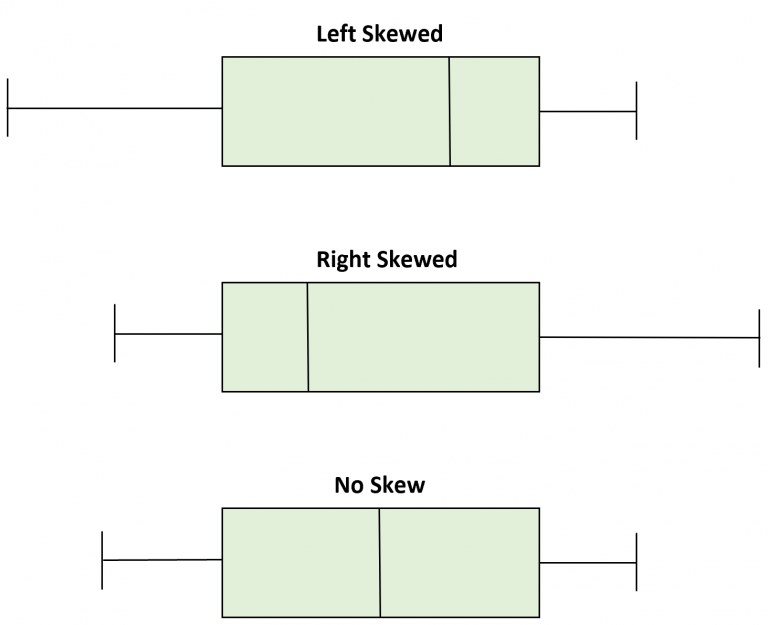
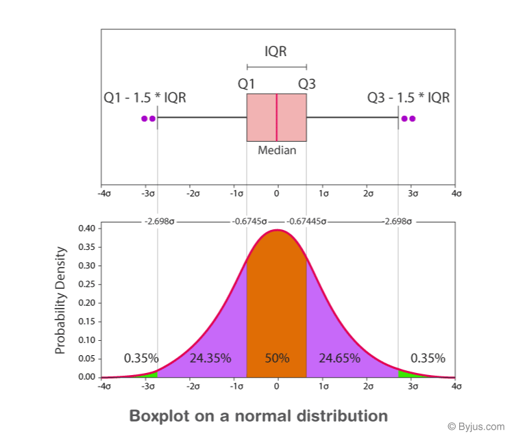
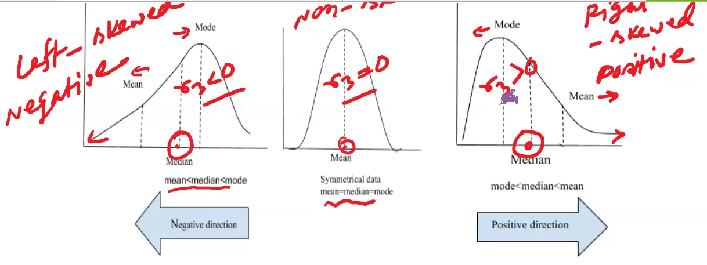

#### Symmatric Skewness
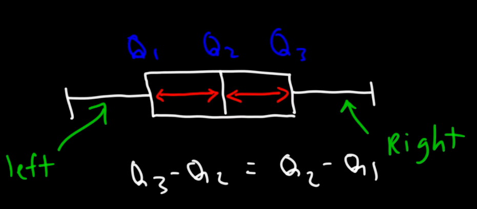

#### Left Skewness
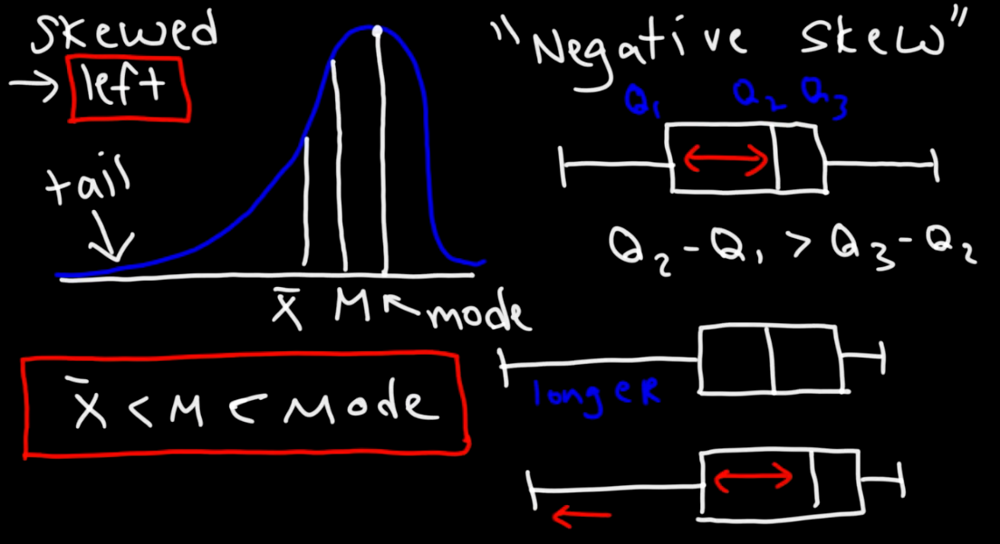

#### Right Skewness
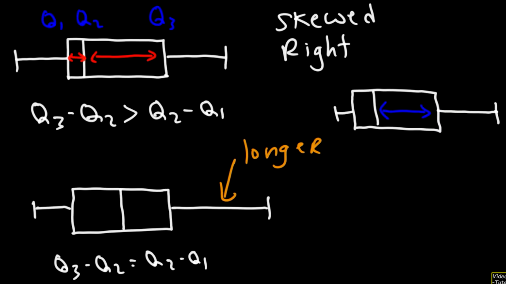
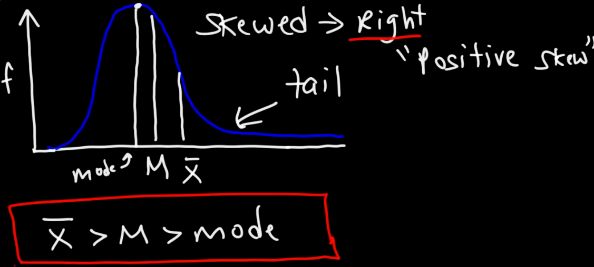
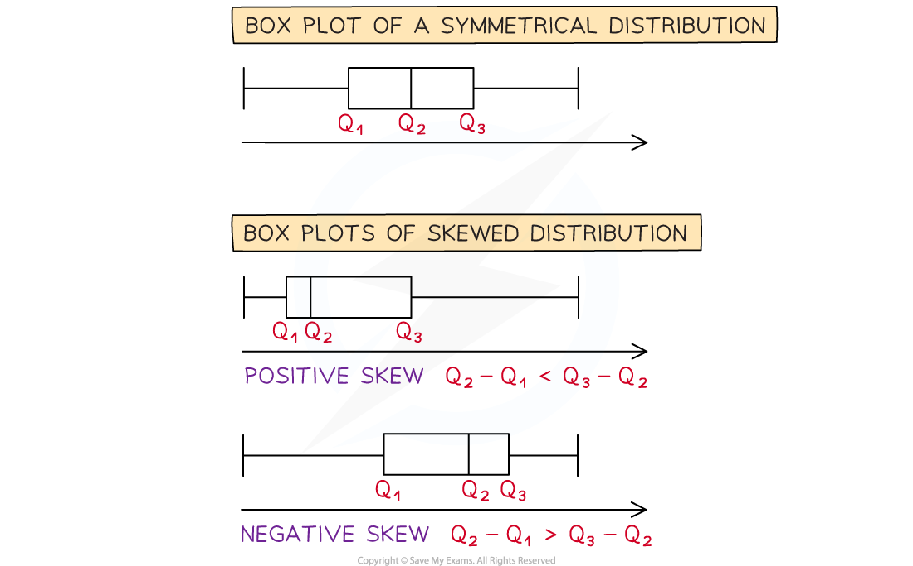

#### Kurtosis
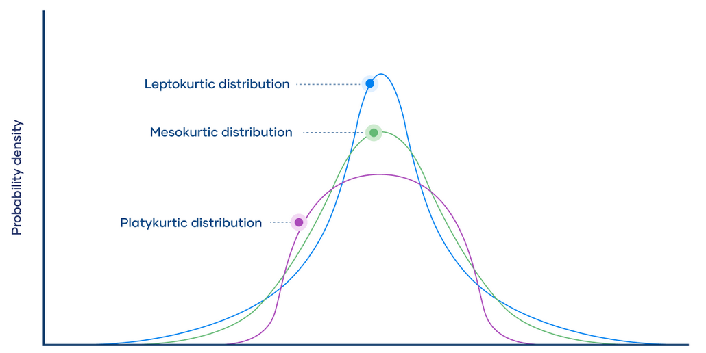
- Kurtosis describes the “tails” and “peaks” of the distribution:
  - High kurtosis (leptokurtic) means heavy tails with more outliers.
  - Low kurtosis (platykurtic) means light tails with fewer outliers.
  - Near-zero excess kurtosis (mesokurtic) is close to a normal distribution.
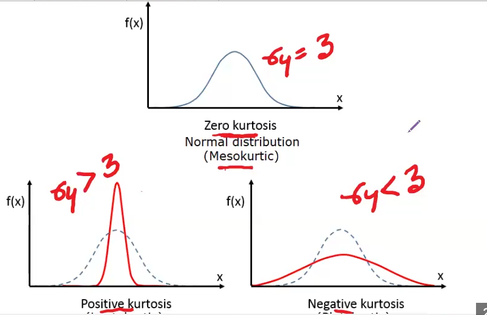

## Solve 1

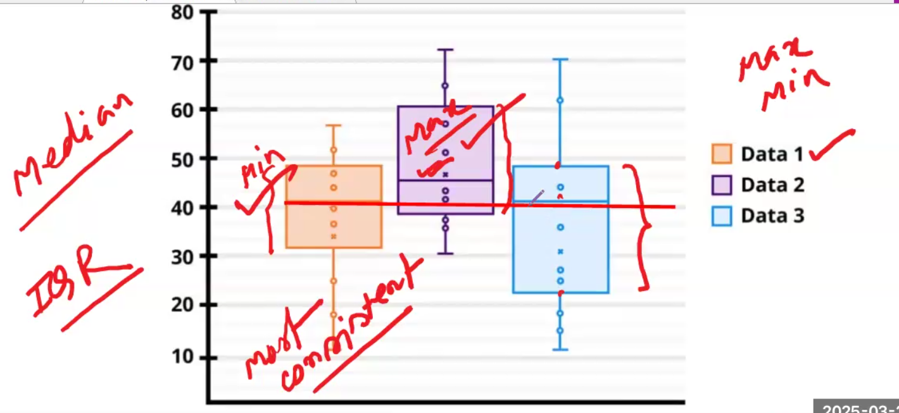

- For Consistency
  -
- Less IQR most consistent

- For Maximization
  -
- larger median will be best
- For Minimization
  - 
- smaller median will be best

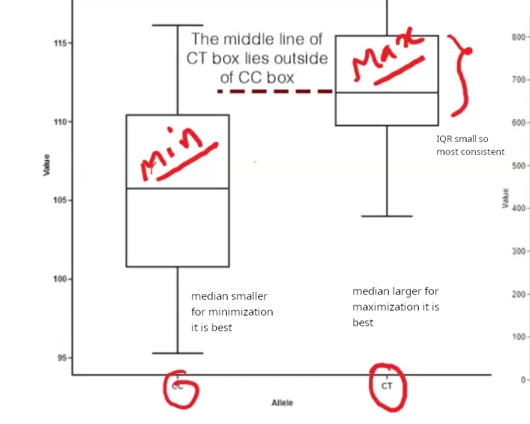

4 thing to compare
- IQR then consistency
- Maximization, Minimization
  - which median better
- If any outlier
- Skewness

