# Central Tendency

A single summary score that best describes the central location of an entire distribution of scores.
- The typical score.
- The center of the distribution.
- One distribution can have multiple locations where scores cluster.
    - Must decide which measure is best for a given situation
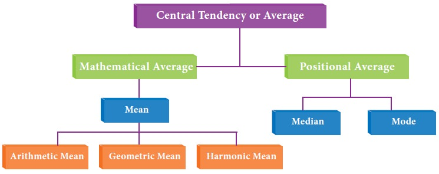

## 3 main measure

---
### 1. Mean (Arithmetic Average)
- Affected by: Outliers (can distort the mean).
- Example: Test scores, heights of students.

#### There are 3  types of Mean in statistics:
#### 1. Arithmetic Mean
- Used for: Simple averages (e.g., test scores, heights).

1. for ungrouped data
2. for elaborated ungrouped data
3. for grouped data

---
#### Example [ungrouped data - AM]
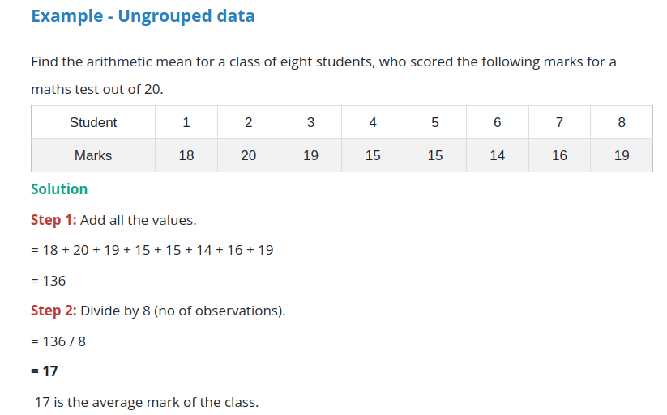
---

#### Example [ungrouped data - AM]

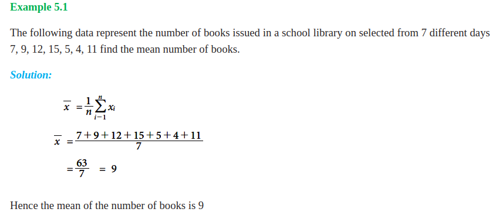

---

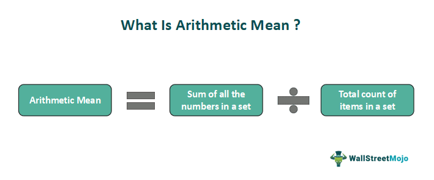
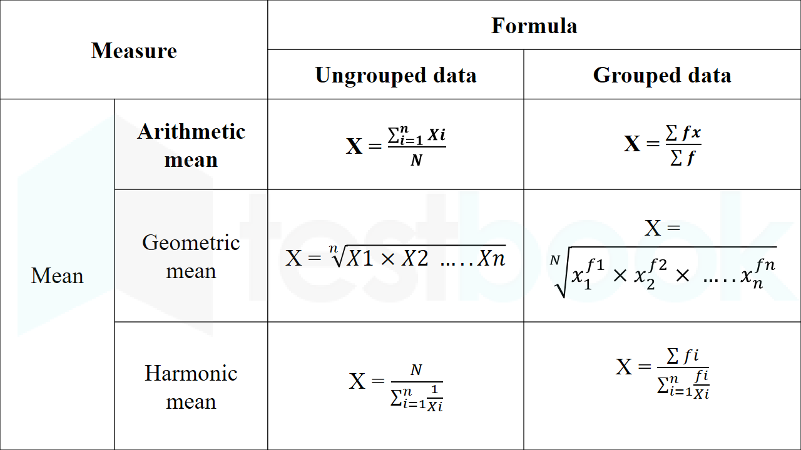

#### [***Example] Grouped - Arithmatic Mean (AM)  (Without Class Boundaries) 

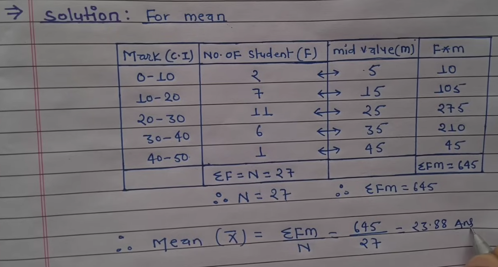
- sum fx = sum fm
- mid value = m = x = 5 = (0+10)/2
- mid value = m = x = 15 = (10+20)/2
---

#### Example [grouped data - AM - continuous]

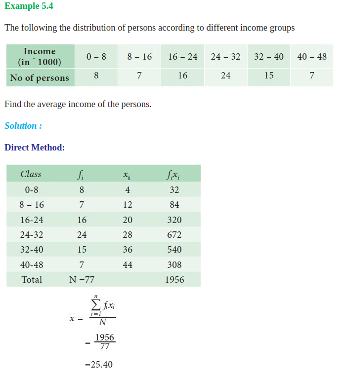
---

#### [***Example] Grouped - Arithmatic Mean (AM)  (Without Class Boundaries)

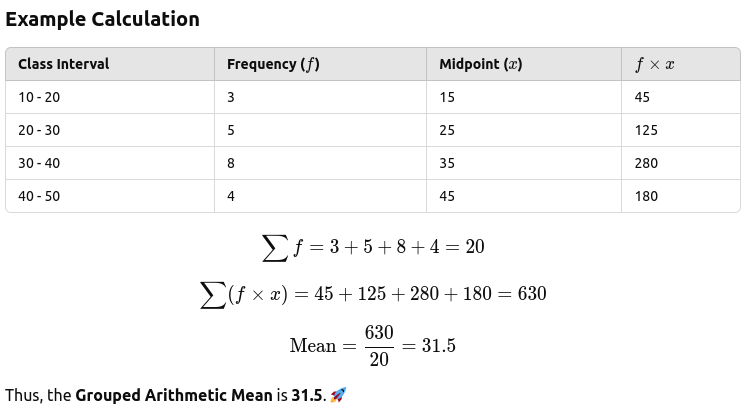

#### [***Example] Grouped - Arithmatic Mean (AM) (With Class Boundaries)

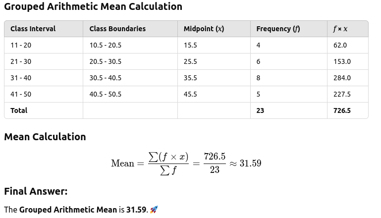
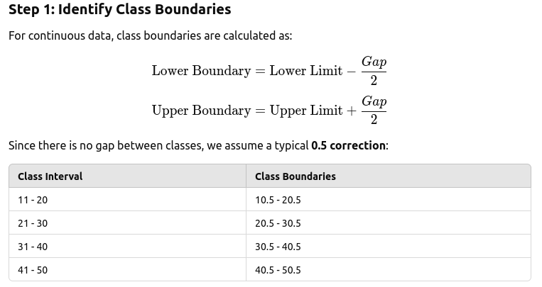
- **Lower Limit = 11 - 0.5 = 10.5**
- **Upper Limit = 20 + 0.5 = 20.5**

---
#### 2. Geometric Mean
- Used for: Growth rates (e.g., population growth, stock returns).

##### [***Example - Ungrouped] Geometric Mean (GM) 
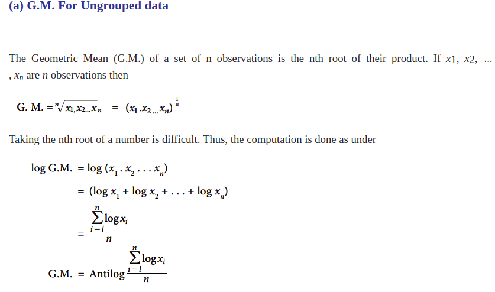
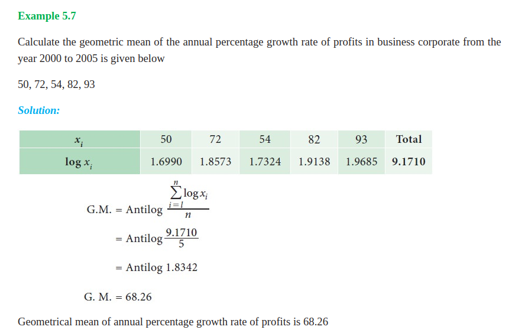

---

##### [***Example - Grouped] Geometric Mean (GM) 
---

#### 3. Harmonic Mean
- Used for: Averaging rates (e.g., speed, finance).

---
#### Ungrouped Geometric Mean

---
#### [Example] Ungrouped Geometric Mean

---
#### Grouped Geometric Mean
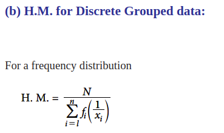
---

#### [Example] Grouped Geometric Mean
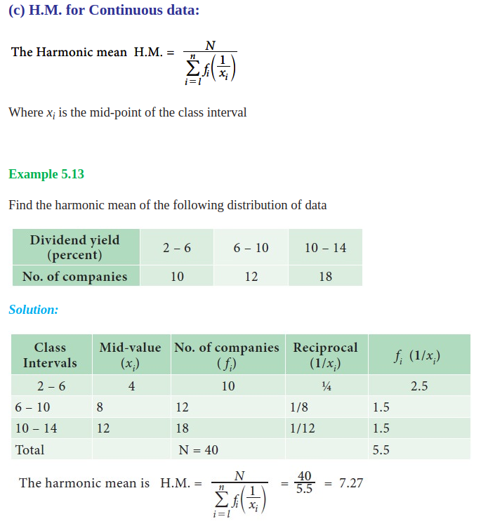

### 2. Median (Middle Value)

- How to find: (**ungrouped**)
  - Arrange data in ascending order.
  - If odd number of values → middle value.
  - If even number of values → average of two middle values.
- Example: Income levels, house prices.
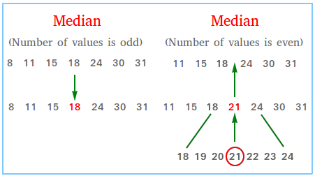

#### [***Formula - ungrouped] Only for Ungrouped dataset not for grouped dataset

---
#### [Example - Math - Ungrouped Even]
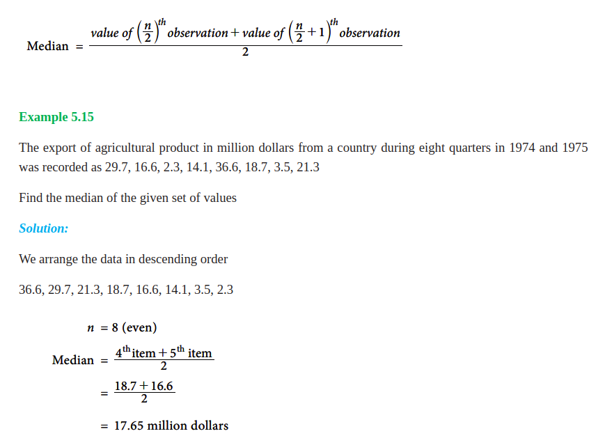
---

#### Grouped - Median  (Without Class Boundaries)

- C.F = Cumalitive Frequency 
  - 2 = 2 [starting]
  - 2 + 7 = 9
  - 9 + 11 = 20 
- N = summation of F (frequency given)
- 9 = C.F. = F. C. = **F**(m-1) [median class row's previous class row's Cumalitive frequency]
- 11 = F = **F** (m)  [ median class row's frequency]
- 10 = C = i = h [class interval difference]
- L = 20 = lower limit of median class row's 

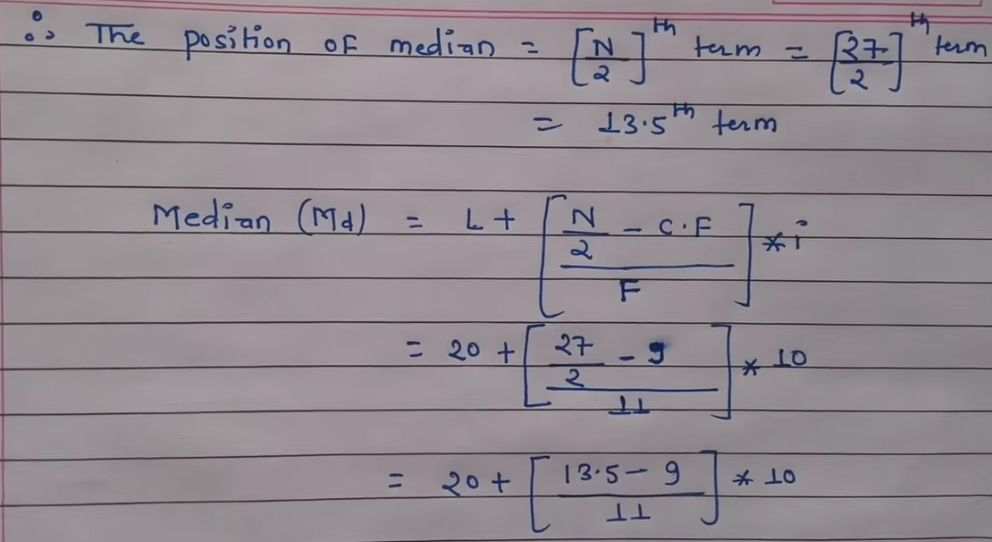
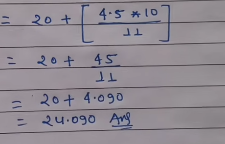

#### Grouped Median Calculation (With Class Boundaries)
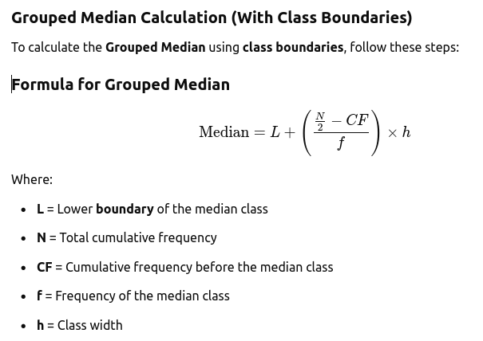
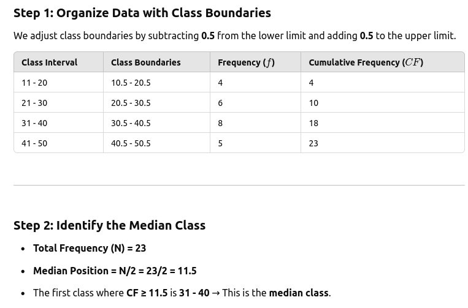
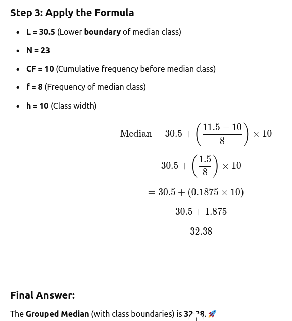

### 3. Mode (Most Frequent Value)
- Best for: Categorical data or distributions with multiple peaks.

Can be:
- Unimodal (one mode),
- Bimodal (two modes),
- Multimodal (more than two).

**Example**: Favorite colors in a class, most common shoe size.

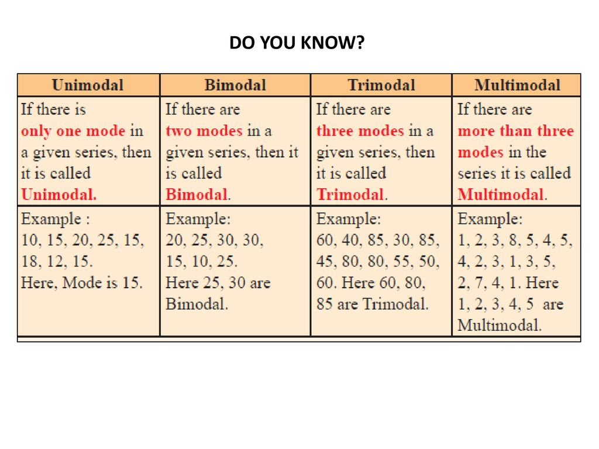

### Choosing the Best Measure of Central Tendency

| Situation                                         | Best Measure | Example                                                   |
| ------------------------------------------------- | ------------ | --------------------------------------------------------- |
| Data is **normally distributed**                  | Mean         | Heights of students in a class                            |
| Data has **outliers or is skewed**                | Median       | Income levels in a city (some billionaires skew the mean) |
| Data is **categorical**                           | Mode         | Most popular car color in a city                          |
| Want to know the **most frequent response**       | Mode         | Most commonly ordered dish at a restaurant                |
| Want a **balanced average**                       | Mean         | Average test scores of students                           |
| Dataset has **extreme high or low values**        | Median       | House prices in a country (luxury homes distort the mean) |
| Need a **measure that is always in the dataset**  | Mode         | Most frequently bought shoe size                          |
| Data is **bimodal or multimodal**                 | Mode         | Exam results where two groups perform very differently    |
| Dealing with **ordinal data** (ranked categories) | Median       | Satisfaction survey ratings (e.g., 1-5 stars)             |

# Documentation
- https://www.brainkart.com/article/Harmonic-Mean-(H-M-)_35082/
- 