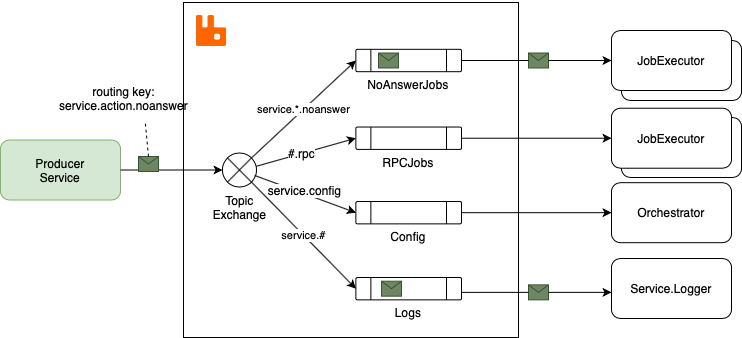

## Why RabbitMQ

An example from the physical world would be calling somebody over the phone: 
1) We start the call
2) Wait for the other party to answer
3) have a nice discussion
4) hang up the phone

But there are other times when we don’t need the answer, we just need the receiver to take ownership of the message and do its job. In this case, we need an intermediary agent, another system to take ownership of the message (temporarily) and make sure that the message reaches its destination. To push the phone example further, the other party is not available at the moment, so we leave a voice message. The voicemail service will notify the intended receiver.

## RabbitMQ
A message broker acts as a middleman for various services (e.g. a web application, as in this example)

## Exchanges
- Messages are not published directly to a queue; instead, the producer sends messages to an exchange
- An exchange is responsible for routing the messages to different queues with the help of bindings and routing keys. A binding is a link between a queue and an exchange. 

### Message flow in RabbitMQ

- The producer publishes a message to an exchange. When creating an exchange, the type must be specified. This topic will be covered later on.
- The exchange receives the message and is now responsible for routing the message. The exchange takes different message attributes into account, such as the routing key, depending on the exchange type.
- Bindings must be created from the exchange to queues. In this case, there are two bindings to two different queues from the exchange. The exchange routes the message into the queues depending on message attributes.
- The messages stay in the queue until they are handled by a consumer
- The consumer handles the message.

##  Types of exchanges 

| **Feature**           | **Direct**                                                                              | **Fanout**                                                                      | **Topic**                                                                 | **Headers**                                                               |
| --------------------- | --------------------------------------------------------------------------------------- | ------------------------------------------------------------------------------- | ------------------------------------------------------------------------- | ------------------------------------------------------------------------- |
| **Routing Mechanism** | Exact match of routing key.                                                             | Routes to all bound queues.                                                     | Wildcard match of routing key with binding.                               | Routes based on message headers.                                          |
| **Routing Key**       | Must match exactly with queue binding.                                                  | Ignored. All queues receive the message.                                        | Matches patterns like `*.pdf.*`.                                          | Ignored. Based on header values.                                          |
| **Use Case**          | Specific queue routing.                                                                 | Broadcast to all queues.                                                        | Flexible pattern-based routing.                                           | Routing based on message attributes.                                      |
| **Example**           | A message with routing key `pdfprocess` is routed to the queue bound with `pdfprocess`. | All queues bound to the fanout exchange receive the message, regardless of key. | A message with routing key `log.error` goes to queues bound with `log.*`. | A message with header `type: urgent` will be routed based on that header. |
| **Example**             | - A message with routing key `invoice123` goes to the queue bound to `invoice123`.   - A message with routing key `task1` goes to the queue bound to `task1`. | - All queues receive a message from an exchange without any specific routing key.   - A broadcast message like "System is down" goes to all queues that are bound. | - A message with routing key `log.error` matches all queues bound with `log.*` (e.g., `log.error`, `log.warning`).   - A message with routing key `user.registered` can be routed to queues bound with `user.*`. | - A message with header `type: urgent` will be routed to the `urgent` queue.   - A message with header `priority: high` will go to a queue that processes high-priority tasks. |
| **Example Scenario 1**  | - **Order Processing**: An order service could route messages to different queues depending on order ID. A queue for `order123` would process order number `123`. | - **Real-time Notifications**: Sending an announcement like "Server maintenance in 10 minutes" to all queues. | - **Logging System**: Routing log messages (e.g., `log.debug`, `log.error`, `log.info`) to different queues for specific types of logs. | - **Task Priority**: Tasks with high priority could be routed to a dedicated queue based on the `priority` header. |
| **Example Scenario 2**  | - **Task Scheduling**: A worker queue that only processes tasks with specific routing keys, such as `data-processing` or `email-sending`. | - **Event Broadcasting**: A message like "New event created" goes to all subscribers (e.g., queues for different departments). | - **Product Categories**: Routing product-related messages to queues based on category (e.g., `electronics.new-arrivals`, `clothing.sale`). | - **Message Type**: A notification with header `type: news` could be routed to a queue that handles news notifications. |

## RabbitMQ and server concepts

Some important concepts need to be described before we dig deeper into RabbitMQ. The default virtual host, the default user, and the default permissions are used in the examples, so let’s go over the elements and concepts:

- Producer: Application that sends the messages.
- Consumer: Application that receives the messages.
- Queue: Buffer that stores messages.
- Message: Information that is sent from the producer to a consumer through RabbitMQ.
- Connection: A TCP connection between your application and the RabbitMQ broker.
- Channel: A virtual connection inside a connection. When publishing or consuming messages from a queue - it's all done over a channel.
- Exchange: Receives messages from producers and pushes them to queues depending on rules defined by the exchange type. To receive messages, a queue needs to be bound to at least one exchange.
- Binding: A binding is a link between a queue and an exchange.
- Routing key: A key that the exchange looks at to decide how to route the message to queues. Think of the routing key like an address for the message.
- AMQP: Advanced Message Queuing Protocol is the protocol used by RabbitMQ for messaging.
- Users: It is possible to connect to RabbitMQ with a given username and password. Every user can be assigned permissions such as rights to read, write and configure privileges within the instance. Users can also be assigned permissions for specific virtual hosts.
- Vhost, virtual host: Provides a way to segregate applications using the same RabbitMQ instance. Different users can have different permissions to different vhost and queues and exchanges can be created, so they only exist in one vhost.

