# Links
- https://www.youtube.com/watch?v=zJ-LqeX_fLU

# Atom
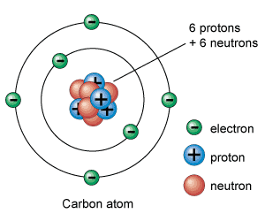
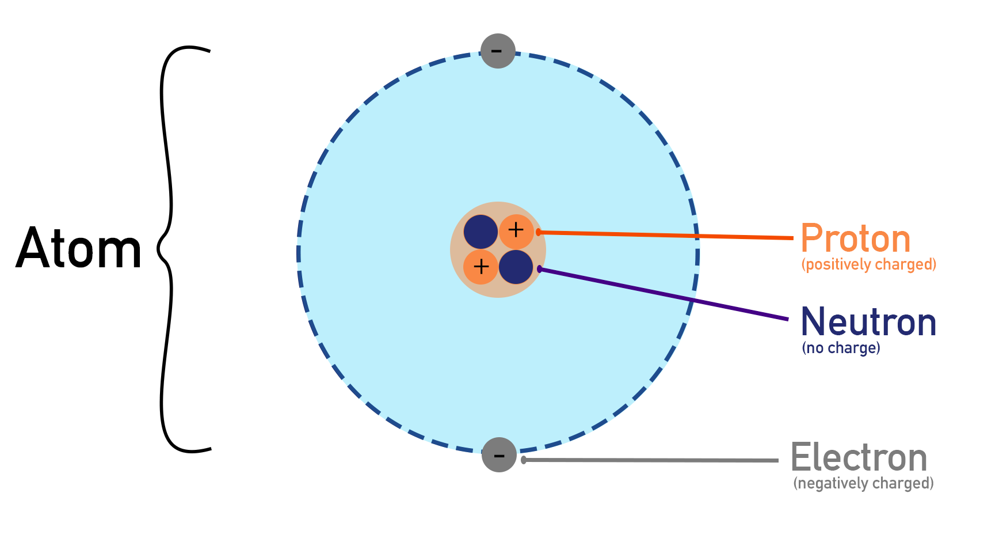
# Carge
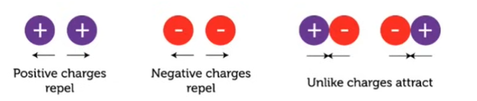

# Flow of Electricity
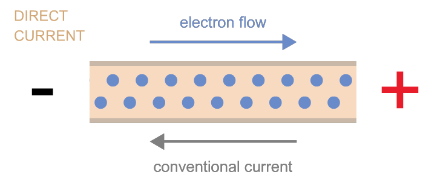

# Voltage, Current, Resistance
## VOltage
- Voltage is often referred to as “power” – for example, how much power does that battery have, 3 volts, 9 volts?
- Voltage is a component of power; however, it is better described as “pressure” or “force” on its own.

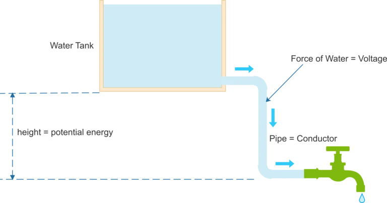
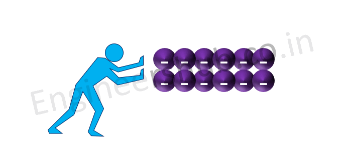
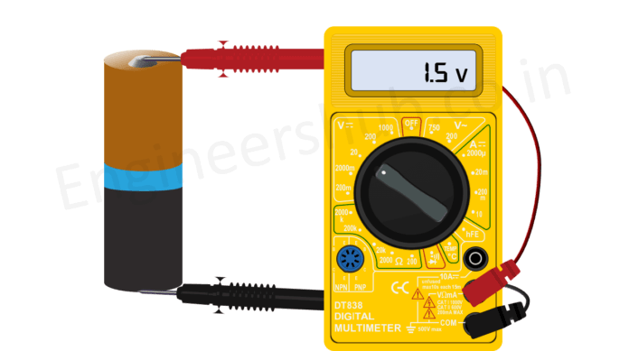
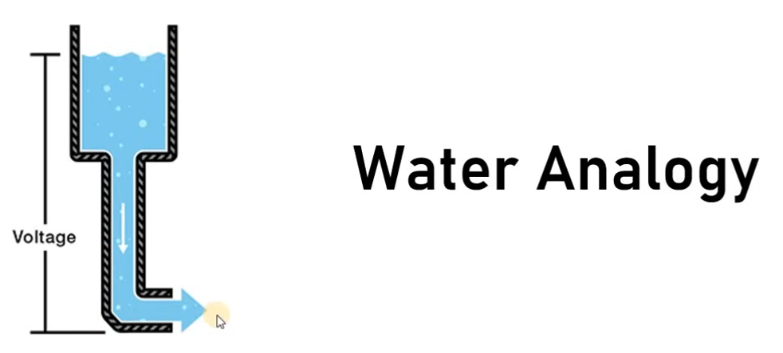

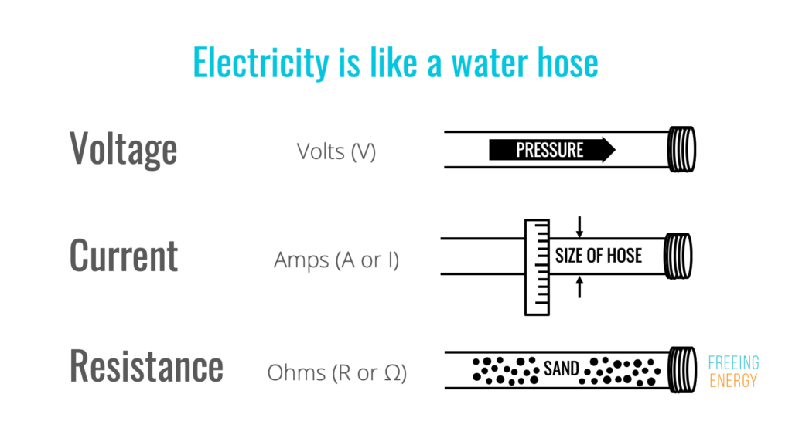
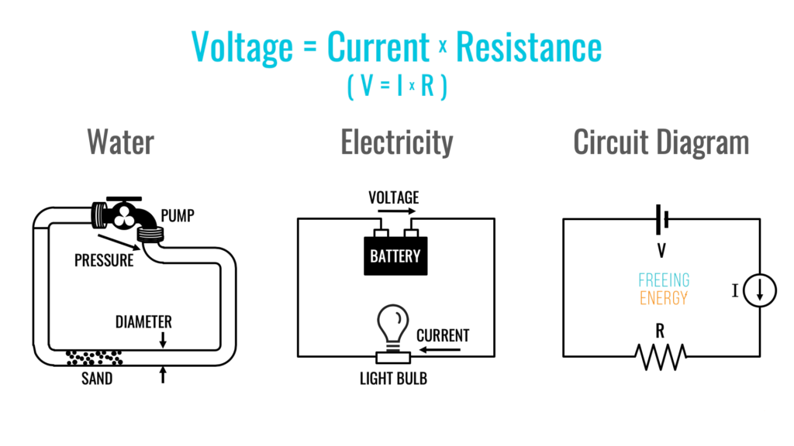

# DC, AC, Batteries, and Transformers
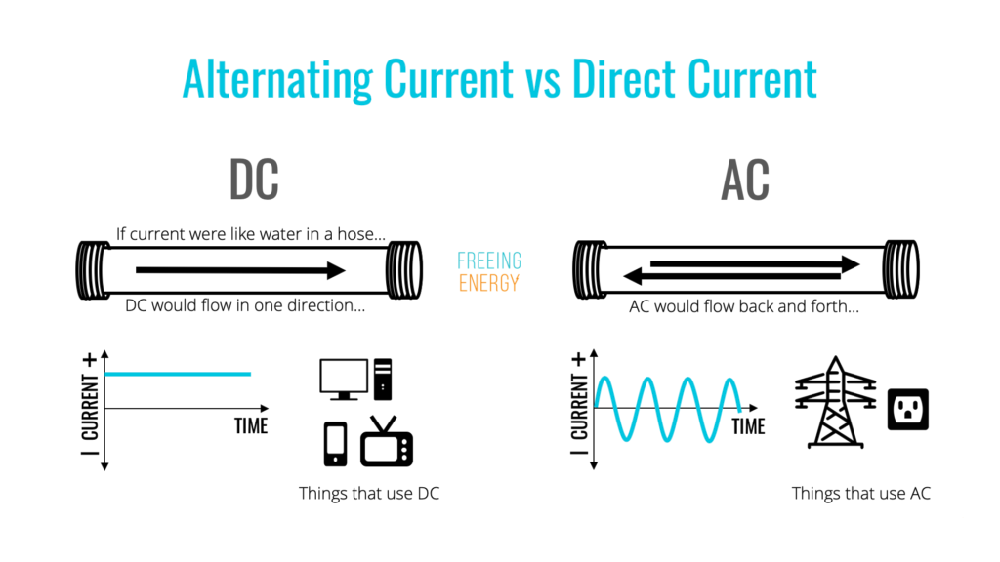
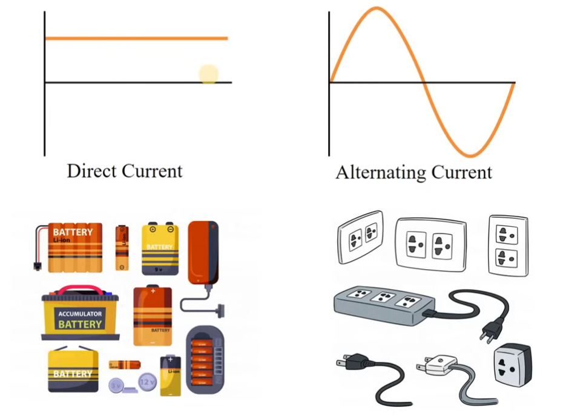

# Power vs Energy
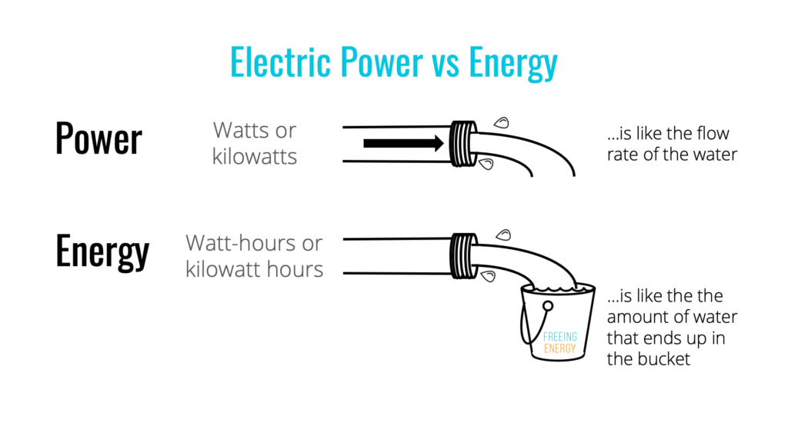

# Series vs Parallel Circuits