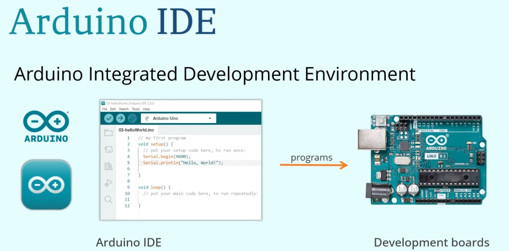

# IDE installation
```
sudo apt install -y libglib2.0-0 libnss3 libxkbcommon0 libasound2 \
libgtk-3-0 libx11-xcb1 libxtst6 libxrandr2

wget https://downloads.arduino.cc/arduino-ide/arduino-ide_2.3.2_Linux_64bit.AppImage

chmod +x arduino-ide_2.3.2_Linux_64bit.AppImage

./arduino-ide_2.3.2_Linux_64bit.AppImage

```